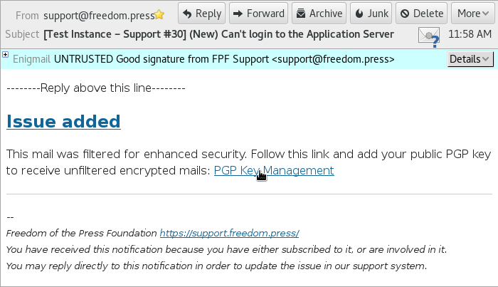
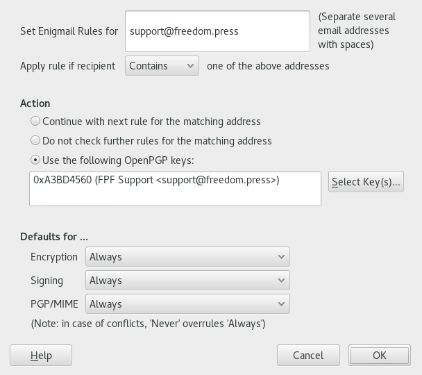
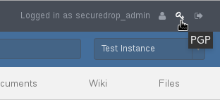
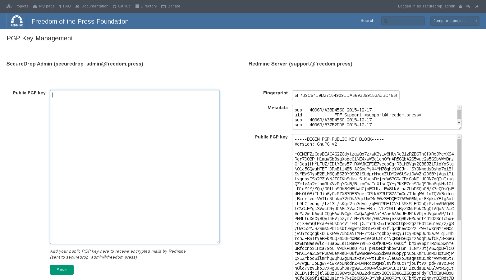

Redmine documentation
=====================

.. _Onboarding SecureDrop Admins:

Onboarding SecureDrop Admins
----------------------------

.. _Overview:

Overview
^^^^^^^^

Freedom of the Press Foundation is transitioning to a Redmine-based
ticketing system for all support requests related to SecureDrop. All
current and future SecureDrop administrators are required to use the new
support system in order to receive support from FPF staff. From now on,
the best way to get in touch with us is through
`support.freedom.press <https://support.freedom.press>`_
or by e-mailing support@freedom.press.

As a current SecureDrop administrator or journalist, you will need to
spend a little time setting up an account on our new support site,
`support.freedom.press <https://support.freedom.press>`_.
This process should be quick and easy, and is documented in
:ref:`Creating your Account`.

Once your account has been created, there are two workflows you can use:
a web-based workflow, and an email-based workflow. Either workflow may
be used interchangeably. We think most people will want to use the
web-based workflow, which is documented in :ref:`Using Redmine`.

Freedom of the Press Foundation takes the security of every SecureDrop
instance seriously. We require an encrypted communications channel for
support requests because they may contain sensitive information about
your SecureDrop instance. The web-based workflow is automatically
encrypted thanks to HTTPS; however, supporting a secure email-based
workflow is more difficult because email is unencrypted by default. Our
solution is to combine Redmine's excellent email-based workflow with
OpenPGP encryption, which we already use to communicate with many
SecureDrop administrators and journalists. You can learn more about
configuring and using the email-based workflow in
:ref:`Setting up Encrypted Email Workflow`.

.. _Why are we doing this?:

Why are we doing this?
^^^^^^^^^^^^^^^^^^^^^^

Our goal with this new system is to simplify and centralize the process
of providing assistance to users of SecureDrop, making it easier for
both us and you. Previously, we had asked people to e-mail us. These
e-mail threads were difficult to follow, especially when they're
encrypted and thus not searchable, and when multiple people are CC'ed,
which quickly becomes a headache in terms of PGP key management. It can
be a challenge to find the information you are looking for or remember
where the conversation left off, when they are frequently spread across
different channels like Signal messages or OTR chats, too.

By moving support requests into Redmine tickets, we can keep much better
track of the status and scope of an issue, the person who is responsible
for dealing with it, and make sure everyone is apprised of the
discussion who needs to be. Reviewing the ticket's history allows
someone to quickly obtain a full understanding of the problem, without
having to resort to searching within encrypted e-mails. We can collect
all of the information relevant to your organization's deployment in one
place, and it's more efficient and less confusing for us when we're
dealing with multiple conversations simultaneously across several
SecureDrop instances.

Administering a SecureDrop instance is hard work, and we hope that this
new system will make us more effective in providing help to you. Don't
hesitate to let us know if you have any feedback on the new support
system.

.. _Creating your Account:

Creating your Account
^^^^^^^^^^^^^^^^^^^^^

To get started, register your account at
`support.freedom.press/account/register <https://support.freedom.press/account/register>`_.
Choose a strong password, and use an e-mail address that you frequently
check. We have to manually confirm each new account, so after submitting
your registration you'll need to wait until you receive an e-mail saying
your account has been activated before proceeding further.

|Registration|
|Activation|

After you've been activated by us and you're ready to login, continue
reading below.

.. _Using Redmine:

Using Redmine
^^^^^^^^^^^^^

Once your account has been activated, go to
`support.freedom.press <https://support.freedom.press>`_
to log in with your new account.

|Login|
|Home|

After logging in, click on Projects in the top menu bar. You'll see a
project for your specific instance listed underneath SecureDrop, which
only Freedom of the Press Foundation and people within your organization
have access to. Click on it. You'll be shown an Overview of the project
and all of the issues that are open, which are also listed under the
Issues pane.

We've created an initial ticket for onboarding, called "Onboarding
verification". Please reply to this, verifying you have logged in and
added your PGP public key.

To do so, click Edit at the bottom of the issue, add some Notes, and
click Submit. This is a useful test to make sure you're able to use our
Redmine. When we acknowledge your response and close that ticket, you
should receive an encrypted e-mail notification; if you don't please let
us know.

In addition to the Activity pane which lists recent updates, your
subproject has modules for Documents, Wiki, and Files. This is where we
intend to store any technical documentation related to your SecureDrop
instance.

To make a new ticket, click "New issue" and fill out the Subject and
Description fields. All other fields can be left blank, although you can
assign a priority if you want. When we see the issue, we will respond
and assign it to the appropriate person. If we're waiting for a reply
from someone in your organization, we may assign it back to you. Sending
an e-mail to support@freedom.press will automatically create a new
ticket in your project, with the title as the subject line.

Under your account settings (accessible in the top right corner) you may
set your local time zone. We encourage you to leave the notification
setting as the default: "For any event on all my projects".

For further instruction on using Redmine, please consult their `User
Guide <https://www.redmine.org/projects/redmine/wiki/User_Guide>`_.

.. _Setting up Encrypted Email Workflow:

Setting up Encrypted Email Workflow
^^^^^^^^^^^^^^^^^^^^^^^^^^^^^^^^^^^

One of Redmine's strengths as a ticketing system is its powerful support
for email-based workflow. You can use email to create new issues, reply
to existing issues, and be notified of updates to issues that are
relevant to you.

If you prefer to only use the web-based workflow, that's fine! In that
case, you will still receive email alerts for changes to issues on your
SecureDrop's project, but the content of the email will not be included.
This is called a "filtered" email. We encourage you to use these
filtered emails as a reminder to login to your Redmine account and check
the content of the corresponding updates to an issue. These are a kind
of "poor man's push notifications", and we welcome feedback on how we
could make notifications for this Redmine system more convenient for
you.

|FilteredEmail|

To protect the contents of support requests, which could be sensitive,
we require all email to and from the server to be encrypted with
OpenPGP. At a high level, in order to use this encrypted email workflow,
you need to:

1. Provide **your public key** to the support server
2. Import the **server's public key** into your local GPG keyring.

The following documentation explains how to perform these steps to get
the encrypted email workflow working. It assumes you have some
familiarity with the concepts used by PGP. It also assumes you are using
Thunderbird+Enigmail for OpenPGP-encrypted email.

Start by navigating to
`support.freedom.press/pgp <https://support.freedom.press/pgp>`_ or
click the key icon in the upper right corner of the support window.

|PGPicon|

In the PGP management window you will see two columns: one for your
public key on the left, and one with the server's public key on the
right.

|PGPsettings|

To provide your public key, start by exporting an ASCII-armored copy of
your public key. Paste your armored public key into the empty text box
on the left and hit **Save**.

.. todo::  provide instructions for exporting ascii-armored copy, or provide
   link to instructions on another site

Now, import the public key for our Redmine server. It is available on
the right hand side of the page. Start by selecting the entire public
key and copying it to your clipboard.

.. todo::  Provide a variety of mechanisms for importing the public key, either
   described here or with links to external documentation.

and then in Thunderbird navigate to Enigmail menu > Key Management >
Edit > and select Import Keys from Clipboard. You may also use the
following command:

.. todo:: The following key is a testing key, so this command is only a
   placeholder until the transition to a live key. DO NOT upload this key to
   keyservers.

    gpg --keyserver keys.gnupg.net --recv-keys 
    5F7B9C54E9B27164909EDA6693359153A3BD4560

The key can be downloaded `at this
link <https://freedom.press/sites/default/files/redmine_key.asc>`_.

.. _Troubleshooting:

Troubleshooting
^^^^^^^^^^^^^^^

When you're replying to Redmine via e-mail, you **must use PGP/MIME**
instead of inline PGP. The default settings for the Enigmail plugin in
Thunderbird should work.

Also, be sure that you **always sign your e-mails**. Our system will
reject them if they don't have a valid signature.

To check these settings, go to Edit > Account Settings in Thunderbird.
Navigate to the "OpenPGP Security" tab of your e-mail account. Be sure
that "Use PGP/MIME by default" is checked. You may not want to enable
"Sign messages by default" for everything, so we encourage you to add a
per-recipient rule for support@freedom.press. T

To do this, go to Enigmail > Edit Per-Recipient Rules > click Add, enter
in support@freedom.press. Set to Apply rule if "Contains" the above
address, select our Key, change all of the defaults (Encryption,
Signing, PGP/MIME) to "Always", then Click OK, and OK again. The
per-recipient rule should look like this:

|Per-recipientRule|

If you'd rather not receive e-mails for your own comments on issues,
there's a setting for that. Go to the "My account" page, select " I
don't want to be notified of changes that I make myself" under "Email
notifications" and hit Save.

When responding to issues, you should only use the "Quote" button if you
want to make an inline reply. Otherwise, hit "Edit".

There's a shortcut in the main menu called "My page". Typically, this
starts out as a list of issues that are assigned to you and issues that
have been reported to you. However, it can be personalized further to
include stuff like Documents and the latest news from your project.

.. _Miscellaneous support:

Miscellaneous support
^^^^^^^^^^^^^^^^^^^^^

If you haven't installed SecureDrop yet and you'd like our help, or you
have a situation related to digital security for journalists, simply get
started by registering an account in Redmine. Once your account is
manually activated by us, we will assign you to a project called
"Support Triage" where you can open a new issue. Any tickets that
created here will be visible only to Freedom of the Press Foundation and
you.

.. |Registration| image:: images/register.png
.. |Activation| image:: images/activated.png
.. |Login| image:: images/login.png
.. |Home| image:: images/home.png

