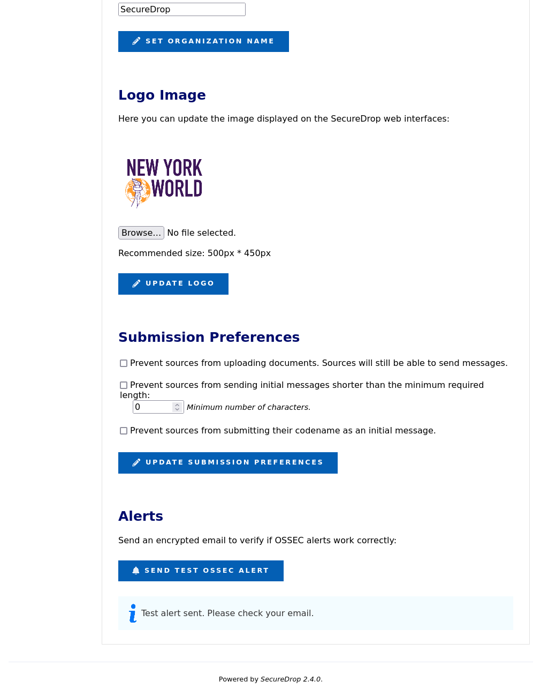
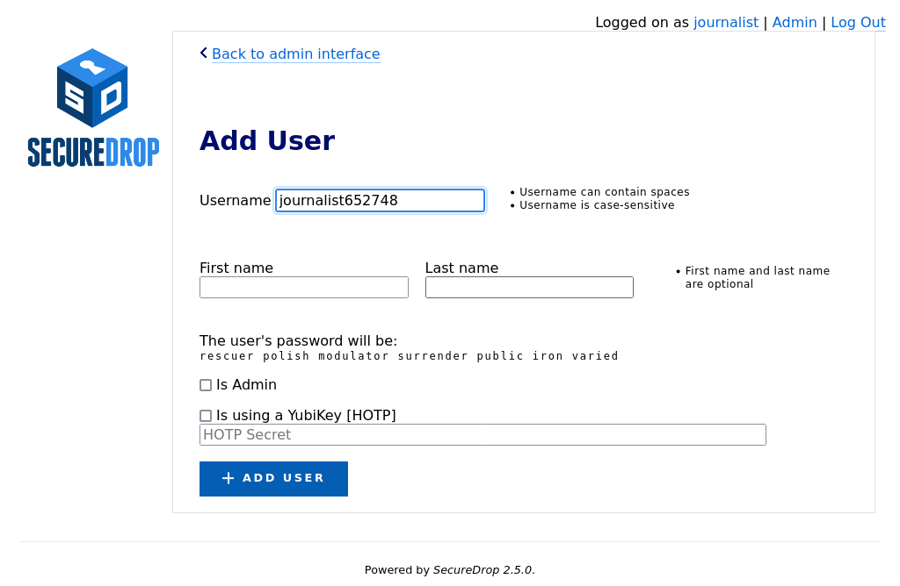

Admin Guide
===========

.. include:: ./includes/provide-feedback.txt

.. _Responsibilities:

Responsibilities
----------------

The SecureDrop architecture contains multiple machines and hardened servers.
While many of the installation and maintenance tasks have been automated, a
skilled Linux admin is required to responsibly run the system.

Responsibilities of SecureDrop administrators
~~~~~~~~~~~~~~~~~~~~~~~~~~~~~~~~~~~~~~~~~~~~~
As a SecureDrop administrator, it is your responsibility to:

* :ref:`manage users <manage_users>`
* :ref:`manage the system configuration <manage_config>`
* :ref:`ensure that servers, firewall and workstations are kept up-to-date <manage_updates>`
* :ref:`monitor OSSEC alerts <monitoring_ossec>`
* :ref:`monitor the SecureDrop team's release and security-related
  communications <monitoring_comms>`
* apply available firmware updates to all SecureDrop hardware
* ensure that the SecureDrop environment is physically secure and monitored
* investigate and respond to security incidents
* schedule and perform required maintenance tasks, such as operating system
  upgrades
* ensure that SecureDrop users adhere to the documented processes for checking
  SecureDrop, communicating with sources, and reviewing documents
* verify the integrity of SecureDrop code
* avoid the installation of unsupported code or patches
* :doc:`decommission SecureDrop after it is no longer in use <decommission>`

Responsibilities of the SecureDrop team
~~~~~~~~~~~~~~~~~~~~~~~~~~~~~~~~~~~~~~~
The SecureDrop team employed by Freedom of the Press Foundation (FPF) and the
SecureDrop community maintain and develop the SecureDrop software, which
is offered as open source software, free of charge, and at your own risk.

FPF offers :doc:`paid priority support services <getting_support>`. We are
happy to provide assistance with installing the system, with training of
administrators and journalists, and with investigation of technical issues
and incidents.

.. note::

   Each SecureDrop instance is hosted and operated independently. Freedom of the
   Press  Foundation does not offer systems administration, hosting or "remote
   hands" services.

When the SecureDrop team becomes aware of a security vulnerability in SecureDrop
or its software dependencies, we assess the impact of the vulnerability in the
context of existing security mitigations and :doc:`our threat model <threat_model/threat_model>`.
Based on this assessment, we prioritize technical work and external communications.

For high severity issues that require technical changes to SecureDrop, we will
issue a point release as soon as possible. As part of issuing a release or
advisory, we will post further details on the SecureDrop website and to the support
portal.

In rare circumstances when a technical fix is extremely time sensitive, we may
provide signed patches to impacted SecureDrop instances. Even in these cases, we
ask that you never install code provided to you that is not signed using the
current `SecureDrop release key <http://securedrop.org/securedrop-release-key.asc>`__.

When in doubt how to resolve an issue, please avoid following technical
instructions that have not been vetted by the SecureDrop team. If you encounter
bugs, please `report them <https://github.com/freedomofpress/securedrop/issues/new/choose>`__.
For sensitive matters, you can contact us via the `SecureDrop Support Portal`_
or via our `contact form <https://securedrop.org/help/>`__.

.. _manage_users:

Managing Users
~~~~~~~~~~~~~~

Admins are responsible for managing user credentials and encouraging best practices. (See
:doc:`passphrases` and :doc:`passphrase_best_practices`.)
The admin will also have access to the *Journalist Interface*, via her own username, passphrase,
and two-factor authentication method (using a smartphone application or YubiKey).

See :ref:`User Management<User Management>` for more information on adding and managing
users.

.. _manage_config:

Managing the System Configuration
~~~~~~~~~~~~~~~~~~~~~~~~~~~~~~~~~

Admins are responsible for configuring and maintaining the system. Several tools
are available to support this:

* :ref:`The Admin Interface<The Admin Interface>` allows the admin to manage users and configure
  web interface features such as organizations logos and submission preferences
* :ref:`Server SSH access<server SSH access>` is also available, to allow administrators to
  troubleshoot server issues and perform manual updates.
* :ref:`The securedrop-admin utility<securedrop-admin utility>` is used via the *Admin Workstation*
  to configure and install SecureDrop, to perform operations including server backups and restores,
  and to update the server configuration after installation.

.. _manage_updates:

Keeping the System Updated
~~~~~~~~~~~~~~~~~~~~~~~~~~

The admin is responsible for ensuring that updates are applied to SecureDrop.
Where possible, updates are applied automatically, but some update operations require
manual intervention.

Updates: Servers
^^^^^^^^^^^^^^^^

The admin should be aware of all SecureDrop updates and take any required
manual action if requested in the `SecureDrop Release Blog`_ (`RSS feed`_). We also
recommend registering with the `SecureDrop Support Portal`_ to stay apprised of upcoming releases.

Most often, the SecureDrop servers will automatically update via ``apt``. However,
occasionally you will need to run ``securedrop-admin install`` or take other manual steps.
If you are onboarded to the support portal, we will let you know in advance of major
releases if manual intervention will be required.

.. _`SecureDrop Release Blog`: https://securedrop.org/news
.. _`RSS Feed`: https://securedrop.org/news/feed

Updates: Network Firewall
^^^^^^^^^^^^^^^^^^^^^^^^^

Given all traffic first hits the network firewall as it faces the non-Tor public
network, the admin should ensure that critical security patches are applied to the
firewall.

Be informed of potential updates to your network firewall. If you're using the
network firewall recommended by FPF, you can subscribe to email updates from
the `Netgate homepage`_ or follow the `Netgate blog`_ to be alerted when
releases occur. If critical security updates need to be applied, you can do so
through the firewall's pfSense WebGUI. Refer to our :ref:`Keeping pfSense up to
date` documentation or the official `pfSense Upgrade Docs`_ for further details
on how to update the suggested firewall.

.. _`Netgate homepage`: https://www.netgate.com/
.. _`Netgate blog`: https://www.netgate.com/blog/
.. _`pfSense Upgrade Docs`: https://docs.netgate.com/pfsense/en/latest/install/upgrade-guide.html

Updates: Workstations
^^^^^^^^^^^^^^^^^^^^^

The admin should keep all SecureDrop workstations updated with:

* **Tails updates** for each *Admin Workstation*, *Journalist Workstation*, and
  *Secure Viewing Station*; and
* **SecureDrop workstation updates** for each *Admin Workstation* and
  *Journalist Workstation*.

You should apply Tails updates to your Tails drives as they are released, as
they often contain critical security fixes. Subscribe to the `Tails RSS Feed`_
to be alerted of new releases. The online Tails drives, once booted and
connected to Tor, will alert you if upgrades are available. Follow the `Tails
Upgrade Documentation`_ on how to upgrade the drives.

.. include:: includes/update-gui.txt

.. _`Tails RSS Feed`: https://tails.boum.org/news/index.en.rss
.. _`Tails
   Upgrade Documentation`: https://tails.boum.org/doc/upgrade/index.en.html

.. _monitoring_ossec:

Monitoring OSSEC Alerts
~~~~~~~~~~~~~~~~~~~~~~~

SecureDrop uses OSSEC to monitor the servers for unusual activity caused by
system configuration issues or security breaches. The admin should decrypt and
read all OSSEC alerts. Report any suspicious events to FPF through the `SecureDrop Support Portal`_.
See the :doc:`OSSEC Guide <ossec_alerts>` for more information on common OSSEC alerts.

.. warning:: Do not post logs or alerts to public forums without first carefully
         examining and redacting any sensitive information.

.. _`OSSEC`: https://www.ossec.net/
.. _`SecureDrop Support Portal`: https://support-docs.securedrop.org/

.. _The Admin Interface:

.. _monitoring_comms:

Monitoring SecureDrop-related communications
~~~~~~~~~~~~~~~~~~~~~~~~~~~~~~~~~~~~~~~~~~~~
Release announcements and security advisories are posted to the
`SecureDrop blog <https://securedrop.org/news>`__, which is also available as
an `RSS feed <https://securedrop.org/news/feed/>`__. You can also follow us on
our social media accounts (`Twitter <https://twitter.com/securedrop>`__ and
`Mastodon <https://securedrop.org/news/feed/>`__).

We strongly recommend :doc:`joining the SecureDrop support portal <getting_support>`.
As a member of the support portal, you will receive email notifications related
to all major announcements, and you can open tickets in case of technical issues.
Membership is free of charge.

The Admin Interface
-------------------------

The *Admin Interface* is an extended version of the *Journalist Interface*, that
allows you to manage users and configure the appearance and behaviour of your
instance's web interfaces.

Logging in
~~~~~~~~~~

To log in to the *Admin Interface*, start the *Admin Workstation* with persistence
enabled and double-click the *Journalist Interface* icon on the Desktop. Tor Browser
will start and load the login page for the *Journalist Interface*. Use your username,
passphrase, and two-factor authentication token to log in.

By default, you will be logged in to the *Journalist Interface*'s source list page.

|SecureDrop main page|

In the course of normal administration operations you should not need to view source
communications, but if you do, you can find information on managing submissions in
the :doc:`journalist guide <journalist>`.

.. note::
  If you have lost your login information or your two-factor authentication is no longer
  valid, you can create another account with admin privileges via the command line
  on the *Application Server*. See :ref:`here <Create Admin CLI>` for more information.

.. _User Management:

User Management
~~~~~~~~~~~~~~~

You can use the *Admin Interface* to add and remove users, and to reset their
credentials if necessary. To open the *Admin Interface*, click **Admin** in the
upper right corner of the *Journalist Interface*.

.. _Adding Users:

Adding Users
^^^^^^^^^^^^

After logging in, you can add new user accounts for the journalists at your organization
who will be checking the system for submissions. Make sure the journalist is
physically in the same room as you when you do this, as they will have to be present
to enable two-factor authentication. SecureDrop supports the use of either a
smartphone authenticator app or a Yubikey for two-factor authentication. If an
app is to be used, the journalist should install it before proceeding with the
account setup.

.. include:: includes/otp-app.txt

#. Click **Admin** in the top right corner of the page to load the *Admin Interface*.

   |SecureDrop admin home|

#. Click **Add User** to add a new user.

   |Add a new user|

#. Hand the keyboard over to the journalist so they can create their own username.
#. Once they’re done entering a username for themselves, have them save their pre-generated Diceware passphrase to their password manager.
#. If the new account should also have admin privileges, allowing them to add or delete other journalist accounts, select **Is Admin**.
#. Finally, set up two-factor authentication for the account, following one of the two procedures below for your chosen method.

.. note::
   The username **deleted** is reserved, as it is used to mark accounts which
   have been deleted from the system.

FreeOTP
#######

#. If the journalist is using FreeOTP or another app for two-factor authentication, click **Add User** to proceed to the next page.

   |Enable FreeOTP|

#. Next, the journalist should open FreeOTP on their smartphone and scan the barcode displayed on the screen.
#. If they have difficulty scanning the barcode, they can tap on the icon at the top that shows a plus and the symbol of a key and use their phone's keyboard to input the two-factor secret into the ``Secret`` input field, without whitespace.
#. Inside the FreeOTP app, a new entry for this account will appear on the main screen, with a six-digit number that recycles to a new number every thirty seconds.  The journalist should enter the six-digit number in the  **Verification code** field at the bottom of the **Enable FreeOTP** form and click **Submit**.

If two-factor authentication was set up successfully, you will be redirected back
to the *Admin Interface* and will see a confirmation that the two-factor code was
verified.

YubiKey
#######

#. If the journalist wishes to use a YubiKey for two-factor authentication, select **Is using a YubiKey**. You will then need to enter their YubiKey's OATH-HOTP Secret Key. For more information on how to retrieve this key, read the :doc:`YubiKey Setup Guide <yubikey_setup>`.

   |Enable YubiKey|

#. Once you've entered the Yubikey's OATH-HOTP Secret Key, click **Add User**.  On the next page, have the journalist authenticate using their YubiKey, by inserting it into a USB port on the workstation and pressing its button.

   |Verify YubiKey|

#. If everything was set up correctly, you will be redirected back to the *Admin Interface*, where you should see a flashed message that says "The two-factor code for user *new username* was verified successfully.".

The journalist will require their username, passphrase, and two-factor authentication
method whenever they check SecureDrop. Make sure that they have memorised their
username and passphrase, or stored them in their password manager, and that they
can keep their two-factor authentication device secure.

Passphrases and Two-Factor Resets
^^^^^^^^^^^^^^^^^^^^^^^^^^^^^^^^^

.. warning:: Both of these operations will lock a user out of their
   SecureDrop account. Users should be physically present when their passphrase
   or two-factor authentication method is reset. If this is not possible, store
   the passphrase and/or two-factor authentication secret in your own password
   manager before securely transmitting them to the user in question, and delete
   them once the user has confirmed they can successfully log in.

Even while following :ref:`passphrase best practices <passphrase_best_practices>`,
your journalists may occasionally lock themselves out of their accounts. This
can happen if, for example, they lose their two-factor device or if they
forget the passphrase to their password manager. When this happens, you
can reset their account as follows:

#. Log in as an administrator to the *Journalist Interface*
#. Select *Admin* at the top right to open the *Admin Interface*
#. Find the user's account name and select **Edit**

|Reset Passphrase|

Next, you can either rotate their passphrase or reset two-factor authentication
for their account.

To change their passphrase to the randomly-generated passphrase shown:

  #. Have the journalist enter their current passphrase and two-factor code.
  #. Make sure the new passphrase is saved in a password manager.
  #. Click **Reset Password**

To reset two-factor authentication:

  #. Click the button that corresponds to the user's chosen two-factor authentication method:

     * Click **Reset Mobile App Credentials** for accounts using FreeOTP or a similar authentication app
     * Click **Reset Security Key Credentials** for accounts using a Yubikey

  #. Follow the on-screen instructions to complete the process and verify their new two-factor authentication credentials.

Off-boarding Users
^^^^^^^^^^^^^^^^^^

See :doc:`our guide to off-boarding users from SecureDrop <offboarding>`.

Instance Configuration
~~~~~~~~~~~~~~~~~~~~~~
The Instance Configuration section of the *Admin Interface* allows you to:

* update the organization name and logo displayed on the *Source* and *Journalist Interfaces*
* set submission preferences for the *Source Interface*
* send test OSSEC alerts.

Updating the Organization Name
^^^^^^^^^^^^^^^^^^^^^^^^^^^^^^

Your organization name is used in page titles and logo ALT text on the
*Source Interface* and *Journalist Interface*. By default, it's set to ``SecureDrop``.
To change it, enter your desired name in the Organization Name field and click
**Set Organization Name**.

.. _Updating Logo Image:

Updating the Logo Image
^^^^^^^^^^^^^^^^^^^^^^^

You can update the system logo shown on the web interfaces of your SecureDrop
instance via the *Admin Interface*. We recommend a size of ``500px x 450px``. Only
PNG-format images are supported. To update the logo image:

#. Copy the logo image to your admin workstation
#. Click **Browse** and select the image from your workstation's filesystem
#. Click **Update Logo** to upload and set the new logo

You should see a message appear indicating the change was a success.

|Logo Update|

.. _submission prefs:

Setting Submission Preferences
^^^^^^^^^^^^^^^^^^^^^^^^^^^^^^

By default, SecureDrop supports both text submissions and document uploads. If you
only want to receive text messages, you can disable uploads as follows:

#. Check the **Prevent sources from uploading documents** checkbox
#. Click **Update Submission Preferences**

This change will be applied immediately on the *Source Interface*. Documents that
were previously uploaded will still be available via the *Journalist Interface*.

.. _test OSSEC alert:

Testing OSSEC Alerts
^^^^^^^^^^^^^^^^^^^^

To verify that the OSSEC monitoring system's functionality, you can send a test
OSSEC alert by clicking **Send Test OSSEC Alert**.

|Test Alert|

You should receive an OSSEC alert email at the address specified during the
installation of SecureDrop. The email may take several minutes to arrive. If
you don't receive it, refer to the :doc:`OSSEC Guide<ossec_alerts>` for information on
troubleshooting steps.

.. _server SSH access:

Server SSH Access
------------------

Generally, you should avoid directly SSHing into the servers in favor of using
the *Admin Interface* or ``securedrop-admin``. However, in some cases,
you may need to SSH in order to troubleshoot and fix a problem that cannot be
resolved via these tools.

In this section we cover basic commands you may find useful when you SSH into
the *Application Server* and *Monitor Server*.

.. tip:: When you SSH into either SecureDrop server, you will be dropped into a
        ``tmux`` session. ``tmux`` is a screen multiplexer - it allows you to tile
        panes, preserve sessions to keep your session alive if the network
        connection fails, and more. Check out this `tmux tutorial`_ to learn how
        to use ``tmux``.

.. _`tmux tutorial`:
  https://thoughtbot.com/blog/a-tmux-crash-course

.. tip:: If you want a refresher of the Linux command line, we recommend
  `this resource`_ to cover the fundamentals.

.. _`this resource`:
  http://linuxcommand.org/lc3_learning_the_shell.php

Shutting Down the Servers
~~~~~~~~~~~~~~~~~~~~~~~~~

.. code:: sh

  sudo shutdown now -h

Rebooting the Servers
~~~~~~~~~~~~~~~~~~~~~

.. code:: sh

  sudo reboot

.. _investigating_logs:

Investigating Logs
~~~~~~~~~~~~~~~~~~

Consult our :doc:`Investigating Logs <logging>` topic guide for locations of the
most relevant log files you may want to examine as part of troubleshooting, and
for how to enable error logging for the *Source Interface*.

.. include:: includes/get-logs.txt

.. _immediate_update:

Immediately Apply a SecureDrop Update
~~~~~~~~~~~~~~~~~~~~~~~~~~~~~~~~~~~~~

SecureDrop will update and reboot once per day. However, once a SecureDrop
update `is announced`_, you can opt to fetch the update immediately.

.. important::

   Except where otherwise indicated, make sure to update both your
   *Application Server* and your *Monitor Server*.

To update your servers immediately, you can SSH
into each server (via ``ssh app`` and ``ssh mon``) and run the following command,
noting the value of ``VERSION_CODENAME``:

.. code:: sh

  cat /etc/os-release

VERSION_CODENAME is "focal"
^^^^^^^^^^^^^^^^^^^^^^^^^^^

.. code:: sh

  sudo unattended-upgrades

.. note::

   Depending on the nature of the update (e.g., if the ``tor`` package is
   upgraded and you are using SSH-over-Tor), your SSH connection may be
   interrupted, and you may have to reconnect to see the full output.

.. _`is announced`:
  https://securedrop.org/news

Application Server
~~~~~~~~~~~~~~~~~~

Adding Users (CLI)
^^^^^^^^^^^^^^^^^^

After the provisioning of the first admin account, we recommend
using the Admin Interface web application for adding additional journalists
and admins.

However, you can also add users via ``./manage.py`` in ``/var/www/securedrop/``
as described :doc:`during first install <create_admin_account>`. You can use
this command line method if the web application is unavailable.

Restart the Web Server
^^^^^^^^^^^^^^^^^^^^^^

If you make changes to your Apache configuration, you may want to restart the
web server to apply the changes:

.. code:: sh

  sudo service apache2 restart

.. _submission-cleanup:

Cleaning up deleted submissions
^^^^^^^^^^^^^^^^^^^^^^^^^^^^^^^

When submissions are deleted through the web interface, their database
records are deleted and their encrypted files are securely wiped. For
large files, secure removal can take some time, and it's possible,
though unlikely, that it can be interrupted, for example by a server
reboot. In older versions of SecureDrop this could leave a submission
file present without a database record.

As of SecureDrop 1.0.0, automated checks send OSSEC alerts when this
situation is detected, recommending you run ``manage.py
list-disconnected-fs-submissions`` to see the files affected. As with
any ``manage.py`` usage, you would run the following on the admin
workstation:

.. code:: sh

   ssh app
   sudo -u www-data bash
   cd /var/www/securedrop
   ./manage.py list-disconnected-fs-submissions

You then have the option of running:

.. code:: sh

   ./manage.py delete-disconnected-fs-submissions

to clean them up. As with any potentially destructive operation, it's
recommended that you :doc:`back the system up <backup_and_restore>`
before doing so.

There is also the inverse scenario, where a database record could
point to a file that no longer exists. This would usually only have
happened as a result of disaster recovery, where perhaps the database
was recovered from a failed hard drive, but some submissions could not
be. The OSSEC alert in this case would recommend running:

.. code:: sh

   ./manage.py list-disconnected-db-submissions

To clean up the affected records you would run (again, preferably
after a backup):

.. code:: sh

   ./manage.py delete-disconnected-db-submissions

Even when submissions are completely removed from the application
server, their encrypted files may still exist in backups. We recommend
that you delete old backup files with ``shred``, which is available on
Tails.

Monitor Server
~~~~~~~~~~~~~~

Restart OSSEC
^^^^^^^^^^^^^

If you make changes to your OSSEC monitoring configuration, you will want to
restart OSSEC via `OSSEC's control script`_, ``ossec-control``:

.. code:: sh

   sudo /var/ossec/bin/ossec-control restart

.. _`OSSEC's control script`:
  https://ossec-docs.readthedocs.io/en/latest/docs/programs/ossec-control.html

.. _securedrop-admin utility:

The ``securedrop-admin`` Utility
--------------------------------

.. _Using securedrop-admin:

Using ``securedrop-admin``
~~~~~~~~~~~~~~~~~~~~~~~~~~
The ``securedrop-admin`` command-line utility is used from the *Admin Workstation*
to perform common server administration tasks, including:

* configuring and installing SecureDrop
* backing up and restoring the servers (see :doc:`backup_and_restore`)
* retrieving server logs for troubleshooting (see :doc:`logging`)
* updating the SecureDrop code and Tails configuration on the *Admin Workstation*
* updating your SecureDrop servers' configuration post-install.

To use ``securedrop-admin``:

#. Boot the *Admin Workstation* with persistence enabled and an admin password set
#. Open a terminal via **Applications > System Tools > Terminal**
#. Change directory to the SecureDrop installation directory: ``cd ~/Persistent/securedrop``

You can list all available ``securedrop-admin`` actions using the command
``./securedrop-admin --help``

.. note:: If your team has multiple admins, each with their own *Admin Workstation*, you
  must take steps to manually synchronize any configuration changes made via ``securedrop-admin``
  with each other. See `Managing Configuration Updates with Multiple Admins`_

Updating the Server Configuration
~~~~~~~~~~~~~~~~~~~~~~~~~~~~~~~~~

.. _update-system-configuration:

There are two primary reasons why you may want to update the system configuration:

- to change SecureDrop server configuration options. **Example:** You want to change
  the time of day at which the servers are automatically rebooted (default: 4:00 AM).
- to restore a valid configuration state on your servers. **Example:** Another admin
  has directly modified the iptables rules during troubleshooting, and you want
  to reinstate the correct rules.

In both cases, follow these steps:

#. Boot the *Admin Workstation* and unlock its persistent volume.
#. Open a terminal and type ``cd ~/Persistent/securedrop``.
#. Run ``git status``. If the output includes ``HEAD detached at``
   followed by the version number displayed in the footer of your *Source Interface*,
   you are running the applicable version of the SecureDrop code on your
   workstation, and can proceed to the next step.
   If not, **it is not not safe to proceed**. Follow the upgrade instructions
   associated with the `release notes for the most recent release of
   SecureDrop <https://securedrop.org/news/release-announcement/>`__. Apply all
   available updates, including for the Tails operating system.
#. Run ``./securedrop-admin sdconfig``. This will display the current
   configuration, one line at a time, and allow you to change it. At this point,
   any changes you make are only saved on this *Admin Workstation*, to the
   following file:

   ``~/Persistent/securedrop/install_files/ansible-base/group_vars/all/site-specific``
#. Run ``./securedrop-admin install``. This will apply the configuration to your
   *Application* and *Monitor Server*, and enforce the canonical state of the
   server configuration.

.. include:: includes/rerun-install-is-safe.txt

Updating Localization for the *Source Interface* and the *Journalist Interface*
~~~~~~~~~~~~~~~~~~~~~~~~~~~~~~~~~~~~~~~~~~~~~~~~~~~~~~~~~~~~~~~~~~~~~~~~~~~~~~~

The *Source Interface* and *Journalist Interface* are translated in the following
languages:

.. include:: includes/l10n.txt

At any time during and after initial setup, you can choose from a list of
supported languages to display using the codes shown in parentheses.

.. note:: With a *Source Interface* displayed in French (for example), sources
          submitting documents are likely to expect a journalist fluent in
          French to be available to read the documents and follow up in that
          language.

To add or remove locales from your instance, you'll need to :ref:`update your
system configuration <update-system-configuration>` as outlined above.

When you reach the prompt starting with "Space separated list of additional
locales to support", you will see a list of languages currently supported.
Refer to the list above to see which languages correspond to which language
codes. For example: ::

    Space separated list of additional locales to support (ru nl pt_BR fr_FR tr it_IT zh_Hant sv hi ar en_US de_DE es_ES nb_NO): nl fr_FR es_ES

You'll need to list all languages you now want to support, adding or removing
languages as needed. Locale changes will be applied after the next reboot.

.. _multiple_admins:

Managing Configuration Updates with Multiple Admins
~~~~~~~~~~~~~~~~~~~~~~~~~~~~~~~~~~~~~~~~~~~~~~~~~~~~

Organizations with multiple admins should set up a way to synchronize
any changes one admin makes to the server configuration, as by default those
changes are stored only on their individual *Admin Workstation*.

Configuration changes will be flagged by OSSEC and will generate alerts, but
if other admins don't regularly review OSSEC alerts they may miss important
changes, such as an update to the *Submission Public Key*. If they subsequently
run ``./securedrop-admin install`` from their *Admin Workstation*, they will
revert the server configuration to an older version.

The simplest approach to keeping workstations in sync is to inform other admins
of changes as you make them, for example via a secure Signal group chat. Any such
communications should happen over a platform that provides E2EE, as you may need to
share sensitive information.

Configuration information is stored in several files on the *Admin Workstation* under
``~/Persistent/securedrop/``:

* ``install_files/ansible-base/group_vars/all/site-specific`` contains settings written by
  ``./securedrop-admin sdconfig`` - if it is changed other admins should be notified.
* The *Submission Public Key* and *OSSEC Alert Public Key* should be present
  under ``install_files/ansible-base``. If these keys are rotated, the public keys
  should be updated on other *Admin Workstations*.
* Onion service information is stored in several files:

    .. code-block:: none

      install_files/ansible-base/app-ssh.auth_private
      install_files/ansible-base/mon-ssh.auth_private
      install_files/ansible-base/app-journalist.auth_private
      install_files/ansible-base/app-sourcev3-ths
      install_files/ansible-base/tor_v3_keys.json

  If onion service addresses are changed, the files listed above should be shared
  securely with other administrators - preferably in person using an encrypted transfer USB,
  as they can be used to access the servers directly via SSH over Tor.

Frequently Asked Questions
--------------------------

Some initial troubleshooting steps for common scenarios follow.
If you continue to have trouble after following these steps, you can contact the
SecureDrop team for further assistance.

Generic Troubleshooting Tips
~~~~~~~~~~~~~~~~~~~~~~~~~~~~

When troubleshooting, ensure you are on the latest version of SecureDrop
in your *Admin Workstation*. This is done by accepting the update
when prompted at boot in the GUI that appears.

.. _troubleshooting_admin_connectivity:

I can't SSH into my servers over Tor from my Admin Workstation. What do I do?
~~~~~~~~~~~~~~~~~~~~~~~~~~~~~~~~~~~~~~~~~~~~~~~~~~~~~~~~~~~~~~~~~~~~~~~~~~~~~

At any point after the successful installation of SecureDrop, if you cannot SSH
into your Admin Workstation, you should first perform the following troubleshooting steps:

#. **Ensure that you are connected to Tor.** You can do this by browsing to any site
   in Tor Browser in your *Admin Workstation*.

#. **Ensure your servers are online.** Visit the *Admin Interface* to check
   your *Application Server* is online, and you can trigger a `test OSSEC alert`_
   to verify your *Monitor Server* is online.

#. **Ensure that SSH aliases and onion service authentication are configured:**

   - First, ensure that the correct configuration files are present in
     ``~/Persistent/securedrop/install_files/ansible-base``:

     - ``app-ssh.auth_private``
     - ``mon-ssh.auth_private``
     - ``app-journalist.auth_private``
     - ``app-sourcev3-ths``
     - ``tor_v3_keys.json``

   - Then, from ``~/Persistent/securedrop``, run  ``./securedrop-admin tailsconfig``.
     This will ensure your local Tails environment is configured properly.

#. **Confirm that your SSH key is available**: During the install, you
   configured SSH public key authentication using ``ssh-copy-id``.
   Ensure this key is available using ``ssh-add -L``. If you see the output
   "This agent has no identities." then you need to add the key via ``ssh-add``
   prior to SSHing into the servers.

I got a unusual error when running ``./securedrop-admin install``. What do I do?
~~~~~~~~~~~~~~~~~~~~~~~~~~~~~~~~~~~~~~~~~~~~~~~~~~~~~~~~~~~~~~~~~~~~~~~~~~~~~~~~

If the error message is not informative, try running it again. The Tor
connection can be flaky and can cause apparent errors, but there is no negative
impact of re-rerunning ``./securedrop-admin install`` more than once. The
command will simply check which tasks have been completed, and pick up where it
left off. However, if the same issue persists, you will need to investigate
further.

.. |Reset Passphrase| image:: images/manual/screenshots/journalist-edit_account_user.png
   :alt: The account editing form allows admins to change name, reset passphrase, and reset two-factor authentication.

.. |SecureDrop main page| image:: images/manual/screenshots/journalist-admin_index_no_documents.png
   :alt: The top navigation of the Journalist Interface says 'Logged on as Journalist' and displays an 'Admin' link.
.. |SecureDrop admin home| image:: images/manual/screenshots/journalist-admin_interface_index.png
   :alt: The Admin Interface displays an 'Add User' button.

.. |Enable FreeOTP| image:: images/manual/screenshots/journalist-admin_new_user_two_factor_totp.png
   :alt: The form used to enable FreeOTP displays a barcode and a two-factor secret.
.. |Enable YubiKey| image:: images/manual/screenshots/journalist-admin_add_user_hotp.png
   :alt: The form used to create new users, filled with the 40-character HOTP secret key of a Yubikey.
.. |Verify YubiKey| image:: images/manual/screenshots/journalist-admin_new_user_two_factor_hotp.png
   :alt: The form used to verify the setup of the Yubikey requests a 6-digit verification code.
.. |Logo Update| image:: images/manual/screenshots/journalist-admin_changes_logo_image.png
   :alt: The Instance Configuration form displays 'Image updated' after the logo was updated successfully.
