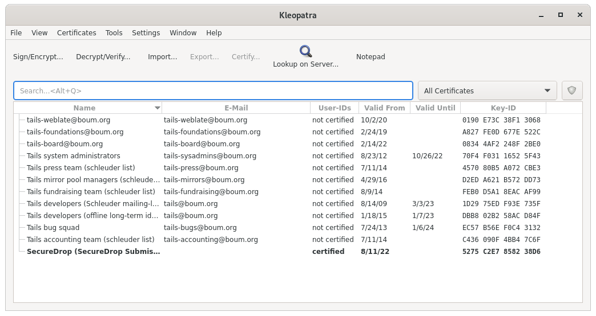
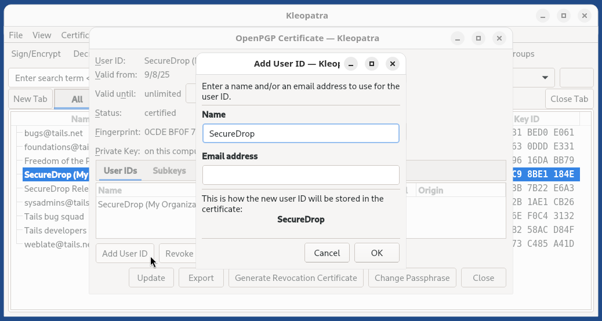
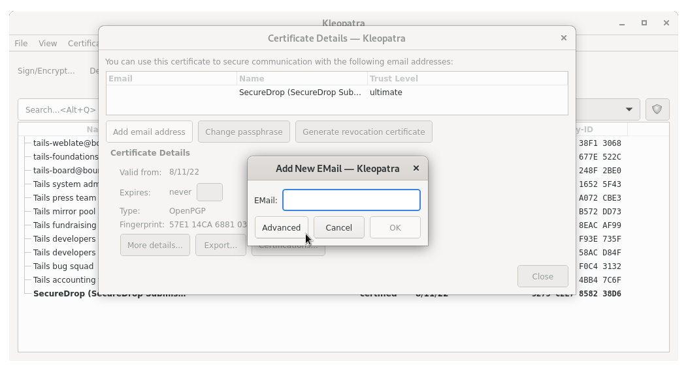
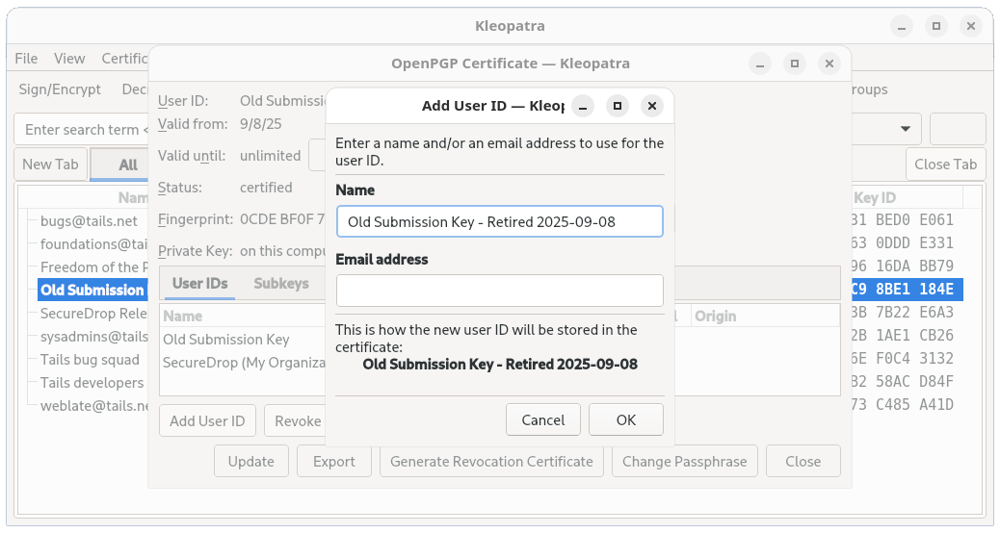
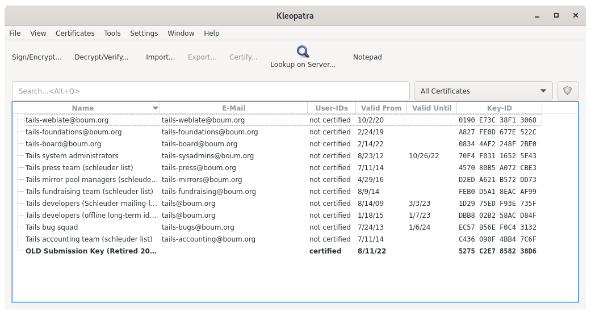
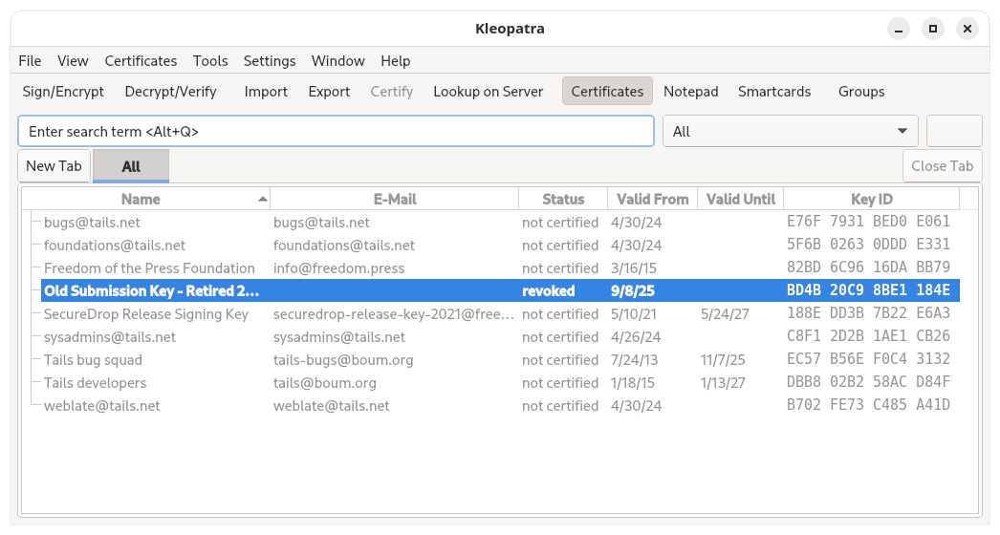

Off-board Administrators and Journalists
========================================

When journalists and SecureDrop administrators leave your organization, it is
important to off-board them from SecureDrop.

**What you need:**

- An *Admin Workstation*. :ref:`Contact SecureDrop Support <getting_support>` or
  follow our :doc:`guide to rebuilding an Admin Workstation <../maintenance/rebuild_admin>`
  if you do not have one.
- An admin account on the Journalist Interface

.. important:: Additional measures may need to be taken if the
   user's departure is on unfriendly terms. These measures will vary
   depending on the circumstances and your own internal incident response
   procedures, and may include doing a full reinstall of SecureDrop.
   If you are in such a situation, feel free to
   :ref:`contact us <getting_support>` for further assistance.

Off-boarding checklist
----------------------

- :ref:`Inform the SecureDrop Support <getting_support>` team that the user should be removed from any support Signal groups, and indicate if any new staff
  members should be added.
- Delete the user's account on the *Journalist Interface*.
- Retrieve *Admin Workstation* or *Journalist Workstation* USB drive(s),
  *Transfer*, *Export*, and *Backup* drive(s), and any other SecureDrop
  hardware or materials.
- If the user receives email alerts (OSSEC alerts or daily submission
  notifications), either directly or as a member of an email alias, remove them
  from those alerts and :ref:`set up someone new <ossec_guide>` to
  :ref:`receive those alerts <daily_journalist_alerts>`.
- (Circumstance-dependent) If you have specific concerns that the *Submission
  Key* has been compromised, you should consider a full reinstall of
  SecureDrop. At minimum, you should :ref:`rotate the Submission Key
  <rotate_submission_key>`.

Additional steps for off-boarding administrators
------------------------------------------------

- If the departing user was your primary SecureDrop admin, designate the next
  person who will take over their function. Ideally, your outgoing
  administrator will be able to provide as much training as possible on the use
  and maintenance of the system, as well as on your organizational policies
  (such as backup strategies, and so on) before they leave; if this is not the
  case, :ref:`contact the SecureDrop Support team <getting_support>`.
- We do not recommend enabling remote management for SecureDrop's network
  firewall. However, if your SecureDrop firewall can be accessed remotely, even
  if only from within your organization's network, you may want to rotate its
  login credentials.
- Back up and :ref:`rotate the Admin Workstation SSH key <rotate_ssh_key>` to
  prevent unauthorized SSH access to the *Application* and *Monitor Servers* in
  the event that this user has retained their Admin SSH credentials.

.. _rotate_ssh_key:

Rotate SSH keys on the SecureDrop Servers
~~~~~~~~~~~~~~~~~~~~~~~~~~~~~~~~~~~~~~~~~

If you are concerned that the user may have a copy of the *Admin
Workstation* USB or that they may have kept a copy of the *Admin Workstation*
SSH key, you should rotate the key in the following manner.

#.  Create a new SSH keypair.
    From an *Admin Workstation*, run

    .. code:: sh

      ssh-keygen -t rsa -b 4096

    and make sure to change the key name. This is the only parameter you need
    to change. For example, instead of ``/home/amnesia/.ssh/id_rsa``, call the
    key ``/home/amnesia/.ssh/newkey``. You don't need a passphrase for the key.

    .. _ssh_add_pubkey:

#.  Copy new public key to the SecureDrop Servers.
    Copy the public portion of the key to the *Application* and *Monitor
    Servers* by running

    .. code:: sh

      scp -O /home/amnesia/.ssh/newkey.pub scp://app

    and

    .. code:: sh

      scp -O /home/amnesia/.ssh/newkey.pub scp://mon

#.  Add this key to the list of authorized keys.
    SSH to the *Application Server* and append this new key to the list of
    authorized keys by using

    .. code:: sh

      cat newkey.pub >> ~/.ssh/authorized_keys

    Be sure to use the command as above so that you append the key, instead of replacing the file. While you are still on the *Application Server*, you can then delete the file ``newkey.pub`` from wherever you scp'd it to (i.e. your home directory). Repeat this process with the *Monitor Server*.

#.  Rename SSH keys.
    Exit all SSH sessions and, on your *Admin Workstation*, rename ``id_rsa`` and ``id_rsa.pub`` (the old SSH keys) to something else. For example,

    .. code:: sh

      mv /home/amnesia/.ssh/id_rsa /home/amnesia/.ssh/id_rsa_old
      mv /home/amnesia/.ssh/id_rsa.pub /home/amnesia/.ssh/id_rsa_old.pub

    Then, rename your ``newkey`` and ``newkey.pub`` to ``id_rsa`` and ``id_rsa.pub``.

#.  Test SSH connection.
    Test that you can still ssh into the *Application and Monitor Servers* (you
    can test with ``ssh app host`` and ``ssh mon host``).

#.  Restrict SSH access to the new key.

      .. important:: If you have other users who also have SSH access to the
         *Application* and *Monitor Servers*, the next step will revoke their
         access. Their public keys will have to be re-appended to the
         ``authorized_keys`` file on each server, as in step 3.

   From an *Admin Workstation*, run

    .. code:: sh

      securedrop-admin reset_admin_access

   This removes all other SSH keys, except for the new key that you are
   currently using, from the list of authorized keys on the *Application* and
   *Monitor Servers*.

.. _rotate_submission_key:

Rotate the *Submission Key*
---------------------------

The *Submission Private Key* is held on the airgapped *Secure Viewing Station*,
and is not normally accessed by SecureDrop users anywhere but on the *SVS*.
Therefore, we recommend rotating the *Submission Key* under the following
circumstances:

- If the user's departure was not amicable
- If the user is still holding on to any *Secure Viewing Station* USB drive or
  backup
- If you have any other reason to believe the *Submission Private Key* or the
  entire *Secure Viewing Station* USB may have been copied or compromised.

You should still keep the old key on the *Secure Viewing Station*, or else you
will not be able to decrypt submissions that were sent to you while that key
was in effect.

**You will need:**

- The *Admin Workstation*
- The *Secure Viewing Station*
- A *Transfer Device* (LUKS-encrypted USB drive)

On the Secure Viewing Station
~~~~~~~~~~~~~~~~~~~~~~~~~~~~~

#. From the *Secure Viewing Station* Apps Menu, choose **Accessories ▸
   Kleopatra**, and select the *Submission Key* from the list of available
   keys.

   |select securedrop key|

#. From the details view that appears, click the **Add User ID** button.

   |key details|

#. Set the name field to "Old SecureDrop Submission Key - Retired ", and add the date of retirement.
   Click **OK** to add this information to the key.

   |edit key name|

   .. note:: This is a local-only change to stop you from mixing up
          the old and new keys

#. Return to the Terminal, then run:

   .. code:: sh

      gpg --list-keys

   In the output, locate the Retired SecureDrop Submission Key. It should
   look similar to this:

   .. code:: text

      pub   rsa4096/0x1CB396626CA370AB 2022-08-16 [SC]
            Key fingerprint = 6A7F 116B 3C22 4F36 7275 236A 1CB3 9662 6CA3 70AB
      uid         [ultimate] OLD SecureDrop Submission Key (Retired 2022-08-16)
      uid         [ultimate] SecureDrop (SecureDrop Submission Key)
      sub   rsa4096/0x228C92459E3D16DE 2022-08-16 [E]

   Make note of the ID of the key, which is the portion of the key after the slash
   in the first line. In this example, the key ID would be: ``0x1CB396626CA370AB``

#. Generate a revocation certificate, by running the command below
   (replacing ``<KEY_ID>`` with the ID you noted in the step above):

   .. code:: sh

      gpg --output revoke.asc --gen-revoke <KEY_ID>

   This will launch an interactive prompt, where you can supply the following
   values:

   .. code:: text

      Create a revocation certificate for this key? (y/N) y
      Please select the reason for the revocation:
        0 = No reason specified
        1 = Key has been compromised
        2 = Key is superseded
        3 = Key is no longer used
        Q = Cancel
      (Probably you want to select 1 here)
      Your decision? 2
      Enter an optional description; end it with an empty line:
      > <Just Press Enter>
      Reason for revocation: Key is superseded
      (No description given)
      Is this okay? (y/N) y
      ASCII armored output forced.
      Revocation certificate created.

#. Import the revocation certificate:

   .. code:: sh

      gpg --import revoke.asc

#. Return to Kleopatra, and make sure the key is now marked as **Revoked**.

   |revoked|

#. Now :doc:`follow the instructions <../installation/generate_submission_key>`
   to create a PGP key on the *Secure Viewing Station*. This will be your new
   *Submission Key.* Copy the fingerprint and new *Submission Public Key* to
   your *Transfer Device*.

On the Admin Workstation
~~~~~~~~~~~~~~~~~~~~~~~~

 .. important:: Ensure that your *Admin Workstation* is
    :doc:`up-to-date <../maintenance/update_tails_usbs>` before performing
    these steps.

#. Take the *Transfer Device* with the new *Submission Public Key* and
   fingerprint to your *Admin Workstation*. As you did during the initial
   install, copy the public key, ``SecureDrop.asc``, to the
   ``~/.config/securedrop-admin`` directory, replacing the existing public
   key file that is there.

#. From a Terminal, run:

    .. code:: sh

      securedrop-admin sdconfig

   If the new public key that you placed in ``~/.config/securedrop-admin``
   has the same name as the old public key, ``SecureDrop.asc``, the
   only part of the configuration you will change is the SecureDrop
   *Submission Key* fingerprint, which you will update with the fingerprint
   of your new key.

#. Once you have completed the above, run:

    .. code:: sh

     securedrop-admin install

   to push the changes to the server.

   You may want to immediately create a test submission, then use a
   Journalist account to log into the *Journalist Interface*, download
   your submission, and take it to the *Secure Viewing Station*.

Return to the Secure Viewing Station
~~~~~~~~~~~~~~~~~~~~~~~~~~~~~~~~~~~~

#. On the *Secure Viewing Station,* decrypt the test submission you made to
   ensure that your new key is working properly.

#. **Do not delete your old submission key!** You'll want to maintain it on
   the *SVS* so that you can still decrypt old submissions that were made
   before you changed keys.

#. If you have any other *Admin Workstations*, make sure that you have copied
   the new *Submission Public Key* into the ``~/.config/securedrop-admin``
   directory, replacing the old public key file, and updated the *Submission
   Public Key* fingerprint by running

   .. code:: sh

    securedrop-admin sdconfig

   and updating the fingerprint when prompted. You do not have to run
   ``securedrop-admin install`` again, since you have already pushed the
   changes to the server.
   
   
Rotate Onion services keys
--------------------------

There are a three pairs of authenticated onion service keys that are used to
secure access to various resources within a SecureDrop environment. These are:

* Keys to access the Journalist interface
* Keys to access the *Application Server* when SSH-over-Tor is enabled, and
* Keys to access the *Monitor Server* when SSH-over-Tor is enabled

To rotate these credentials, you can follow the steps below. 

.. note::

   Rotating the authenticated onion service keys will not change the Onion
   addresses for the services. Your *Source Interface* and *Journalist
   Interface* addresses will remain the same.

#. Prepare your *Admin Workstation* to generate new keys: 
   
First, delete the existing `app-journalist.auth_private` (containing the *Journalist Interface* private key and onion address) and `app-sourcev3.ths` (containing the *Source Interface* address):
   .. code:: sh

    rm ~/.config/securedrop-admin/app-journalist.auth_private
    rm ~/.config/securedrop-admin/app-sourcev3.ths
    
Then, move `tor_v3_keys.json` (which contains the keypairs for the *Journalist Interface* and the servers) to delete the original and leave a backup version of the file:

    .. code:: sh

    mv ~/.config/securedrop-admin/tor_v3_keys.json ~/.config/securedrop-admin/tor_v3_keys.json.bak
    
#. Generate new keys on your *Admin Workstation*:

   .. code:: sh
   
    securedrop-admin generate_v3_keys
    
#. Push the new keys to your SecureDrop server:

   .. code:: sh
   
    securedrop-admin install
    
   .. important::

      If you have SSH-over-Tor enabled, the first install run **will fail**
      midway through the run, due to the keys for SSH getting swapped out. This
      is expected. When you see this failure message, you need to do the following:
   
      1. Open the ``~/.config/securedrop-admin/tor_v3_keys.json`` file and locate the new private keys for both the *Application* and *Monitor Server* SSH access. They will be marked ``"app_ssh_private_key"`` and ``"mon_ssh_private_key"``.
   
      2. Open the ``~/.config/securedrop-admin/app-ssh.auth_private`` file, and replace the previous key (the last portion of the line, directly following ``:x25519:``) with the new key. 
   
      3. Repeat the process for ``~/.config/securedrop-admin/mon-ssh.auth_private``
   
      4. Reboot your *Admin Workstation*
   
      5. SSH into each server and confirm access
   
      6. Repeat the ``securedrop-admin install`` command, which should complete successfully this time
    
#. Configure your *Admin Workstation* to use the new keys:

   .. code:: sh
    
    securedrop-admin localconfig
    
   and reboot when prompted.
   
#. Confirm you can login to the *Journalist Interface*

#. Clean up leftover backup files

   .. code:: sh
   
    rm ~/.config/securedrop-admin/tor_v3_keys.json.bak
    rm ~/.config/securedrop-admin/app-journalist.auth_private.bak
    rm ~/.config/securedrop-admin/app-sourcev3.auth_private.bak
   
#. Update the keys on *Journalist Workstation*, *SecureDrop Workstation*,
   or other *Admin Workstation* drives.
    
      * For *Journalist Workstation* drives, copy:
   
        .. code:: sh
   
         ~/.config/securedrop-admin/app-journalist.auth_private
    
        from your *Admin Workstation* to a *Transfer Device*, then copy it
        to the corresponding location on the *Journalist Workstation*. Apply
        the changes via:
    
        .. code:: sh
     
         securedrop-admin localconfig
     
        and reboot when prompted. Once rebooted, verify that you can login to the
        *Journalist Interface*.
   
      * For *Admin Workstation* drives, copy: 
   
        .. code:: sh
   
         ~/.config/securedrop-admin/app-journalist.auth_private
         ~/.config/securedrop-admin/app-ssh.auth_private
         ~/.config/securedrop-admin/mon-ssh.auth_private
         ~/.config/securedrop-admin/tor-v3-keys.json
    
        from the original *SecureDrop Workstation* to a *Transfer Device*, then copy
        it to the corresponding location on the other *Admin Workstation.* Apply
        the changes via:
   
        .. code:: sh
   
         securedrop-admin localconfig
    
        and reboot when prompted. Once rebooted, verify that you can login to the
        *Journalist Interface*, and connect to both the *App* and *Mon* servers via
        SSH.
   
      * For *SecureDrop Workstation*, manually copy the *Journalist Interface* details from the *Admin Workstation* to the configuration file in ``dom0`` and then apply the changes as
        `outlined here. <https://workstation.securedrop.org/en/stable/admin/install/troubleshoot.html#failed-to-import-journalist-interface-details>`__
   
        Make sure to run:
   
        .. code:: sh
   
         sdw-admin --apply
    
        to apply the changes. Then, verify you are able to login to SecureDrop Inbox.

.. _getting_support:

Getting Support
---------------

If you have any questions about the steps in this guide, we're here to help:

.. include:: ../../includes/getting-support.txt
