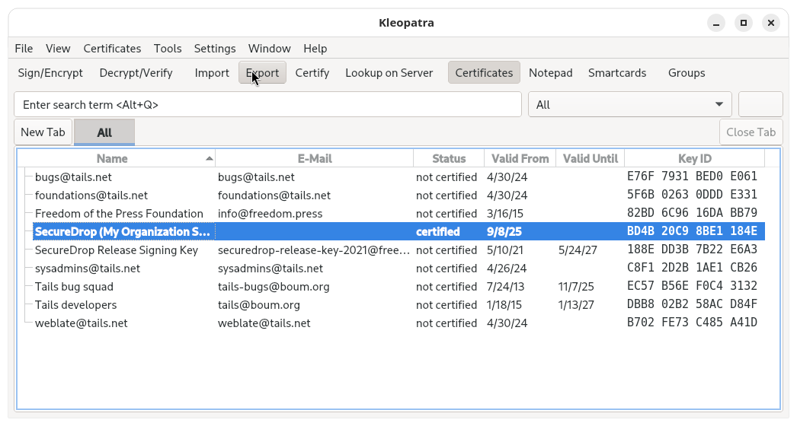
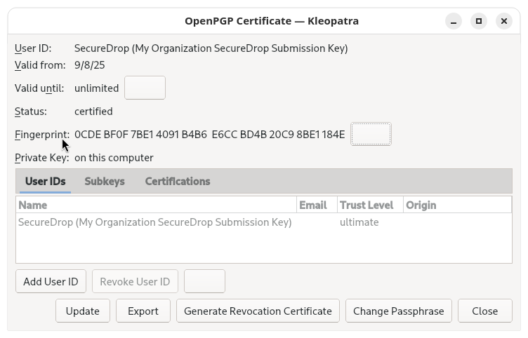

# Generate the Submission Key

% These instructions will be replaced with whatever mechanism the all-on-Qubes SecureDrop Workstation uses to generate the submission key.

When a Source sends a message or file via SecureDrop, it is automatically encrypted with the instance's [Submission Key](#glossary_submission_key). The private part of this key is only stored in an isolated qube on the SecureDrop Workstation which is never connected to the Internet. Messages and files sent through SecureDrop can only be decrypted on a SecureDrop Workstation using this key.

We will now generate the Submission Key. If you aren't still logged into your Secure Viewing Station from the previous step, boot it using its Tails USB flash drive, with persistence enabled.

:::{important}
The private key you will generate in the following steps is one of the most important secrets associated with your SecureDrop installation. This procedure is intended to ensure that the private key is protected by the air-gap throughout its lifetime.
:::

## Create the key

01. Navigate to **Apps ▸ System Tools ▸ Console** to open a terminal .

02. In the terminal, run `gpg --full-generate-key`:

    

03. When it says **Please select what kind of key you want**, choose "*(1) RSA and RSA (default)*".

04. When it asks **What keysize do you want?**, type `4096`.

05. When it asks **Key is valid for?**, press Enter. This means your key does not expire.

06. It will let you know that this means the key does not expire at all and ask for confirmation. Type **y** and hit Enter to confirm.

    

07. Next it will prompt you for user ID setup. Use the following options: - **Real name**: "SecureDrop" - **Email address**: leave this field blank - **Comment**: `[Your Organization's Name] SecureDrop Submission Key`

08. GPG will confirm these options. Verify that everything is written correctly. Then type `O` for `(O)kay` and hit enter to continue:

    

09. A box will pop up (twice) asking you to type a passphrase. Since the key is protected by the encryption on the Tails persistent volume, it is safe to simply click **OK** without entering a passphrase.

10. The software will ask you if you are sure. Click **Yes, protection is not needed**.

11. Wait for the key to finish generating.

## Export the Submission Public Key

Navigate to **Apps ▸ Accessories ▸ Kleopatra** to open a graphical interface to manage GPG keys. Once Kleopatra opens you will find a list of keys, including the SecureDrop Submission Key you just created.

Click to select the key, then click the "Export…" button in the toolbar above.

Save the key to the *Transfer Device* by changing the location to `/media/amnesia/Transfer Device`, then set the filename to `SecureDrop.asc`. Once that is set, click the *Save* button to finish exporting the key to the transfer device.

:::{note}
This is the public key only.
:::

After exporting the public key, you will be returned back to the list of keys. You'll need to provide the fingerprint of the Submission Key during the installation. Go ahead and double-click on the Submission Key, then write down the 40 hexadecimal digits under *Fingerprint*.

:::{note}
Your fingerprint will be different from the one in the example screenshot.
:::

At this point, you are done with the Secure Viewing Station for now. You can shut down Tails, grab the Admin Workstation USB flash drive, and move over to your regular workstation.
