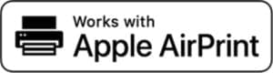
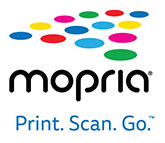
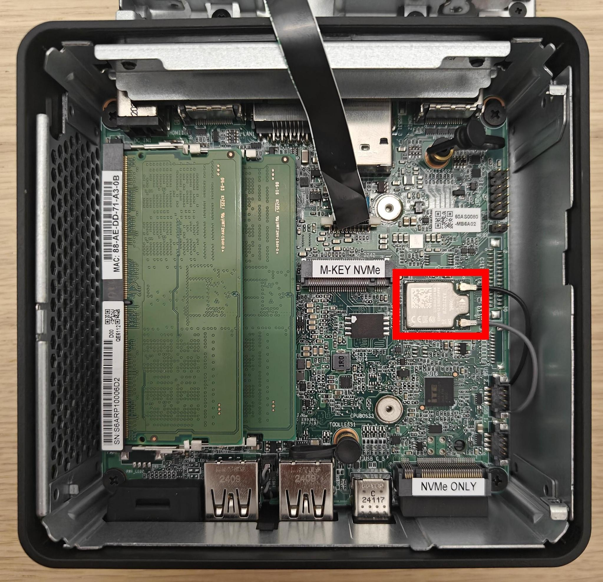
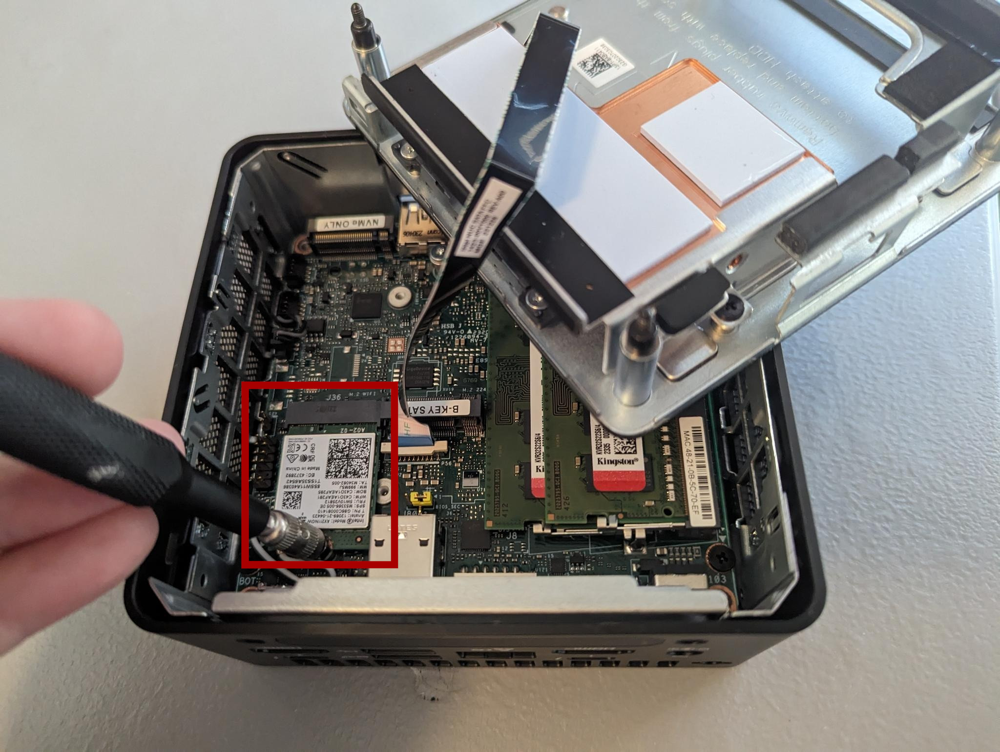
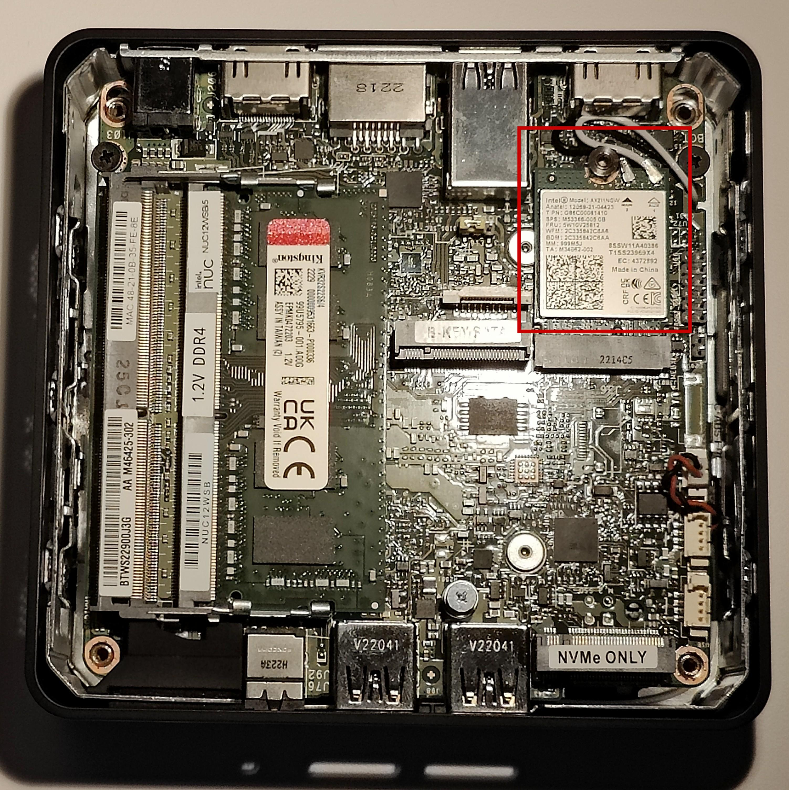
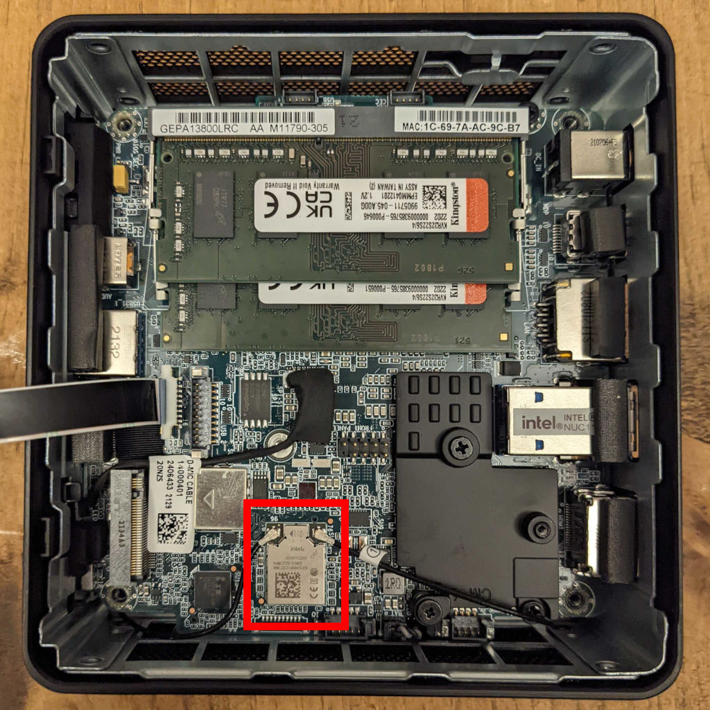

.. _hardware_guide:
.. _hardware:

Hardware
========

This document outlines the required hardware components necessary to
successfully install and operate a SecureDrop instance, and recommends
some specific components that we have found to work well. If you have
any questions, please :ref:`contact the SecureDrop Support team <getting_support>`.

Hardware Overview
-----------------

.. _Required Hardware:

For an installation of SecureDrop, you must acquire:

* 2 computers (with storage drives) to use as the SecureDrop servers.
* A mouse, keyboard, and monitor (along with any necessary dongles or adapters) for
  installing the servers.
* At least 1 dedicated physical laptop for the *SecureDrop Workstation*.
* A dedicated network firewall with at least 4 NICs.
* At least 3 ethernet cables.
* At least 1 USB drive one for the Ubuntu Server and Qubes OS installation media,
  and at least 1 more USB drive if needed as an *Export Device*.

.. _Optional Hardware:

Additionally, you may want to consider the following purchases:

* a printer without wireless network support, to use in combination with the
  *SecureDrop Workstation*.
* an external hard drive for server backups.
* a USB drive to store backups of your *SecureDrop Workstation*
* a security key for HOTP authentication, such as a YubiKey, if you want to
  use hardware-based two-factor authentication instead of a mobile app.
* a USB drive with a physical write protection switch, or a USB write blocker,
  if you want to mitigate the risk of introducing malware from your network to
  your *SecureDrop Workstation* during repeated use of an *Export Device*.
* CD-R/DVD-R writers, if you want to use CD-Rs/DVD-Rs as export
  media, and a CD shredder that can destroy media consistent with your threat
  model.

.. tip::

    While a printer is not required, we highly recommend it. Printing documents
    is generally far safer than copying them in digital form. See our
    guide to working with documents for more information.

Advice for users on a tight budget
----------------------------------
If you cannot afford to purchase new hardware for your
SecureDrop instance, we encourage you to consider
re-purposing existing hardware to use with SecureDrop. If
you are comfortable working with hardware, this is a great
way to set up a SecureDrop instance for cheap.

Since SecureDrop's throughput is significantly limited by
the use of Tor for all connections, there is no need to use
top of the line hardware for any of the servers or the
firewall.

Additionally, we recommend against re-purposing Apple Macintosh
laptops and desktops, due to incompatibility with Qubes OS.

If you choose to use recycled hardware, you should of course
consider whether or not it is trustworthy; making that
determination is outside the scope of this document.

.. _Hardware Recommendations:

Required Hardware
-----------------

Servers
^^^^^^^

These are the core components of a SecureDrop instance.

* *Application Server*: 1 physical server to run the SecureDrop web services.

* *Monitor Server*: 1 physical server which monitors activity on the
  *Application Server* and sends email notifications to an admin.

* *Network Firewall*: 1 physical computer that is used as a dedicated firewall
  for the SecureDrop servers.

An acceptable alternative that requires more technical expertise is
to :doc:`configure an existing hardware firewall <network_firewall>`.

We are often asked if it is acceptable to run SecureDrop on
cloud servers (e.g. Amazon EC2, DigitalOcean, etc.) or on dedicated
servers in third-party datacenters instead of on dedicated hardware
hosted in the organization. This request is generally motivated by a
desire for cost savings and/or convenience. However: we consider it
**critical** to have dedicated physical machines hosted within the
organization for both technical and legal reasons:

* While the documents are stored encrypted at rest (via PGP) on the
  SecureDrop *Application Server*, the documents hit server memory
  unencrypted (unless the source used the GPG key provided to
  encrypt the documents first before submitting), and are then
  encrypted in server memory before being written to disk. If the
  machines are compromised then the security of source material
  uploaded from that point on cannot be assured. The machines are
  hardened to prevent compromise for this reason. However, if an
  attacker has physical access to the servers either because the
  dedicated servers are located in a datacenter or because the
  servers are not dedicated and may have another virtual machine
  co-located on the same server, then the attacker may be able to
  compromise the machines. In addition, cloud servers are trivially
  accessible and manipulable by the provider that operates them. In
  the context of SecureDrop, this means that the provider could
  access extremely sensitive information, such as the plaintext of
  submissions or the encryption keys used to identify and access
  the onion services.

* In addition, attackers with legal authority such as law
  enforcement agencies may (depending on the jurisdiction) be able
  to compel physical access, potentially with a gag order attached,
  meaning that the third party hosting your servers or VMs may be
  legally unable to tell you that law enforcement has been given
  access to your SecureDrop servers.

One of the core goals of SecureDrop is to avoid the potential
compromise of sources through the compromise of third-party
communications providers. Therefore, we consider the use of
virtualization for production instances of SecureDrop to be an
unacceptable compromise and do not support it. Instead, dedicated
servers should be hosted in a physically secure location in the
organization itself. While it is technically possible to modify
SecureDrop's automated installation process to work on virtualized
servers (for example, we do so to support our CI pipeline), doing so
in order to run it on cloud servers is at your own risk and without
our support or consent.

Workstations
^^^^^^^^^^^^

In order to install and use *SecureDrop Workstation*, you will need a Qubes-compatible computer with the following specifications:

- 64-bit Intel processor with virtualization support
- a minimum of 32GB RAM
- sufficient disk space for the Qubes OS base install and SecureDrop Workstation VMs (a 128GB or greater SSD is recommended)

More information on hardware compatibility can be found on the `Qubes OS System Requirements <https://www.qubes-os.org/doc/system-requirements/>`_ page.

USB
~~~

SecureDrop Workstation only supports printing over USB, so ensure the printer you select has a **USB port**.

.. note::
  In rare cases, an AirPrint or Moipra-compatible printer with a USB port may not actually support IPP-over-USB, which is required for SecureDrop to use the printer. Check with the manufacturer if in doubt. 

Offline
~~~~~~~

To maintain the isolation of SecureDrop Workstation, it is essential that your printer not be shared with other computers and networks. 

* Select a compatible printer with **no WiFi**. A printer that connects with USB only is best if you can find one, but compatible USB printers lacking *both* Ethernet and WiFi are rare. 
* In the case of a printer with Ethernet and/or WiFi, **keep the printer offline** and **disabling WiFi** (if present).
* Use this printer exclusively with SecureDrop Workstation and do not connect it directly to other computers.

Two-factor Device
^^^^^^^^^^^^^^^^^
Two-factor authentication is used when connecting to different parts of the
SecureDrop system. Each admin and each journalist needs a two-factor
device. We currently support two options for two-factor authentication:

* Your existing smartphone with an app that computes TOTP codes
  (e.g. FreeOTP `for Android <https://play.google.com/store/apps/details?id=org.fedorahosted.freeotp>`__ and `for iOS <https://apps.apple.com/us/app/freeotp-authenticator/id872559395>`__).

* A dedicated hardware dongle that computes HOTP codes (e.g. a
  `YubiKey <https://www.yubico.com/setup/>`__).

.. include:: ../../includes/otp-app.txt

Export Device(s)
^^^^^^^^^^^^^^^^
Journalists need physical media (known as the
*Export Device*) to copy submissions to their everyday workstation.

Our standard recommendation is to use USB drives, in combination with
volume-level encryption and careful data hygiene. Our documentation, including
the :doc:`journalist guide <../../journalist/journalist>`, is based on this approach. 
We also urge the use of a secure printer or similar analog conversions to 
export documents from the *SecureDrop Workstation*, whenever possible.

You may want to consider enforcing write protection on USB drives when only read
access is needed, or you may want to implement a workflow based on CD-Rs or
DVD-Rs instead. We encourage you to evaluate these options in the context of
your own threat model.

Please find some notes regarding each of these methods below, and see our
recommendations in the :doc:`setup guide <set_up_transfer_and_export_device>`
for additional background.

USB drives
~~~~~~~~~~

We recommend using one or multiple designated USB drives as the *Export
Device(s)*. Whether one or multiple drives are appropriate depends on the number
of journalists accessing the system, and on whether the team is distributed
or not.

Our documentation explains how the *Export Device* can be encrypted using VeraCrypt (which works
across platforms). We have not evaluated hardware-based encryption options; if
you do select a hardware solution, make sure that the *Export Device* also works
on the operating system(s) used by journalists.

We also recommend buying an additional USB drive for making regular backups of
your *SecureDrop Workstations*.

One thing to consider is that you are going to have *a lot* of USB drives to
keep track of, so you should consider how you will label or identify them and
buy drives accordingly. Drives that are physically larger are often easier to
label (e.g. with tape, printed sticker or a label from a labelmaker).

USB drives with write protection (optional)
~~~~~~~~~~~~~~~~~~~~~~~~~~~~~~~~~~~~~~~~~~~
When it is consistently applied and correctly implemented in hardware, write
protection can prevent the spread of malware from the computers used to read
files stored on an *Export Device*.

It is especially advisable to enable write protection before attaching an
*Export Device* to an everyday workstation that lacks the security protections
of the Tails operating system.

The two main options to achieve write protection of USB drives are:

- drives with a built-in physical write protection switch
- a separate USB write blocker device as used in forensic applications.

DVD-Rs or CD-Rs
~~~~~~~~~~~~~~~
Single-use, write-once media can be used to realize an export
workflow that is always one-directional: files are exported
from the *SecureDrop Workstation* and the media used to do so are destroyed.

If you want to realize such a workflow, we recommend purchasing separate drives
for each computer that will write to or read from the media, to minimize the
risks from malware compromising any one drive's firmware.

You will also need a stack of blank DVD/CD-Rs, which you can buy anywhere, and a
method to securely destroy media after use. Depending on your threat model, this
can be very expensive; a cheap shredder can be purchased for less than $50,
while shredders designed for use in Sensitive Compartmented Information
Facilities (SCIFs) sell for as much as $3,000.

Monitor, Keyboard, Mouse
^^^^^^^^^^^^^^^^^^^^^^^^
You will need these to do the initial installation of Ubuntu on the
*Application* and *Monitor Servers*.

Optional Hardware
-----------------

This hardware is not *required* to run a SecureDrop instance, but most
of it is still recommended.

Printers
^^^^^^^^

There are several requirements for a printer to be compatible with SecureDrop Workstation. Your printer should:

1. Support **driverless printing** standards
2. Have a **USB port**
3. Be offline, or at least have **no WiFi**

These requirements are expanded below.

Driverless
~~~~~~~~~~

*SecureDrop Workstation* implements driverless IPP printing to support a large selection of modern printers. Compatible printers can be easily identified by their support for the Apple AirPrint or Moipra standards:

You may consult Apple's `list of printers that support AirPrint <https://support.apple.com/en-us/HT201311#printers>`_, Moipra's `list of certified products <https://mopria.org/certified-products>`_, or OpenPrinting's `list of printers supporting driverless printing <https://openprinting.github.io/printers/>`_.

Backup Storage
^^^^^^^^^^^^^^

It's useful to run periodic backups of the servers in case of failure. We
recommend buying an external hard drive to store server backups.

.. include:: ../../includes/encrypting-drives.txt

.. _SecureBoot:

SecureBoot
----------

SecureBoot is a feature available on most systems that, when enabled,
does not allow any operating system to boot that has not been signed by a
trusted key. By only booting to operating systems that are properly signed,
you can be sure that the OS itself has not been corrupted or tampered with,
at least at the boot level.

While preparing your hardware for a SecureDrop installation, you will want to
make sure SecureBoot is disabled for *SecureDrop Workstations* as well as
the Servers.

For instructions on how to enable or disable the SecureBoot feature for your
device, please consult the manufacturer's manual for BIOS settings, as they
differ for each make and model.

SecureBoot for Workstations
^^^^^^^^^^^^^^^^^^^^^^^^^^^

SecureBoot is not fully supported by Qubes OS, and should therefore be
disabled prior to installation.

SecureBoot for Servers
^^^^^^^^^^^^^^^^^^^^^^

**SecureBoot must be disabled on the server hardware.** During the installation,
SecureDrop installs a hardened, security-focused version of the Linux kernel 
(grsec) that does not support SecureBoot. If SecureBoot is enabled on either of
the servers during the install, you will receive a pre-install error reminding
you that it must be turned off before the installation can proceed.

.. _Specific Hardware Recommendations:

Specific Hardware Recommendations
---------------------------------

We recommend against a device that requires an external USB keyboard or other externally-connected devices, for security reasons. In practice this usually means that you should run SecureDrop Workstation on a Qubes-compatible laptop. Not all laptops support Qubes, and some may require additional customization. We recommend (in order) either a Qubes-certified laptop, one of the laptop models we use for development and testing, or a computer from the community-maintained Qubes Hardware compatibility list.

Qubes-certified laptops
^^^^^^^^^^^^^^^^^^^^^^^

Qubes-certified laptops are certified and tested against Qubes major releases. They must support additional security features beyond the minimal requirements above, such as the use of `coreboot <https://www.coreboot.org/>`_ in place of proprietary firmware. Where possible, we recommend that you use a Qubes-certified laptop with ``coreboot`` for SecureDrop Workstation. A full list of certified computers can be found on the `Qubes OS Certified Hardware <https://www.qubes-os.org/doc/certified-hardware/>`_ page.

        .. note:: Some certified computers also support the use of `Heads <https://osresearch.net>`_ with ``coreboot``, for additional protection against advanced attacks during the boot process. Heads adds a layer of complexity to the overall user experience, but may make sense for you as an option if you have an expectation of those kinds of threats. If you have questions about Heads, or other hardware choices, contact us via Signal`_.

FPF-tested laptops
^^^^^^^^^^^^^^^^^^
In addition to Qubes-certified devices, we develop and test using Qubes-compatible laptops from other vendors. The following models may be used for SecureDrop Workstation, though some level of additional configuration may be required.

.. _framework_13_series:

Framework 13 (Intel Core Ultra Series 1)
~~~~~~~~~~~~~~~~~~~~~~~~~~~~~~~~~~~~~~~~

The Framework 13 laptop with an Intel Core Ultra Series 1 processor is a recommended option for the SecureDrop Workstation beginning with Qubes 4.2. 

You can either order a preassmbled system, or you can customize your build and assemble the laptop yourself once it is delivered, which is useful as either a cost-saving measure or in the event that you wish to customize the ports or internal components.

Framework laptops are designed to be repairable, customizable, and user-servicable, and have grown to be a popular choice with Qubes users and SecureDrop developers.

You will want to ensure you are using the latest BIOS version available. Instructions for checking the BIOS version and performing an upgrade for the Intel Core Ultra Series 1 models can be found on `this page in the Framework knowledgebase. <https://knowledgebase.frame.work/framework-laptop-bios-and-driver-releases-intel-core-ultra-series-1-H1nZQdxYR>`_

.. note::

    You'll want to be sure to install Qubes OS using the kernel-latest option, available from the initial boot menu (GRUB) prior to booting to the Qubes OS installer.

Framework 13 (13th-generation)
~~~~~~~~~~~~~~~~~~~~~~~~~~~~~~

The Framework 13 laptop with a 13th generation Intel processor is a recommended option for the SecureDrop Workstation beginning with Qubes 4.2. 

You can either order a preassmbled system, or you can customize your build and assemble the laptop yourself once it is delivered, which is useful as either a cost-saving measure or in the event that you wish to customize the ports or internal components.

Framework laptops are designed to be repairable, customizable, and user-servicable, and have grown to be a popular choice with Qubes users and SecureDrop developers.

You will want to ensure you are using the latest BIOS version available. Instructions for checking the BIOS version and performing an upgrade for the 13th generation models can be found `here in the Framework knowledgebase. <https://knowledgebase.frame.work/framework-laptop-bios-and-driver-releases-13th-gen-intel-core-BkQBvKWr3>`_

.. _thinkpad_x_series:

Lenovo ThinkPad X1 Carbon (10th-generation)
~~~~~~~~~~~~~~~~~~~~~~~~~~~~~~~~~~~~~~~~~~~

The 10th-generation ThinkPad X1 Carbon **with a 12th-generation Intel Core processor** is a recommended option for the SecureDrop Workstation beginning with Qubes 4.1. If you plan to use it, you will want to ensure the BIOS is up-to date by following these instructions: :ref:`general_BIOS_update`.

You'll need to have a USB-to-Ethernet adapter on hand in order to :ref:`apply Qubes updates <apply_dom0_updates>`, which will enable Wi-Fi and fix glitchy video rendering and cursor performance.

.. _thinkpad_t_series:

Lenovo ThinkPad T14 (2nd-generation)
~~~~~~~~~~~~~~~~~~~~~~~~~~~~~~~~~~~~

The 2nd-generation ThinkPad T14 **with an 11th-generation Intel Core processor** is a recommended option for the SecureDrop Workstation beginning with Qubes 4.1. If you plan to use it, you will want to ensure the BIOS is up-to date by following these instructions: :ref:`general_BIOS_update`.

The Ethernet and Wi-Fi controllers may not work without one-time manual configuration, as documented here.

The Qubes Hardware Compatibility List (HCL)
~~~~~~~~~~~~~~~~~~~~~~~~~~~~~~~~~~~~~~~~~~~

The `Qubes Hardware Compatibility List (HCL) <https://www.qubes-os.org/hcl/>`_
is a community-maintained list of hardware that has been tested by Qubes users.
It consists of individual reports generated and submitted by Qubes users across
the world. Anyone can attempt to install Qubes on their computer, then report
back on whether or not it can be installed, if there are any issues, and overall,
what the experience is like.

There are some benefits to this list:

* A much wider selection of hardware is tested, because anyone can contribute to the list
* There are sometimes multiple reports for a particular system, which lets you compare and feel confident the results are consistent
* It tells you exactly what is and isn't working within the system, so you can decide if a device you own will function well enough to suit your needs
* Devices get tested across many different configurations and Qubes versions

However, there are some things to consider:

* Reports are not verified for their accuracy by either the Qubes team or Freedom of the Press Foundation
* Reports correspond to a specific Qubes OS version, and may not reflect breaking changes or expanded hardware support in the most recent Qubes OS version
* It's important that you update the BIOS of your laptop prior to installing SecureDrop Workstation: for more details see :ref:`general_BIOS_update`

For the best experience, we recommend choosing a Qubes-certified laptop, or a
laptop that we have directly tested (in that order); however, if none of those
suit your needs, or if you want to see if your existing hardware might be
Qubes compatible, the HCL is a good choice.

Application and Monitor Servers
^^^^^^^^^^^^^^^^^^^^^^^^^^^^^^^

We recommend using NUCs for the servers and routinely test new models for compatibility.
NUCs ("Next Unit of Computing") are comparatively inexpensive, compact, quiet,
and low-power devices, which makes them suitable for deployment in a wide range
of environments. Originally produced by Intel, ASUS has taken over production
beginning with the 14th generation.

There are a `variety of models <https://www.asus.com/us/content/nuc-overview/>`__
to choose from. We currently recommend the 11th through 13th generation NUC models listed below.

.. note:: If using non-recommended hardware, ensure you remove as much
    extraneous hardware as physically possible from your servers. This
    could include: speakers, cameras, microphones, fingerprint readers,
    wireless, and Bluetooth cards.
    
.. note:: If using non-recommended hardware, you may require drivers that
    are not available in the kernel that ships by default in the version 
    of Ubuntu Server we recommend. In this event, you may need to select the
    Hardware Enablement Kernel (HWE) during boot, which supports more recent
    hardware. To do so, select the "Boot and Install with the HWE Kernel"
    option in the boot menu for Ubuntu Server.

NUCs typically come as kits, and some assembly is required. You will need to
purchase the RAM and hard drive separately for each NUC and insert both into the
NUC before it can be used. We recommend:

-  2x 240GB SSDs (2.5" or M.2, depending on your choice of kit)
-  1x memory kit of compatible 2x8GB sticks
   -  You can put one 8GB memory stick in each of the servers.

.. _nuc14_recommendation:

14th-gen NUC
~~~~~~~~~~~~
We have tested and can recommend the `ASUS NUC14RVH <https://www.asus.com/us/displays-desktops/nucs/nuc-mini-pcs/asus-nuc-14-pro/>`__.
It provides both 22x80 and 22x42 M.2 ports for NVMe SSD storage, as well as a 2.5 inch drive bay for a SATA hard
drive or SSD (if using this slot, we recommend choosing an SSD).

The NUC14's AX211 wireless hardware is not removable. Before installation of the
RAM and storage, we recommend that you disconnect the wireless antennae leads
from the AX211 component. They're the wires highlighted in the red box in
the picture. Cover the free ends with electrical tape after disconnecting them.

  The location of the wireless card within the NUC14

.. note:: The wireless card is located underneath the NVMe port

.. _nuc13_recommendation:

13th-gen NUC
~~~~~~~~~~~~
We have tested and can recommend the `ASUS NUC13ANHi5 <https://www.asus.com/us/displays-desktops/nucs/nuc-mini-pcs/asus-nuc-13-pro/>`__.
It provides two M.2 SSD storage options: a 22x80 port for an NVMe drive, and a 
22x42 port for a SATA drive. It also has a 2.5 inch drive bay for a SATA hard
drive or SSD (if using this slot, we recommend choosing an SSD).

The NUC13's AX211 wireless hardware is removable. Doing so requires the use of
a 5mm nut driver. Before installation of the RAM and storage, we recommend that
you remove the wireless card and disconnect the wireless antennae leads
from the AX211 component. Be sure to cover the free ends with electrical tape
after disconnecting them.

  The location of the wireless card within the NUC13
  
.. note:: The wireless card is located underneath the 22x80 NVMe port

.. _nuc12_recommendation:

12th-gen NUC
~~~~~~~~~~~~
We have tested and can recommend the `NUC12WSKi5 <https://www.asus.com/us/displays-desktops/nucs/nuc-mini-pcs/nuc-12-pro-mini-pc/techspec/>`__.
It provides two M.2 SSD storage options: a 22x80 port for an NVMe drive, and a 
22x42 port for a SATA drive.

The NUC12's AX211 wireless hardware is removable. Doing so requires the use of
a 5mm nut driver. Before installation of the RAM and storage, we recommend that
you remove the wireless card and disconnect the wireless antennae leads
from the AX211 component. Be sure to cover the free ends with electrical tape
after disconnecting them.

  The location of the wireless card within the NUC12
  
.. _nuc11_recommendation:

11th-gen NUC
~~~~~~~~~~~~
We have tested and can recommend the `Intel NUC11PAHi3 <https://www.asus.com/us/displays-desktops/nucs/nuc-kits/nuc-11-performance-kit/techspec/>`__.
It provides two storage options: M.2 SSD storage and a 2.5" secondary storage
option (SSD or HDD).

The NUC11's AX201 wireless hardware is not removable. Before installation of the
RAM and storage, we recommend that you disconnect the wireless antennae leads
from the AX201 component. They're the black wires highlighted in the red box in
the picture. Cover the free ends with electrical tape after disconnecting them.

|NUC11 leads|

Before the initial OS installation, boot into the BIOS by pressing **F2** at
startup and adjust the system configuration:

- Under **Advanced ▸ Onboard Devices**, disable all onboard devices
  other than LAN: HD audio, microphone, Thunderbolt, WLAN, Bluetooth,
  SD card controller, and enhanced consumer infrared.

- Under **Boot ▸ Secure Boot**, disable **Secure Boot** using the drop-down menu.

.. note:: Unlike some previous generation NUCs we recommended, the NUC11PAHi3
      does not support SGX. However, if you use a different type of 11th
      generation NUC that does have SGX support, disable it under **Security
      ▸ Security Features**, as it is not used by SecureDrop but may be targeted
      by active CPU exploits.

.. _nuc10_recommendation:

10th-gen NUC
~~~~~~~~~~~~
We previously recommended the NUC10i5FNH, however it is now end-of-life so we
recommend replacing it with a version that the manufacturer supports. While SecureDrop
will most likely continue working in the short-term, we will no longer be testing on
this hardware.

8th-gen NUC
~~~~~~~~~~~~
We previously recommended the NUC8i5BEK, however it is now end-of-life so we
recommend replacing it with a version that the manufacturer supports. While SecureDrop
will most likely continue working in the short-term, we will no longer be testing on
this hardware.

.. _nuc7_recommendation:

7th-gen NUC
~~~~~~~~~~~~
We previously recommended the NUC7i5BNH, however it is now end-of-life so we
recommend replacing it with a version that the manufacturer supports. While SecureDrop
will most likely continue working in the short-term, we will no longer be testing on
this hardware.

Export Device(s)
^^^^^^^^^^^^^^^^^^^^^^^^^^^^^^^^^^^^^^^
For USB drives with physical write protection, we have tested the `Kanguru SS3 <https://www.kanguru.com/products/kanguru-ss3>`__,
and it works well with and without encryption.

If you want to use a setup based on CD-Rs or DVD-Rs, we've found the CDR/DVD
writers from Samsung and LG to work reasonably well; you can find some examples
`here <https://www.newegg.com/External-CD-DVD-Blu-Ray-Drives/SubCategory/ID-420>`__.

Please see our recommendations in the :doc:`setup guide <set_up_transfer_and_export_device>`
for additional background.

Network Firewall
^^^^^^^^^^^^^^^^

We recommend a 4 NIC network firewall and currently provide setup instructions for pfSense and OPNSense. Suitable models include:

* the `Protectli Vault 4-Port <https://protectli.com/vault-4-port/>`__, running `OPNSense <https://opnsense.org/>`__ configured with `coreboot <https://www.coreboot.org/>`__.
* the `Netgate SG-4100 <https://shop.netgate.com/products/4100-base-pfsense>`__
  running `pfSense Plus <https://www.pfsense.org/>`__.
* the `Netgate SG-6100 <https://shop.netgate.com/products/6100-base-pfsense>`__
  running `pfSense Plus <https://www.pfsense.org/>`__. This device is overspecced for SecureDrop's purposes, but can be used if the other cheaper firewalls can't be procured.

Hardware End-of-Life
^^^^^^^^^^^^^^^^^^^^

No matter what hardware you decide to use, it's important to be mindful of
how long it will continue to receive security updates. Given the security
requirements for a SecureDrop instance, any hardware that is no longer
receiving security updates from the manufacturer will become more and more
vulnerable over time. Once your hardware has reached its end-of-life (EOL),
we recommend upgrading to newer, supported hardware.

For the hardware we recommend, you can find a list of end-of-life dates below:

===================  ====================================================
Hardware             End-of-Life (EOL)
===================  ====================================================
ASUS NUC14RVH        Not yet confirmed
ASUS NUC13ANHi5      Not yet confirmed
Intel NUC12WSKi5     April 05, 2026
Intel NUC11PAHi3     September 30, 2026                                                                                      
Thinkpad T Series    EOL dates vary; consult with manufacturer           
TekLager APU4D4      Not yet confirmed
Netgate SG-4100      Not yet confirmed (will be 2 years after sales stop)
Netgate SG-6100      Not yet confirmed (will be 2 years after sales stop)
===================  ====================================================
