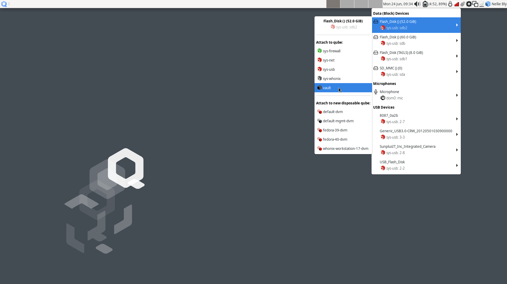
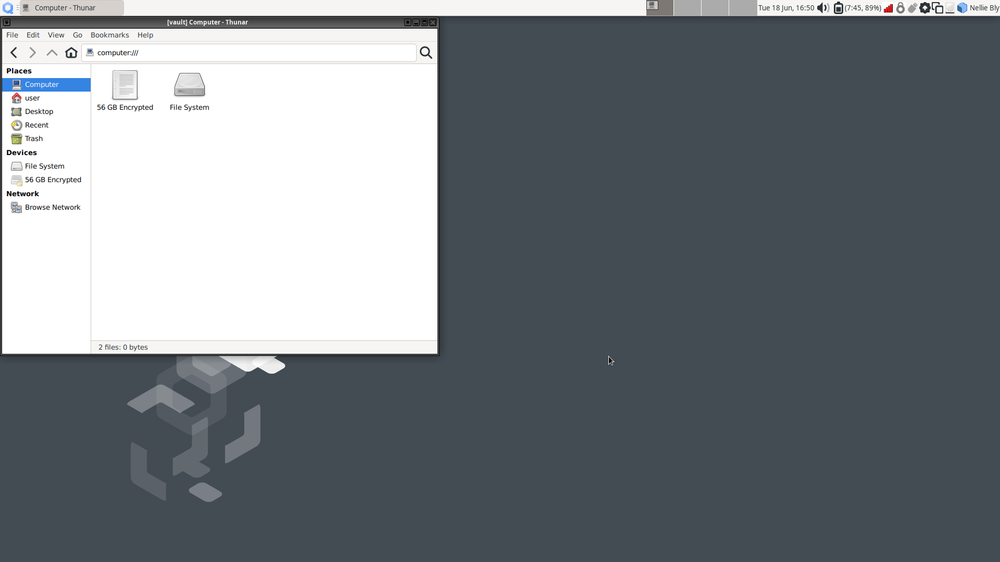

Installing SecureDrop Workstation
=================================

.. _download_rpm:

Download SecureDrop Workstation Packages
~~~~~~~~~~~~~~~~~~~~~~~~~~~~~~~~~~~~~~~~

First, you must configure the Qubes-Contrib repo, then download the SecureDrop Workstation packages.

- Make sure that network connection is enabled using the network manager widget in the upper right panel.

- Next, in a ``dom0`` terminal (|qubes_menu| **▸** |qubes_menu_gear| **▸ Other ▸ Xfce Terminal**):

  .. code-block:: sh

    sudo qubes-dom0-update -y qubes-repo-contrib
    sudo qubes-dom0-update --clean -y securedrop-workstation-keyring

- The SecureDrop Relase keyring will be installed on your machine. Wait 15 seconds for the key to be imported into the ``rpm`` database. Then:

  .. code-block:: sh

    sudo qubes-dom0-update --clean -y securedrop-workstation-dom0-config
    sudo dnf -y remove qubes-repo-contrib

Configure SecureDrop Workstation
~~~~~~~~~~~~~~~~~~~~~~~~~~~~~~~~

Now you can proceed with configuring the SecureDrop Workstation with the correct *Journalist Interface* details and submission private key.

Import Submission Private Key
-----------------------------

In order to decrypt submissions, you will need a copy of the
`Submission Private Key <https://docs.securedrop.org/en/stable/glossary.html#submission-key>`_
from your SecureDrop instance's Secure Viewing Station.

To protect this key and preserve the air gap, you will need to connect the SVS USB to a Qubes VM with no network access, and copy it from there to ``dom0``. You cannot directly copy and paste to the ``dom0`` VM from another VM - instead, follow the steps below:

- First, use the network manager widget in the upper right panel to disable your network connection. These instructions refer to the ``vault`` VM, which has no network access by default, but if the SVS USB is attached to another VM by mistake, this will offer some protection against exfiltration.

- Next, choose |qubes_menu| **▸ Apps ▸ vault ▸ Thunar File Manager** to open the file manager in the ``vault`` VM.

- Connect the SVS USB to a USB port on the Qubes computer, then use the devices widget in the upper right panel to attach it to the ``vault`` VM. There will be three entries for the USB in the section titled **Data (Block) Devices**. Choose the *unlabeled* entry (*not* the one labeled "TAILS") annotated with a ``sys-usb`` text that ends with a number, like ``sys-usb:sdb2``. That is the persistent volume.

  |Attach TailsData|

- In the the ``vault`` file manager, select the persistent volume's listing in the lower left sidebar. It will be named ``N GB encrypted``, where N is the size of the persistent volume. Enter the SVS persistent volume passphrase to unlock and mount it. When asked if you would like to forget the password immediately or remember it until you logout, choose the option to **Forget password immediately**.

  .. note::

    You will receive a message that says **Failed to open directory "TailsData"**. This is normal behavior and will not cause any issues with the subsequent steps.

  |Unlock TailsData|

- Open a ``dom0`` terminal via |qubes_menu| **▸** |qubes_menu_gear| **▸ Other ▸ Xfce Terminal**. Once the terminal window opens, run the following command to import the submission key:

  .. code-block:: sh 

      sdw-admin --configure

  Follow the command prompts to complete submission key import. 

  .. note::
    If there are multiple keys present on the device, ``sdw-admin --configure`` will print the fingerprints of those keys for you to select which to use as the submission private key. You can open ``<source interface address>.onion/metadata`` in Tor Browser on another network-connected computer to check the correct key fingerprint used by your SecureDrop instance.

- Once the submission key import is complete, in the ``vault`` file manager, right-click on the **TailsData** sidebar entry, then select **Unmount** and disconnect the SVS USB.

- If you were prompted for a passphrase during import, you will now need to remove the passphrase on ``sd-journalist.sec``. See :doc:`/admin/workstation_reference/removing_gpg_passphrase`.

.. _copy_journalist:

Import *Journalist Interface* details
-------------------------------------

SecureDrop Workstation connects to your SecureDrop instance's API via the *Journalist Interface*. In order to do so, it will need the *Journalist Interface* address and authentication info. As the clipboard from another VM cannot be copied into ``dom0`` directly, follow these steps to copy the file into place:

- Locate an *Admin Workstation* or *Journalist Workstation* USB drive. Both hold the address and authentication info for the *Journalist Interface*; if you also want to copy the journalist user's password database, use the *Journalist Workstation* USB drive.

- Connect the USB drive to a USB port on the Qubes computer, then use the devices widget in the upper right panel to attach it to the ``vault`` VM. There will be 3 listings for the USB in the widget: one for the base USB, one for the Tails partition on the USB, labeled ``Tails``, and a 3rd unlabeled listing, for the persistent volume. Choose the third listing.

- In the the ``vault`` file manager, select the persistent volume's listing in the lower left sidebar. It will be named ``N GB encrypted``, where N is the size of the persistent volume. Enter the persistent volume passphrase to unlock and mount it. When prompted, select the option to **Forget password immediately**.

- In the ``dom0`` terminal, proceed with the next import step of the ``sdw-admin`` command or re-run 

  .. code-block:: sh 

      sdw-admin --configure 

  The command will print out the imported *Journalist Interface* details to confirm before proceeding.

- If you used an *Admin Workstation* USB drive, or you don't intend to copy a password database to this workstation, safely disconnect the USB drive now. In the ``vault`` file manager, right-click on the **TailsData** sidebar entry, then select **Unmount** and disconnect the USB drive.

Copy SecureDrop login credentials
~~~~~~~~~~~~~~~~~~~~~~~~~~~~~~~~~

Users of SecureDrop Workstation must enter their username, passphrase and two-factor code to connect with the SecureDrop server. You can manage these passphrases using the KeePassXC password manager in the ``vault`` VM. If this laptop will be used by more than one journalist, we recommend that you shut down the ``vault`` VM now (using the Qube widget in the upper right panel), skip this section, and use a smartphone password manager instead.

In order to set up KeePassXC for easy use:

- Add KeePassXC to the application menu by selecting it from the list of available apps in |qubes_menu| **▸ Apps ▸ vault ▸ Settings ▸ Applications** and pressing the button labeled **>** (do not press the button labeled **>>**, which will add *all* applications to the menu).

- Launch KeePassXC via |qubes_menu| **▸ Apps ▸ vault ▸ KeePassXC**. When prompted to enable automatic updates, decline. ``vault`` is networkless, so the built-in update check will fail; the app will be updated through system updates instead.

- Close the application.

.. important::

   The *Admin Workstation* password database contains sensitive credentials not required by journalist users. Make sure to copy the credentials from the *Journalist Workstation* USB.

In order to copy a journalist's login credentials:

- If a *Journalist Workstation* USB is not currently attached, connect it, attach it to the ``vault`` VM, open it in the file manager, and enter its encryption passphrase.

- Locate the password database. It should be in the ``Persistent`` directory, and will typically be named ``keepassx.kdbx`` or similar.

- Open a second ``vault`` file manager window (``Ctrl + N`` in the current window) and navigate to the **Home** directory.

- Drag and drop the password database to copy it.

- In the ``vault`` file manager, right-click on the **TailsData** sidebar entry, then select **Unmount** and disconnect the *Journalist Workstation* USB. Close this file manager window.

- In the file manager window that displays the home directory, open the copy you made of the password database by double-clicking it.

- If the database is passwordless, KeePassXC may display a security warning when opening it. To preserve convenient passwordless access, you can protect the database using a key file, via **Database ▸ Database settings ▸ Security ▸ Add additional protection ▸ Add Key File ▸ Generate**. This key file has to be selected when you open the database, but KeePassXC will remember the last selection.

- Inspect each section of the password database to ensure that it contains only the information required by the journalist user to log in.

- Close the application window and shut down the ``vault`` VM (using the Qube widget in the upper right panel). At this time, you can also re-enable the network connection using the network manager widget.

Install SecureDrop Workstation (estimated wait time: 60-90 minutes)
~~~~~~~~~~~~~~~~~~~~~~~~~~~~~~~~~~~~~~~~~~~~~~~~~~~~~~~~~~~~~~~~~~~~~

- Configure infinite scrollback for your terminal via **Edit ▸ Preferences ▸ General ▸ Unlimited scrollback**. This helps to ensure that you will be able to review any error output printed to the terminal during the installation.

- Finally, in the ``dom0`` terminal, run the command:

  .. code-block:: sh

    sdw-admin --apply

This command will take a considerable amount of time and approximately 4GB of bandwidth, as it sets up multiple VMs and installs supporting packages. When the command finishes, reboot the machine to complete the installation. Your SecureDrop Workstation is finally ready to use!

Test the Workstation
~~~~~~~~~~~~~~~~~~~~

The preflight updater will start automatically after logging into the system. Please follow the preflight updater's instructions. 

  .. note::

    If you close the SecureDrop Client during your session, you can launch it again using the SecureDrop icon on the desktop. 

Once the update check is complete, the SecureDrop Client will launch. Log in using an existing journalist account and verify that sources are listed and submissions can be downloaded, decrypted, and viewed.

(Optional) Enable the SecureDrop App
~~~~~~~~~~~~~~~~~~~~~~~~~~~~~~~~~~~~

By default, you will receive the SecureDrop Client, our original tool for journalists to access the sources,
messages, and attachments within SecureDrop. Our newest tool, `the SecureDrop App  <https://github.com/freedomofpress/securedrop-client/tree/main/app#readme>`_, can be enabled manually during the initial roll-out period. After this period is complete, the SecureDrop App will become the new default.

If you would like to switch to the SecureDrop App immediately, you can follow these steps:

1. Ensure your system is completely up-to-date using the preflight updater.

2. In a ``dom0`` terminal, edit the ``config.json`` file by running:

  .. code-block:: sh

    nano /usr/share/securedrop-workstation-dom0-config/config.json
    
  You will need to add a line that reads ``"app": true,``. Your final config 
  should look similar to the example below:
    
  .. code-block:: sh
  
    {
      "app": true,
      "submission_key_fpr": "65A1B5FF195B56353CC63DFFCC40EF1228271441",
      "hidserv": {
        "hostname": "sdolvtfhatvsysc6l34d65ymdwxcujausv7k5jk4cy5ttzhjoi6fzvyd.onion",
        "key": "5U4JPYSZ34N2ZDSOUAL2YLEX2NPI5BLL2Y66QJW24KLSH7R3FEPQ"
      },
      "environment": "prod",
      "vmsizes": {
        "sd_app": 10,
        "sd_log": 5
      }
    }
    
  .. hint::

    Be sure to include the ``,`` at the end of the line containing ``"app": true,``

3. Apply the changes by running:

  .. code-block:: sh

    sdw-admin --apply
    
4. When prompted, reboot your SecureDrop Workstation.

After logging in again, you should now be able to click the SecureDrop icon on the Desktop to launch the
SecureDrop App.

If you encounter an issue or would like to use the original SecureDrop Client,
you can access it for a limited time via |qubes_menu| **▸** |qubes_menu_gear| 
**▸ Other ▸ SecureDrop Client (legacy)**.

.. _Password Management Section:

Enable password copy and paste
~~~~~~~~~~~~~~~~~~~~~~~~~~~~~~
If you use KeePassXC in the ``vault`` VM to manage login credentials, you can enable the user to copy passwords to the SecureDrop App using inter-VM copy and paste. While this is relatively safe, we recommend reviewing the section :doc:`Managing Clipboard Access <../workstation_reference/managing_clipboard>` of this guide, which goes into further detail on the security considerations for inter-VM copy and paste.

The password manager runs in the networkless ``vault`` VM, and the SecureDrop App runs in the ``sd-app`` VM. To permit this one-directional clipboard use, issue the following command in ``dom0``:

.. code-block:: sh

   qvm-tags vault add sd-send-app-clipboard

Confirm that the tag was correctly applied using the ``ls`` subcommand:

.. code-block:: sh

   qvm-tags vault ls

To revoke this configuration change later or correct a typo, you can use the ``del`` subcommand, e.g.:

.. code-block:: sh

   qvm-tags vault del sd-send-app-clipboard
   

.. |qubes_menu| image:: ../../images/qubes_menu.png
  :alt: Qubes Application menu
.. |qubes_menu_gear| image:: ../../images/qubes_menu_gear.png
  :alt: System Tools 
