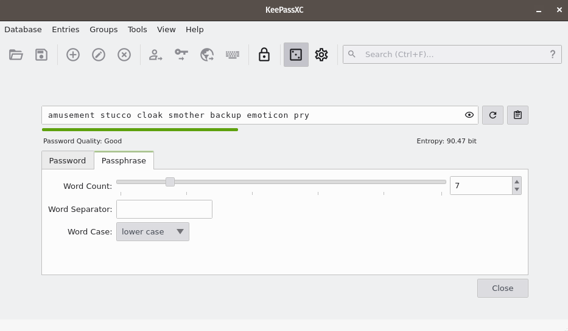

Installation Overview
=====================

Migrating from a Tails-Based SecureDrop
---------------------------------------

If you are migrating from an older Tails-based SecureDrop, using the separate *Secure Viewing Station*, *Journalist Workstation* and *Admin Workstation* USB drives, then skip to the :ref:`Migration Overview<migration_overview>`.

Setting Expectations
--------------------

SecureDrop is a technical tool. It is designed to protect journalists and sources, but no tool can guarantee safety. This guide will instruct you in installing and configuring SecureDrop, but it does not explain how to use it safely and effectively. Put another way: at the end of this guide, you will have built a car; you will not know how to drive. The :ref:`Deployment Guide <deployment>` contains best practices for working with SecureDrop. Make sure to read it after completing the installation.

Setting up SecureDrop is a multi-step process, where each step builds on the steps that come before it. It's important that you treat the installation as a complete process, making sure not to skip any portions of the install guide or jump ahead to later content.

Once you have all the necessary hardware, :doc:`setting up SecureDrop <install>` will take at least a day's work.

We recommend that you set aside at least a week to :ref:`complete and test <Deployment>` your setup.

Tracking your progress
----------------------

To assist in the installation process, we offer a `SecureDrop Installation Worksheet`_, which you can print out and complete as you go. Only complete this worksheet on paper, never electronically.

It is **critical** that you destroy this worksheet when your installation is complete and all of your  passphrases have been safely stored in a password manager.

.. warning:: Remember to destroy the `SecureDrop Installation Worksheet`_ after the
             installation is complete.

.. _`SecureDrop Installation Worksheet`: https://docs.google.com/a/freedom.press/document/d/18RMAzhx1XCgpmw366I8tItBXQTzkFy_i_D0c605DTS8/edit?usp=sharing

Technical Summary
-----------------

This installation guide will walk you through the process of setting up
the computers and services needed for a functional SecureDrop.

During this process, you'll set up at least four devices:

- *SecureDrop Workstation*:
   A laptop running the QubesOS operating system configured as a *SecureDrop Workstation*, that you use to install and administer SecureDrop on the servers via SSH. If necessary (i.e. in a small newsroom), the same *SecureDrop Workstation* used for administration may be used by journalists to decrypt, view, and export submitted documents. For a larger newsroom, you may set up additional *SecureDrop Workstations* as needed for journalist use.
- *Application Server*:
   An Ubuntu server running two segmented Tor hidden services. The source connects to the *Source Interface*, a public-facing Tor Onion Service, to send messages and documents to the journalist. The journalist connects to the *Journalist Interface*, an `authenticated Tor Onion Service <https://community.torproject.org/onion-services/advanced/client-auth/>`__, using the SeucreDrop App on a SecureDrop Workstation to   download encrypted documents and respond to sources.
- *Monitor Server*:
   An Ubuntu server that monitors the *Application Server* with `OSSEC <https://www.ossec.net/>`__ and sends email alerts.
- Network Firewall
   A hardware firewall dedicated to your SecureDrop installation. 

A summary of the major steps is as follow:

#. Acquire compatible hardware.
#. Prepare email accounts and GPG keys for alert e-mails.
#. Prepare a primary *SecureDrop Workstation* laptop.
#. Set up the KeePassXC password manager on the primary *SecureDrop Workstation*.
#. Install and configure the dedicated network firewall from the primary *SecureDrop Workstation*. 
#. Prepare the (*Application* and *Monitor*) servers.
#. Install SecureDrop on the servers from the primary *SecureDrop Workstation*.
#. Complete local configuration of the primary *SecureDrop Workstation*.
#. Create the first Admin user.
#. Test the installation.

Optionally:
#. Prepare additional *SecureDrop Workstations* for use by journalists.
#. Prepare encrypted USB *Export Drives*.

Minimum security requirements for the SecureDrop environment
------------------------------------------------------------

-  The *Application* and *Monitor Servers* should be dedicated physical machines, not virtual machines.
-  A trusted location to host the servers. The servers should be hosted in a location that is owned or occupied by the organization to ensure that their legal department can not be bypassed with gag orders.
-  The SecureDrop servers should be on a separate internet connection or completely segmented from the corporate network, such as a dedicated subnet with DENY rules for all traffic to and from the corporate LAN.
-  All traffic from the corporate network should be blocked at the SecureDrop's point of demarcation.
-  Video monitoring should be recorded of the server area and the organizations safe.
-  Journalists should ensure that while using the *SecureDrop Workstation* they are in an area without video cameras.
-  An established monitoring plan and incident response plan. Who will receive the OSSEC alerts and what will their response plan be? These should cover technical outages and a compromised environment plan.

Passphrases Overview
------------------------------

Each individual with a role (admin or journalist) at a given SecureDrop instance must generate and retain a number of strong, unique passphrases. The section is an overview of the passphrases, keys, two-factor secrets, and other credentials that are required for each role in a SecureDrop installation. 

Ideally, each admin and journalist would only have to remember the passphrases to unlock the encrypted storage on their *SecureDrop Workstation* laptop.

Admin
~~~~~

The admin will be using a *SecureDrop Workstation* configured to connect to the *Application Server* and the *Monitor Server* using Tor and SSH. The tasks performed by the admin will require the following set of credentials and passphrases:

-  A passphrase for the full disk encryption of the *SecureDrop Workstation* they use.
-  Additional credentials, which we recommend adding to Tails' KeePassXC password
   manager during the installation:

   -  The *Application Server* and *Monitor Server* admin username and password
      (required to be the same for both servers).
   -  The network firewall username and password.
   -  The SSH private key and, if set, the key's passphrase.
   -  The *OSSEC Alert Public Key*.
   -  The admin's personal GPG public key, if you want to potentially encrypt
      sensitive files to it for further analysis.
   -  The account details for the destination email address for OSSEC alerts.
   -  The onion services values required to connect to the *Application* and
      *Monitor Servers*.

The admin will also need to have a way to generate two-factor authentication codes.

.. include:: ../../includes/otp-app.txt

And the admin will also have the following two credentials:

-  The secret code for the *Application Server*'s two-factor authentication.
-  The secret code for the *Monitor Server*'s two-factor authentication.

Journalist
~~~~~~~~~~

The journalist will be using a *SecureDrop Workstation* to view submissions with the SecureDrop App. The tasks performed by the journalist will require the following set of passphrases:

-  A passphrase for the full disk encryption of the *SecureDrop Workstation* they use.
-  A passphrase for the KeePassXC password manager, which unlocks the passphrase for logging into the SecureDrop App.

The journalist will also need to have a two-factor authenticator, such as an Android or iOS device with FreeOTP installed, or a YubiKey. This means the journalist will also have the following credential:

-  The secret code for the Journalist's two-factor authentication.

*Export USB*
~~~~~~~~~~~~~~~~~~~~~~~~~~~~~~~~~~~~~

We recommend using encrypted USB drives for transferring files off of the *SecureDrop Workstation*.

For every export operation, the user will need to enter the USB drive's encryption passphrase at least twice (on the computer they're copying from, and on the computer they're copying to). To make it easy for them to find the passphrase, we recommend storing it in the journalist's own existing password manager, which should be accessible using their smartphone.

If your organization is not using a password manager already, please see
the `Freedom of the Press Foundation guide <https://freedom.press/training/blog/choosing-password-manager/>`__
to choosing one.

.. _passphrase_best_practices:

Passphrase Best Practices
-------------------------

All SecureDrop users---Sources, Journalists, and Admins---are required to memorize at least one passphrase. This section describes best practices for passphrase management in the context of SecureDrop.

#. **Do** memorize your passphrase.

#. If necessary, **do** write your passphrase down temporarily while you
   memorize it.

   .. caution:: **Do** store your written passphrase in a safe place, such as a
                safe at home or on a piece of paper in your wallet. **Do**
                destroy the paper as soon as you feel comfortable that you have
                the passphrase memorized. **Do not** store your passphrase on
                any digital device, such as your computer or mobile phone.

#. **Do** review your passphrase regularly. It's easy to forget a long or
   complex passphrase if you only use it infrequently.

   .. tip:: We recommend reviewing your passphrase (e.g. by ensuring that you
            can log in to your SecureDrop account) on at least a monthly basis.

#. **Do not** use your passphrase anywhere else.

   If you use your SecureDrop passphrase on another system, a compromise of that
   system could theoretically be used to compromise SecureDrop. You should avoid
   reusing passphrases in general, but it is especially important to avoid doing
   so in the context of SecureDrop.

How to Generate a Strong, Unique Passphrase
~~~~~~~~~~~~~~~~~~~~~~~~~~~~~~~~~~~~~~~~~~~

We recommend using a unique, 7-word passphrase for each case described above. We encourage each end user to use KeePassXC, an easy-to-use password manager included in QubesOS, to generate and retain strong and unique passphrases. The SecureDrop installation includes a template that you can use to initialize this database, which will be explained when you set up your first :ref:`*SecureDrop Workstation* <keepassxc_setup>`.

*Using KeePassXC to Generate a Passphrase*
~~~~~~~~~~~~~~~~~~~~~~~~~~~~~~~~~~~~~~~~~~

To create a random passphrase using KeePassXC, launch the application,
then click the **dice icon**. Then click the **Passphrase** tab and set the
**Word Count** to 7. You can optionally set a **Word Separator**, for example a
space or hyphen.

|screenshot of KeePassXC passphrase generation feature, showing a
randomly generated 7-word passphrase|

