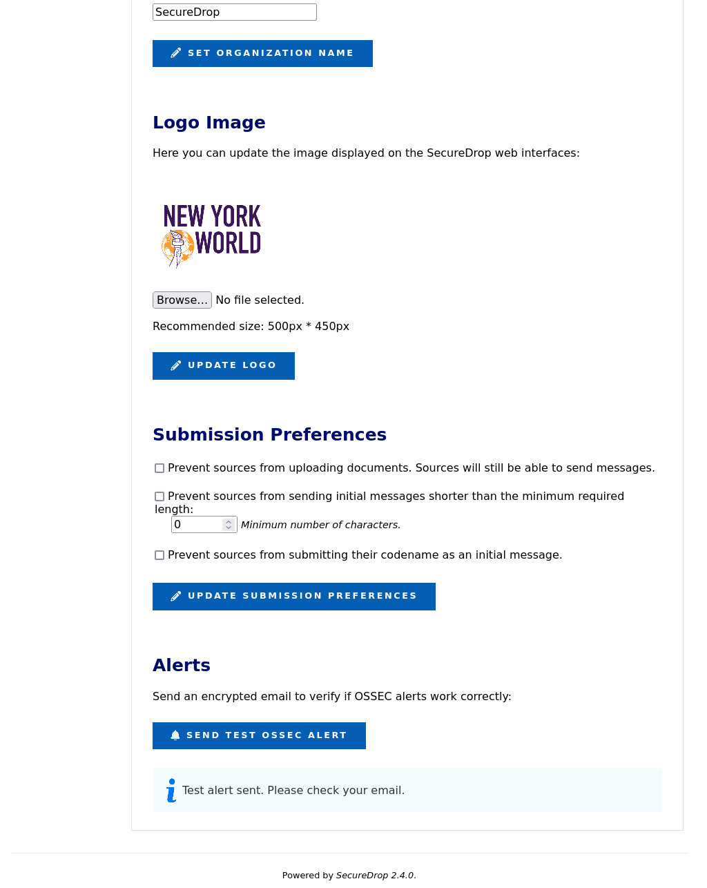
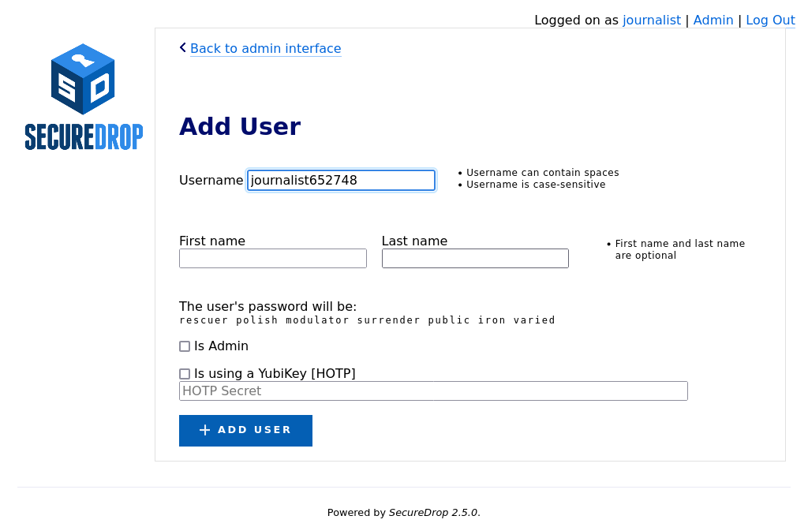

Introduction for SecureDrop Administrators
==========================================

SecureDrop servers are managed by a systems administrator.

For larger newsrooms, there may be a team of systems admins, but at least one person within the organization will need to serve as the administrator. In some situations, such as smaller news organizations where a journalist has the technical capacity to administer systems, one person can serve as both Journalist and Administrator. When possible, we advise having a dedicated staff member serving the role of SecureDrop Administrator.

The admin connects to the *Application* and *Monitor Servers* over `authenticated onion services <https://tb-manual.torproject.org/onion-services/>`__, and manages them using `Ansible <https://www.ansible.com/>`__.

If you are considering becoming a SecureDrop administrator, below are some
attributes that will be important to have:

* Experience with managing Linux-based systems from the command line.
* Proficiency with network hardware such as firewalls and switches (e.g. pfSense).
* Experience with QubesOS.
* Experience with configuration management tools such as Ansible, Salt, Chef, or Puppet.
* Ability to use and configure secure communication tools such as GPG.

We consider the first two requirements and the last three preferred attributes.

This Admin Guide will walk you through the entire experience, from planning to installation, to deployment, to ongoing maintenance.

.. _Responsibilities:

Responsibilities of SecureDrop administrators
---------------------------------------------

The SecureDrop architecture contains multiple machines and hardened servers.
While many of the installation and maintenance tasks have been automated, a
skilled Linux admin is required to responsibly run the system.

As a SecureDrop administrator, it is your responsibility to:

* :doc:`install SecureDrop </admin/installation/install>`
* :ref:`manage users <manage_users>`
* :ref:`manage the system configuration <manage_config>`
* :ref:`ensure that servers, firewall and workstations are kept up-to-date <manage_updates>`
* :ref:`monitor OSSEC alerts <monitoring_ossec>`
* :ref:`monitor the SecureDrop team's release and security-related
  communications <monitoring_comms>`
* apply available firmware updates to all SecureDrop hardware
* ensure that the SecureDrop environment is physically secure and monitored
* ensure that SecureDrop Workstations are kept up to date, and that users are aware of the importance of running pre-fight updates
* investigate and respond to security incidents
* schedule and perform required maintenance tasks, such as operating system upgrades
* ensure that SecureDrop users adhere to the documented processes for checking SecureDrop, communicating with sources, and reviewing documents
* verify the integrity of SecureDrop code
* avoid the installation of unsupported code or patches
* :doc:`decommission SecureDrop after it is no longer in use </admin//maintenance/decommission>`

Responsibilities of the SecureDrop team
---------------------------------------
The SecureDrop team employed by Freedom of the Press Foundation (FPF) and the
SecureDrop community maintain and develop the SecureDrop software, which
is offered as open source software, free of charge, and at your own risk.

FPF offers :doc:`paid priority support services </introduction/getting_support>`. We are
happy to provide assistance with installing the system, with training of
administrators and journalists, and with investigation of technical issues
and incidents.

.. note::

   Each SecureDrop instance is hosted and operated independently. Freedom of the
   Press  Foundation does not offer systems administration, hosting or "remote
   hands" services.

When the SecureDrop team becomes aware of a security vulnerability in SecureDrop
or its software dependencies, we assess the impact of the vulnerability in the
context of existing security mitigations and 
:doc:`our threat model </appendices/threat_model/threat_model>`.
Based on this assessment, we prioritize technical work and external communications.

For high severity issues that require technical changes to SecureDrop, we will
issue a point release as soon as possible. As part of issuing a release or
advisory, we will post further details on the SecureDrop website and to the support
portal.

In rare circumstances when a technical fix is extremely time sensitive, we may
provide signed patches to impacted SecureDrop instances. Even in these cases, we
ask that you never install code provided to you that is not signed using the
current `SecureDrop release key <https://securedrop.org/securedrop-release-key.asc>`__.

When in doubt how to resolve an issue, please avoid following technical
instructions that have not been vetted by the SecureDrop team. If you encounter
bugs, please `report them <https://github.com/freedomofpress/securedrop/issues/new/choose>`__.
For sensitive matters, you can contact us via the `SecureDrop Support Portal`_
or via our `contact form <https://securedrop.org/help/>`__.

.. _manage_users:

Managing Users
--------------

Admins are responsible for managing user credentials and encouraging best practices. (See
:ref:`Passphrase Best Practices<passphrase_best_practices>`.)
The admin will also have access to the *Journalist Interface*, via her own username, passphrase,
and two-factor authentication method (using a smartphone application or YubiKey).

See :ref:`User Management<User Management>` for more information on adding and managing
users.

.. _manage_config:

Managing the System Configuration
---------------------------------

Admins are responsible for configuring and maintaining the system. Several tools
are available to support this:

* :ref:`The Admin Interface<The Admin Interface>` allows the admin to manage users and configure
  web interface features such as organizations logos and submission preferences
* :ref:`Server SSH access<server SSH access>` is also available, to allow administrators to
  troubleshoot server issues and perform manual updates.
* :ref:`The securedrop-admin utility<securedrop-admin utility>` is used via the *Admin VM*
  to configure and install SecureDrop, to perform operations including server backups and restores,
  and to update the server configuration after installation.

.. _manage_updates:

Keeping the System Updated
--------------------------

The admin is responsible for ensuring that updates are applied to SecureDrop. Where possible, updates are applied automatically, but some update operations require manual intervention.

Updates: Servers
^^^^^^^^^^^^^^^^

The admin should be aware of all SecureDrop updates and take any required manual action if requested in the `SecureDrop Release Blog`_ (`RSS feed`_). We also recommend registering with the `SecureDrop Support Portal`_ to stay apprised of upcoming releases.

Most often, the SecureDrop servers will automatically update via ``apt``. However, occasionally you will need to take other manual steps. If you are in touch with us directly for :doc:`support </introduction/getting_support>`, we will let you know in advance of major releases if manual intervention will be required.

.. _`SecureDrop Release Blog`: https://securedrop.org/news
.. _`RSS Feed`: https://securedrop.org/news/feed

Updates: Network Firewall
^^^^^^^^^^^^^^^^^^^^^^^^^

Given all traffic first hits the network firewall as it faces the non-Tor public network, the admin should ensure that critical security patches are applied to the firewall.

Because of recent changes to the frequency and scope of security updates, we do not recommend the use of pfSense Community Edition (CE). pfSense Plus continues to receive necessary security updates on a regular basis, and is provided with the purchase of most Netgate firewalls. If you wish to use a custom firewall or alternate option, we recommend using an OPNSense-based solution.

If you're using one of the network firewalls recommended by FPF, you can subscribe to email updates from the `Netgate homepage`_ or follow the `Netgate blog`_ to be alerted when releases occur. If critical security updates need to be applied, you can do so through the firewall's pfSense WebGUI.

Refer to our :ref:`Keeping pfSense up to date` documentation or the official `pfSense Upgrade Docs`_ for further details on how to update the suggested firewall.

No matter which vendor you go with, you should make it a priority to stay informed of potential updates to your network firewall.

.. _`Netgate homepage`: https://www.netgate.com/
.. _`Netgate blog`: https://www.netgate.com/blog/
.. _`pfSense Upgrade Docs`: https://docs.netgate.com/pfsense/en/latest/install/upgrade-guide.html

Updates: Workstations
^^^^^^^^^^^^^^^^^^^^^

The admin should keep all SecureDrop Workstations updated.

.. _monitoring_ossec:

Monitoring OSSEC Alerts
-----------------------

SecureDrop uses OSSEC to monitor the servers for unusual activity caused by system configuration issues or security breaches. The admin should decrypt and read all OSSEC alerts. Report any suspicious events to FPF through the `SecureDrop Support Portal`_. See the :doc:`OSSEC Guide </admin/reference/ossec_alerts>` for more information on common OSSEC alerts.

.. warning:: Do not post logs or alerts to public forums without first carefully
         examining and redacting any sensitive information.

.. _`OSSEC`: https://www.ossec.net/
.. _`SecureDrop Support Portal`: https://support-docs.securedrop.org/

.. _The Admin Interface:

.. _monitoring_comms:

Monitoring SecureDrop-related communications
--------------------------------------------
Release announcements and security advisories are posted to the `SecureDrop blog <https://securedrop.org/news>`__, which is also available as an `RSS feed <https://securedrop.org/news/feed/>`__. You can also follow us on our social media accounts (`Twitter <https://twitter.com/securedrop>`__ and `Mastodon <https://securedrop.org/news/feed/>`__).

We strongly recommend :doc:`joining the SecureDrop support portal </introduction/getting_support>`. As a member of the support portal, you will receive email notifications related to all major announcements, and you can open tickets in case of technical issues. Membership is free of charge.

Installation Support
--------------------

Any organization can install SecureDrop for free and also make modifications because the project is open source.

Because the installation and operation are complex, and because SecureDrop can only be as secure as the  operational security practices followed by its users, Freedom of the Press Foundation will also help  organizations install SecureDrop and train journalists and administrators.

If you would like to work with Freedom of the Press Foundation on your SecureDrop installation, please reach out to us. We do ask news organizations that can afford to pay for installation support, training and maintenance to do so.

As part of `priority support agreements <https://securedrop.org/priority-support/>`_  and on a pro-bono basis for smaller news organizations, Freedom of the Press Foundation will visit your offices, help set up SecureDrop and train journalists to use it. (For  pro-bono support, we request that our travel costs
are covered.) 

.. include:: ../../includes/provide-feedback.txt

.. |Reset Passphrase| image:: ../../images/manual/screenshots/journalist-edit_account_user.png
   :alt: The account editing form allows admins to change name, reset passphrase, and reset two-factor authentication.

.. |SecureDrop main page| image:: ../../images/manual/screenshots/journalist-admin_index_no_documents.png
   :alt: The top navigation of the Journalist Interface says 'Logged on as Journalist' and displays an 'Admin' link.
.. |SecureDrop admin home| image:: ../../images/manual/screenshots/journalist-admin_interface_index.png
   :alt: The Admin Interface displays an 'Add User' button.

.. |Enable FreeOTP| image:: ../../images/manual/screenshots/journalist-admin_new_user_two_factor_totp.png
   :alt: The form used to enable FreeOTP displays a barcode and a two-factor secret.
.. |Enable YubiKey| image:: ../../images/manual/screenshots/journalist-admin_add_user_hotp.png
   :alt: The form used to create new users, filled with the 40-character HOTP secret key of a Yubikey.
.. |Verify YubiKey| image:: ../../images/manual/screenshots/journalist-admin_new_user_two_factor_hotp.png
   :alt: The form used to verify the setup of the Yubikey requests a 6-digit verification code.
.. |Logo Update| image:: ../../images/manual/screenshots/journalist-admin_changes_logo_image.png
   :alt: The Instance Configuration form displays 'Image updated' after the logo was updated successfully.