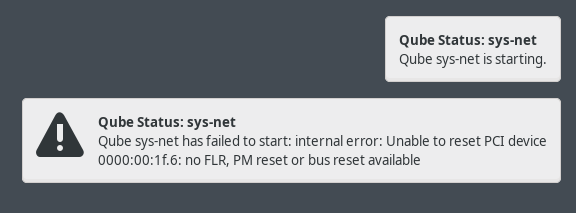

"Unable to reset PCI device"
~~~~~~~~~~~~~~~~~~~~~~~~~~~~

On some hardware, network devices (Ethernet and Wi-Fi) will not immediately work out of the box and require a one-time manual configuration on install. After Qubes starts for the first time, ``sys-net`` will fail to start:

|screenshot_sys_net_pci_reset|

Open a ``dom0`` terminal via |qubes_menu| **▸** |qubes_menu_gear| **▸ Other Tools ▸ Xfce Terminal**, and run the following command to list the devices connected to the ``sys-net`` VM.

.. code-block:: sh

  qvm-pci ls sys-net

This will return the two devices (Ethernet and WiFi) that are connected to ``sys-net``:

.. code-block:: sh

  BACKEND:DEVID  DESCRIPTION                                                            USED BY
  dom0:00_14.3   Network controller: Intel Corporation                                  sys-net
  dom0:00_1f.6   Ethernet controller: Intel Corporation Ethernet Connection (5) I219-V  sys-net

For both device IDs (e.g. ``dom0:00_1f.6`` and ``dom0:00_14.3``), you will need to detach and re-attach the device to ``sys-net``, then restart ``sys-net`` as follows:

.. code-block:: sh

  qvm-pci detach sys-net dom0:00_14.3
  qvm-pci detach sys-net dom0:00_1f.6
  qvm-pci attach sys-net --persistent --option no-strict-reset=True dom0:00_14.3
  qvm-pci attach sys-net --persistent --option no-strict-reset=True dom0:00_1f.6
  qvm-start sys-net

``sys-net`` should now start, and network devices will be functional. This change is only required once on first install.  See the `Qubes documentation of this issue <https://www.qubes-os.org/doc/pci-troubleshooting/#unable-to-reset-pci-device-errors>`_ for more information.

Full system freezes
~~~~~~~~~~~~~~~~~~~

A `known issue <https://github.com/QubesOS/qubes-issues/issues/8825>`_ with some hardware results in Qubes fully freezing.
If you encounter this issue, you will need to forcibly restart your computer, usually by holding down the power button.

When you boot up, you will see a black-and-white menu with the following options:

.. code-block:: text

  Qubes, with Xen hypervisor
  Advanced options for Qubes (with Xen hypervisor)
  UEFI Firmware Settings

While ``Qubes, with Xen hypervisor`` is selected, press :kbd:`e` to edit the option. You should now see a rudimentary
edit interface.

Find the line that starts with ``multiboot2   /xen-`` and ends with ``${xen_rm_opts}``. Use the arrow keys to move your
cursor to before ``${xen_rm_opts}`` and type :kbd:`cpufreq=xen:hwp=off` (leave a space between ``off`` and the ``$``.

Press :kbd:`Ctrl-x` to continue with booting. This will fix the current boot, we now need to make the fix permanent.

Once Qubes has started and you have logged in, open a ``dom0`` terminal via |qubes_menu| **▸** |qubes_menu_gear| **▸ Other Tools ▸ Xfce Terminal** and type
:kbd:`sudo nano /etc/default/grub` to start an editor.

Move your cursor to the bottom of the file and add: :kbd:`GRUB_CMDLINE_XEN_DEFAULT="$GRUB_CMDLINE_XEN_DEFAULT cpufreq=xen:hwp=off"`

Press :kbd:`Ctrl-x`, then :kbd:`y`, and then :kbd:`Enter` to save the file.

Finally, in the terminal run :kbd:`sudo grub2-mkconfig -o /boot/grub2/grub.cfg`. The workaround will now automatically be applied
going forwards.

.. |qubes_menu| image:: ../../images/qubes_menu.png
  :alt: Qubes Application menu
.. |qubes_menu_gear| image:: ../../images/qubes_menu_gear.png
  :alt: System Tools 