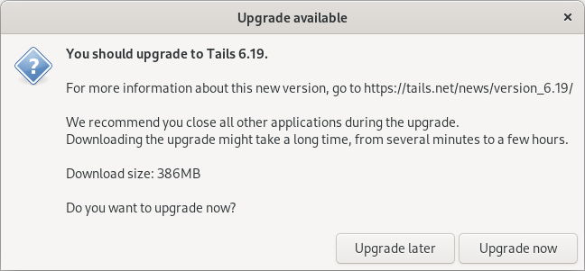

Updating Tails USBs
===================

You are responsible for keeping your Tails USBs updated.

There are two ways to perform updates: via the Tails graphical installer and manually. The manual update process will work on any Tails USB. The graphical installer requires an Internet connection to notify you when updates are available, so it is only suitable for internet-connected Tails workstations (such as the *Admin Workstation* and the *Journalist Workstation*).

Because the *Secure Viewing Station* (SVS) is airgapped, it cannot receive update notifications, so it will need to be updated manually.

.. important::
        The *SVS* stores some of SecureDrop's most sensitive data (decrypted submissions, the *Submission Private Key*), so we **strongly** encourage you to manually update the *SVS* whenever a new version of Tails is released.

The Tails project typically releases updates every 6 to 8 weeks. Occasionally
they release a new version ahead of the normal cycle in order to address a
security issue. For regular Tails OS and security information, check out the
Tails `Security page`_ and subscribe to the Tails RSS/Atom feed.

.. _Security page: https://tails.boum.org/security/index.en.html

Update via Graphical Installer
------------------------------

For Internet-connected Tails workstations, you'll see a notification when a new version of Tails is available.

|Update Notification|

We recommend that you :ref:`back up your existing configuration <backup_workstations>` and update as soon as possible. It usually takes some time for updates to download, so keep that in mind when choosing when to update.

.. _Update Tails Manually:

Update Manually
---------------

The process for manually updating a Tails USB is:

  #. Recommended: :ref:`Make a backup of the USB you want to update <Step 1>`.
  #. Install the :ref:`latest version of Tails <Step 2>` on your *primary Tails USB* or a blank USB stick.
  #. Use the *primary Tails USB* to :ref:`perform a manual update of your desired Tails USB <Step 3>` on a fully offline (airgapped) computer, such as the computer used for the *Secure Viewing Station*.

What you need
^^^^^^^^^^^^^

  #. Your *Admin Workstation* computer to download the latest version of Tails
  #. A *primary Tails USB* stick (you may still have one; it was used to create the *Admin Workstation*, *Secure Viewing Station*, and *Journalist Workstation* Tails USBs during the initial SecureDrop install process)
  #. The Tails USB that you want to update
  #. A Backup USB to back up the data on your existing Tails USBs
  #. An airgapped computer, such as the computer used for the *Secure Viewing Station*, to perform the update

.. _Step 1:

1. Back up your Tails USB
^^^^^^^^^^^^^^^^^^^^^^^^^

Follow the instructions to :ref:`back up your existing Tails USB <backup_workstations>`.

.. _Step 2:

2. Get the latest version of Tails
^^^^^^^^^^^^^^^^^^^^^^^^^^^^^^^^^^

If you have an existing *primary Tails USB* and the version of Tails you are
updating to supports automatic updates, boot into it on your *Admin Workstation*
computer and follow the graphical updater prompts that guide you through the
`update process`_.

Alternatively, you can also download and :ref:`install the newest version of Tails from scratch <setup_install_tails>` (as you did when you first installed SecureDrop). This may be faster if your *primary Tails USB* has not been updated in a while,
and is necessary for Tails releases that do not support automatic updates.

.. _update process: https://tails.boum.org/doc/upgrade/index.en.html

.. _Step 3:

3. Perform airgapped update
^^^^^^^^^^^^^^^^^^^^^^^^^^^

In this step, use the up-to-date *primary Tails USB* to update your desired Tails USB.

.. warning::
        The entire *Secure Viewing Station* is designed to be airgapped, so
        the *SVS* Tails USB must **never** be plugged into a computer with
        a network connection.

        Use an airgapped computer, such as the *Secure Viewing Station* computer, to perform the steps in this section.

Plug your *primary Tails USB* into the airgapped computer and boot into Tails.

You can then perform the `manual update steps`_. In the Tails Cloner, do **not** click the checkbox
labeled "Clone the current persistent storage". This refers to the persistent storage of your
*primary Tails USB*. If you leave the checkbox unchecked, the persistent storage of the USB
drive you are updating will be preserved.

While writing to the USB disk, Tails may appear to be frozen, or a dialog may appear warning
that the application is unresponsive. In the latter case, click **Wait**
(repatedly if needed) until the operation is complete.

.. _manual update steps: https://tails.boum.org/upgrade/clone/index.en.html

If you encounter issues
^^^^^^^^^^^^^^^^^^^^^^^

If you run into issues, you can always restore your data from the backup device following the instructions :ref:`here <restore_workstations>`.

If you continue to have problems, you can contact us through the `SecureDrop Support Portal`_.

.. _SecureDrop Support Portal: https://support-docs.securedrop.org/
