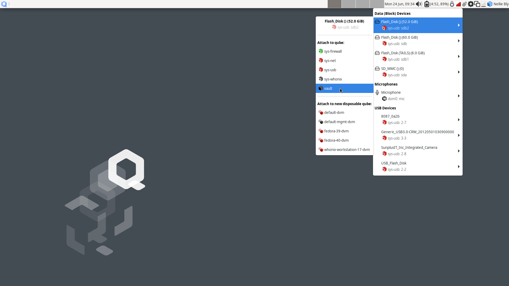
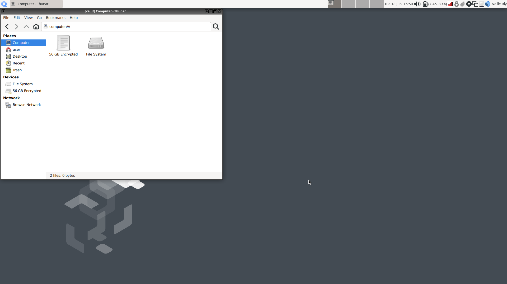

Migrating a Journalist Workstation from Tails
=============================================

.. TODO

Install Qubes OS and SecureDrop packages
----------------------------------------
.. TODO Overview and summary?

.. Include installing Qubes and securedrop-manage
.. include:: /admin/installation/install_qubes.rst
  :start-after: .. _qubes_prerequisites:

Configure SecureDrop Workstation
~~~~~~~~~~~~~~~~~~~~~~~~~~~~~~~~

Now you can proceed with configuring the SecureDrop Workstation with the correct *Journalist Interface* details and submission private key.

Import Submission Private Key
-----------------------------

In order to decrypt submissions, you will need a copy of the
`Submission Private Key <https://docs.securedrop.org/en/stable/glossary.html#submission-key>`_
from your SecureDrop instance's Secure Viewing Station.

To protect this key and preserve the air gap, you will need to connect the SVS USB to a Qubes VM with no network access, and copy it from there to ``dom0``. You cannot directly copy and paste to the ``dom0`` VM from another VM - instead, follow the steps below:

- First, use the network manager widget in the upper right panel to disable your network connection. These instructions refer to the ``vault`` VM, which has no network access by default, but if the SVS USB is attached to another VM by mistake, this will offer some protection against exfiltration.

- Next, choose |qubes_menu| **▸ Apps ▸ vault ▸ Thunar File Manager** to open the file manager in the ``vault`` VM.

- Connect the SVS USB to a USB port on the Qubes computer, then use the devices widget in the upper right panel to attach it to the ``vault`` VM. There will be three entries for the USB in the section titled **Data (Block) Devices**. Choose the *unlabeled* entry (*not* the one labeled "TAILS") annotated with a ``sys-usb`` text that ends with a number, like ``sys-usb:sdb2``. That is the persistent volume.

  |Attach TailsData|

- In the the ``vault`` file manager, select the persistent volume's listing in the lower left sidebar. It will be named ``N GB encrypted``, where N is the size of the persistent volume. Enter the SVS persistent volume passphrase to unlock and mount it. When asked if you would like to forget the password immediately or remember it until you logout, choose the option to **Forget password immediately**.

  .. note::

    You will receive a message that says **Failed to open directory "TailsData"**. This is normal behavior and will not cause any issues with the subsequent steps.

  |Unlock TailsData|

- Open a ``dom0`` terminal via |qubes_menu| **▸** |qubes_menu_gear| **▸ Other ▸ Xfce Terminal**. Once the terminal window opens, run the following command to import the submission key:

  .. code-block:: sh 

      sdw-admin --configure

  Follow the command prompts to complete submission key import. 

  .. note::
    If there are multiple keys present on the device, ``sdw-admin --configure`` will print the fingerprints of those keys for you to select which to use as the submission private key. You can open ``<source interface address>.onion/metadata`` in Tor Browser on another network-connected computer to check the correct key fingerprint used by your SecureDrop instance.

- Once the submission key import is complete, in the ``vault`` file manager, right-click on the **TailsData** sidebar entry, then select **Unmount** and disconnect the SVS USB.

- If you were prompted for a passphrase during import, you will now need to remove the passphrase on ``sd-journalist.sec``. See :doc:`/admin/migration/removing_gpg_passphrase`.

.. _copy_journalist:

Import *Journalist Interface* details
-------------------------------------

SecureDrop Workstation connects to your SecureDrop instance's API via the *Journalist Interface*. In order to do so, it will need the *Journalist Interface* address and authentication info. As the clipboard from another VM cannot be copied into ``dom0`` directly, follow these steps to copy the file into place:

- Locate an *Admin Workstation* or *Journalist Workstation* USB drive. Both hold the address and authentication info for the *Journalist Interface*; if you also want to copy the journalist user's password database, use the *Journalist Workstation* USB drive.

- Connect the USB drive to a USB port on the Qubes computer, then use the devices widget in the upper right panel to attach it to the ``vault`` VM. There will be 3 listings for the USB in the widget: one for the base USB, one for the Tails partition on the USB, labeled ``Tails``, and a 3rd unlabeled listing, for the persistent volume. Choose the third listing.

- In the the ``vault`` file manager, select the persistent volume's listing in the lower left sidebar. It will be named ``N GB encrypted``, where N is the size of the persistent volume. Enter the persistent volume passphrase to unlock and mount it. When prompted, select the option to **Forget password immediately**.

- In the ``dom0`` terminal, proceed with the next import step of the ``sdw-admin`` command or re-run 

  .. code-block:: sh 

      sdw-admin --configure 

  The command will print out the imported *Journalist Interface* details to confirm before proceeding.

- If you used an *Admin Workstation* USB drive, or you don't intend to copy a password database to this workstation, safely disconnect the USB drive now. In the ``vault`` file manager, right-click on the **TailsData** sidebar entry, then select **Unmount** and disconnect the USB drive.

Copy SecureDrop login credentials
~~~~~~~~~~~~~~~~~~~~~~~~~~~~~~~~~

Users of SecureDrop Workstation must enter their username, passphrase and two-factor code to connect with the SecureDrop server. You can manage these passphrases using the KeePassXC password manager in the ``vault`` VM. If this laptop will be used by more than one journalist, we recommend that you shut down the ``vault`` VM now (using the Qube widget in the upper right panel), skip this section, and use a smartphone password manager instead.

In order to set up KeePassXC for easy use:

- Add KeePassXC to the application menu by selecting it from the list of available apps in |qubes_menu| **▸ Apps ▸ vault ▸ Settings ▸ Applications** and pressing the button labeled **>** (do not press the button labeled **>>**, which will add *all* applications to the menu).

- Launch KeePassXC via |qubes_menu| **▸ Apps ▸ vault ▸ KeePassXC**. When prompted to enable automatic updates, decline. ``vault`` is networkless, so the built-in update check will fail; the app will be updated through system updates instead.

- Close the application.

.. important::

   The *Admin Workstation* password database contains sensitive credentials not required by journalist users. Make sure to copy the credentials from the *Journalist Workstation* USB.

In order to copy a journalist's login credentials:

- If a *Journalist Workstation* USB is not currently attached, connect it, attach it to the ``vault`` VM, open it in the file manager, and enter its encryption passphrase.

- Locate the password database. It should be in the ``Persistent`` directory, and will typically be named ``keepassx.kdbx`` or similar.

- Open a second ``vault`` file manager window (:kbd:`Ctrl + N` in the current window) and navigate to the **Home** directory.

- Drag and drop the password database to copy it.

- In the ``vault`` file manager, right-click on the **TailsData** sidebar entry, then select **Unmount** and disconnect the *Journalist Workstation* USB. Close this file manager window.

- In the file manager window that displays the home directory, open the copy you made of the password database by double-clicking it.

- If the database is passwordless, KeePassXC may display a security warning when opening it. To preserve convenient passwordless access, you can protect the database using a key file, via **Database ▸ Database settings ▸ Security ▸ Add additional protection ▸ Add Key File ▸ Generate**. This key file has to be selected when you open the database, but KeePassXC will remember the last selection.

- Inspect each section of the password database to ensure that it contains only the information required by the journalist user to log in.

- Close the application window and shut down the ``vault`` VM (using the Qube widget in the upper right panel). At this time, you can also re-enable the network connection using the network manager widget.

.. include:: /admin/installation/install_sdw.rst
  :start-after: .. _install_securedrop_workstation:
  :end-before: .. _end_install_securedrop_workstation:

