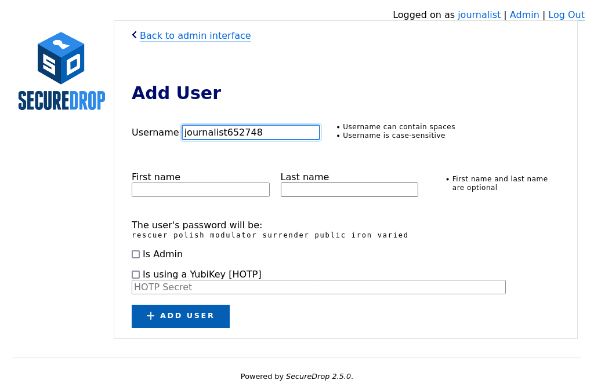
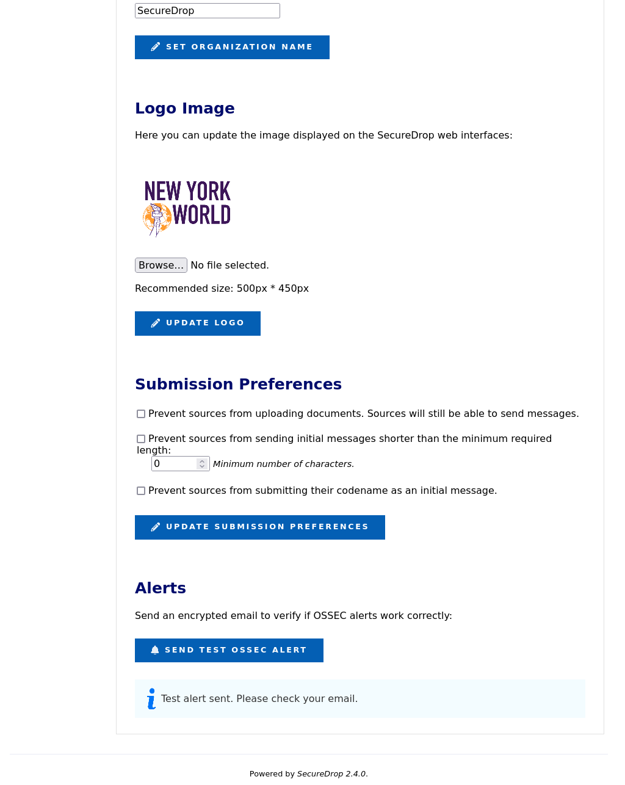

# The Admin Interface

The [Admin Interface](#glossary_admin_interface) allows you to manage users and configure the appearance and behaviour of your instance's web interfaces.

## Logging in

To log in to the Admin Interface, start the [Admin Workstation](#glossary_admin_workstation). Open the *SecureDrop Menu* and select the **Launch Journalist Interface** option. Tor Browser will start and load the login page for the Admin Interface. Use your username, passphrase, and two-factor authentication token to log in.

By default, you will be logged in to the Admin Interface's source list page.


In the course of normal administration operations you should not need to view or interact with messages from Sources. Should you need to, you can consult the [journalist guide](../../journalist/journalist.md).

:::{note}
If you have lost your login information or your two-factor authentication is no longer valid, you can create another account with admin privileges via the command line on the Application Server. See [here](#create-admin-cli) for more information.
:::

(user-management)=

## User management

You can use the Admin Interface to add and remove users, and to reset their credentials if necessary. To open the Admin Interface, click **Admin** in the upper right corner of the Admin Interface.

(adding-users)=

### Adding users

After logging in, you can add new user accounts for the Journalists at your organization who will be checking the SecureDrop Inbox. Make sure the Journalist is physically in the same room as you when you do this, as they will have to be present to enable two-factor authentication. SecureDrop supports the use of either a smartphone authenticator app or a Yubikey for two-factor authentication. If an app is to be used, the Journalist should install it before proceeding with the account setup.

```{include} ../../includes/otp-app.md
```

1. Click **Admin** in the top right corner of the page to load the Admin Interface.

   

2. Click **Add User** to add a new user.

   

3. Hand the keyboard over to the Journalist so they can create their own username.

4. Once they're done entering a username for themselves, have them save their pre-generated Diceware passphrase to their password manager.

5. If the new account should also have admin privileges, allowing them to add or delete other journalist accounts, select **Is Admin**.

6. Finally, set up two-factor authentication for the account, following one of the two procedures below for your chosen method.

:::{note}
The username **deleted** is reserved, as it is used to mark accounts which have been deleted from the system.
:::

#### FreeOTP

1. If the Journalist is using FreeOTP or another app for two-factor authentication, click **Add User** to proceed to the next page.

   

2. Next, the Journalist should open FreeOTP on their smartphone and scan the barcode displayed on the screen.

3. If they have difficulty scanning the barcode, they can tap on the icon at the top that shows a plus and the symbol of a key and use their phone's keyboard to input the two-factor secret into the `Secret` input field, without whitespace.

4. Inside the FreeOTP app, a new entry for this account will appear on the main screen, with a six-digit number that recycles to a new number every thirty seconds. The Journalist should enter the six-digit number in the **Verification code** field at the bottom of the **Enable FreeOTP** form and click **Submit**.

If two-factor authentication was set up successfully, you will be redirected back to the Admin Interface and will see a confirmation that the two-factor code was verified.

```{include} ../../includes/tor-security-setting.md
```

#### YubiKey

1. If the Journalist wishes to use a YubiKey for two-factor authentication, select **Is using a YubiKey**. You will then need to enter their YubiKey's OATH-HOTP Secret Key. For more information on how to retrieve this key, read the [YubiKey Setup Guide](../deployment/yubikey_setup.md).

   

2. Once you've entered the Yubikey's OATH-HOTP Secret Key, click **Add User**. On the next page, have the Journalist authenticate using their YubiKey, by inserting it into a USB port on the workstation and pressing its button.

   

3. If everything was set up correctly, you will be redirected back to the Admin Interface, where you should see a flashed message that says "The two-factor code for user *new username* was verified successfully.".

The Journalist will require their username, passphrase, and two-factor authentication method whenever they check SecureDrop. Make sure that they have memorised their username and passphrase, or stored them in their password manager, and that they can keep their two-factor authentication device secure.

(passphrases_and_two-factor_resets)=

### Passphrases and two-factor authentication resets

:::{warning}
Both of these operations will lock a user out of their SecureDrop account. Users should be physically present when their passphrase or two-factor authentication method is reset. If this is not possible, store the passphrase and/or two-factor authentication secret in your own password manager before securely transmitting them to the user in question, and delete them once the user has confirmed they can successfully log in.
:::

Even while following [passphrase best practices](#passphrase_best_practices), your Journalists may occasionally lock themselves out of their accounts. This can happen if, for example, they lose their two-factor device or if they forget the passphrase to their password manager. When this happens, you can reset their account as follows:

1. Log in as an administrator to the Admin Interface
2. Select *Admin* at the top right to open the Admin Interface
3. Find the user's account name and select **Edit**


Next, you can either rotate their passphrase or reset two-factor authentication for their account.

To change their passphrase to the randomly-generated passphrase shown:

1. Have the Journalist enter their current passphrase and two-factor code.
2. Make sure the new passphrase is saved in a password manager.
3. Click **Reset Password**

To reset two-factor authentication:

1. Click the button that corresponds to the user's chosen two-factor authentication method:

   - Click **Reset Mobile App Credentials** for accounts using FreeOTP or a similar authentication app
   - Click **Reset Security Key Credentials** for accounts using a Yubikey

2. Follow the on-screen instructions to complete the process and verify their new two-factor authentication credentials.

### Off-boarding users

See [our guide to off-boarding users from SecureDrop](/admin/reference/offboarding.md).

## Instance configuration

The Instance Configuration section of the Admin Interface allows you to:

- update the organization name and logo displayed on the Source and Admin Interfaces
- set submission preferences for the Source Interface
- send test OSSEC alerts.

### Updating the organization name

Your organization name is used in page titles and logo ALT text on the Source Interface and Admin Interface. By default, it's set to `SecureDrop`. To change it, enter your desired name in the Organization Name field and click **Set Organization Name**.

(updating-logo-image)=

### Updating the logo image

You can update the system logo shown on the web interfaces of your SecureDrop instance via the Admin Interface. We recommend a size of `500px x 450px`. Only PNG-format images are supported. To update the logo image:

1. Copy the logo image to your Admin Workstation
2. Click **Browse** and select the image from your workstation's filesystem
3. Click **Update Logo** to upload and set the new logo

You should see a message appear indicating the change was a success.


It may be necessary to hold the Shift key while pressing the Reload button in the browser, which will force it to purge the cached version of the logo in order to see the new one.

(test-ossec-alert)=

### Testing OSSEC alerts

To verify that the OSSEC monitoring system's functionality, you can send a test OSSEC alert by clicking **Send Test OSSEC Alert**.



You should receive an OSSEC alert email at the address specified during the installation of SecureDrop. The email may take several minutes to arrive. If you don't receive it, refer to the [OSSEC Guide](/admin/installation/troubleshoot_ossec.md) for information on troubleshooting steps.

(submission-prefs)=

### Submission preferences

The Submission Preferences subsection allows you to restrict what Sources can send to your instance.

### Disabling file uploads

By default, SecureDrop supports both text messages and file uploads. If you only want to receive text messages, you can disable uploads as follows:

1. Check the **Prevent sources from uploading documents** checkbox
2. Click **Update Submission Preferences**

This change will be applied immediately on the Source Interface. Files that were previously uploaded will still be available via the Admin Interface.

### Preventing short initial messages

By default, SecureDrop does not apply a minimum length requirement to messages. If your instance is experiencing a high volume of short one-time messages with no actionable content, or if you would like to indicate to Sources that their initial message should include enough information for Journalists to respond to them effectively, you can set an initial message length as follows:

1. Check the **Prevent sources from sending initial messages shorter than the minimum required length** checkbox
2. Enter the desired minimum length in the field below the checkbox
3. Click **Update Submission Preferences**

This change will be applied immediately on the Source Interface. Initial messages that are too short will be rejected, with an error message informing Sources of the requirement. This requirement will not be applied to initial messages that also include an uploaded file, or to subsequent messages in the conversation.

To remove the requirement, uncheck the checkbox and click **Update Submission Preferences**.

### Preventing initial messages containing the Source's codename

Sources should never need to share their seven-word codename with Journalists. If your instance is receiving one-time messages consisting of the Source's codename, you can optionally reject those messages, before they are stored, as follows:

1. Check the **Prevent sources from submitting their codename as an initial message** checkbox
2. Click **Update Submission Preferences**

This change will be applied immediately on the Source Interface. Initial messages that contain the Source's codename will be rejected, with an error message reminding Sources to protect their codename and keep it secret. To remove this restriction, uncheck the checkbox and click **Update Submission Preferences**.
