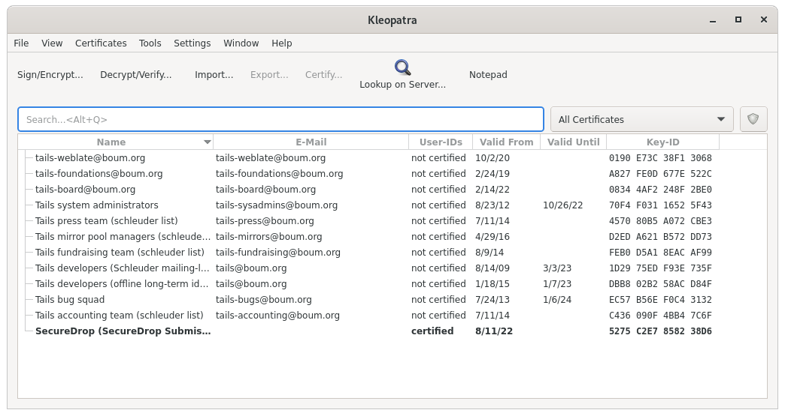
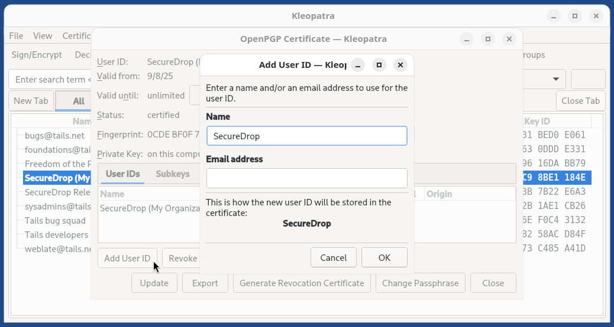
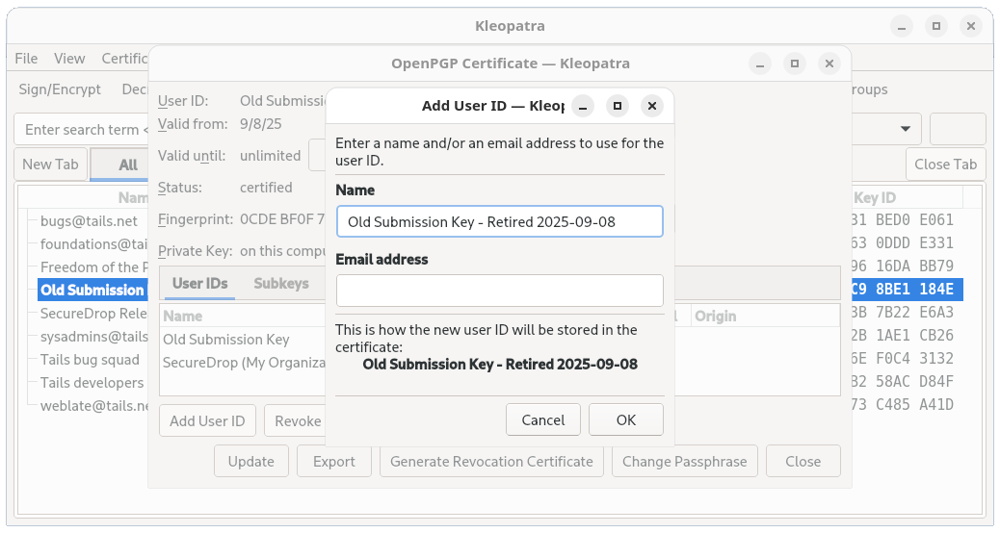
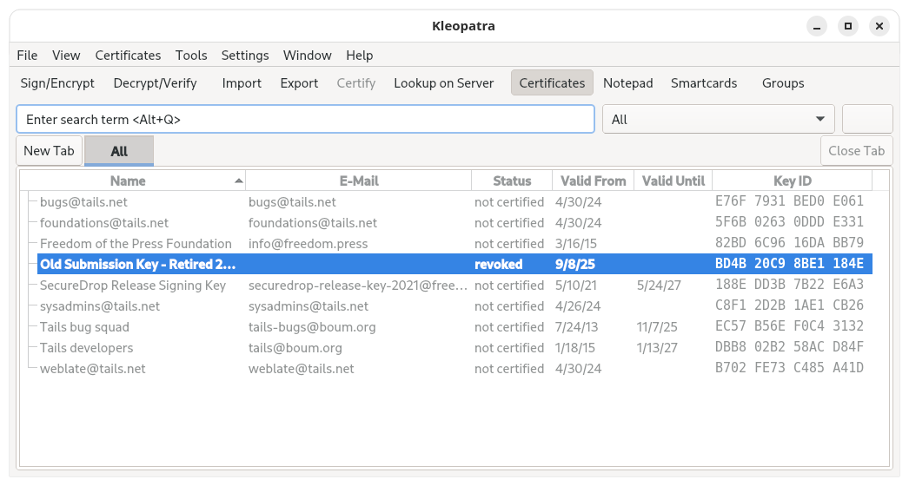

# Off-board Administrators and Journalists

When Journalists and SecureDrop Administrators leave your organization, it is important to off-board them from SecureDrop.

:::{important}
Additional measures may need to be taken if the user's departure is on unfriendly terms. These measures will vary depending on the circumstances and your own internal incident response
procedures, and may include doing a full reinstall of SecureDrop. If you are in such a situation, feel free to [contact us](/introduction/getting_support.md) for further assistance.
:::

## Off-boarding checklist

- [Inform the SecureDrop Support](/introduction/getting_support.md) team that the user should be removed from any support Signal groups, and indicate if any new staff members should be added.
- Delete the user's account on the Admin Interface.
- Retrieve [SecureDrop Workstation](#glossary_securedrop_workstation) laptops, *Backup* drive(s), and any other SecureDrop hardware or materials.
- If the user receives email alerts (OSSEC alerts or Daily Journalist Alerts), either directly or as a member of an email alias, remove them from those alerts and [set up someone new](#ossec_guide) to receive those alerts.
- (Circumstance-dependent) If you have specific concerns that the Submission Private Key has been compromised, you should consider a full reinstall of SecureDrop. At minimum, you should [rotate the Submission Key](#rotate_submission_key).

## Additional steps for off-boarding Administrators

- If the departing user was your primary SecureDrop Administrator, designate the next person who will take over their function. Ideally, your outgoing Administrator will be able to provide as much training as possible on the use and maintenance of the system, as well as on your organizational policies (such as backup strategies, and so on) before they leave; if this is not the case, [contact the SecureDrop Support team](/introduction/getting_support.md).
- We do not recommend enabling remote management for SecureDrop's network firewall. However, if your SecureDrop firewall can be accessed remotely, even if only from within your organization's network, you may want to rotate its login credentials.
- Back up and [rotate the SSH key](#rotate_ssh_key) to prevent unauthorized SSH access to the Application and Monitor Servers in the event that this user has retained their Admin SSH credentials.

(rotate_ssh_key)=

### Rotate SSH keys on the SecureDrop servers

If you are concerned that the user may have a copy of the SSH key, you should rotate the key in the following manner.

1. Create a new SSH keypair. From the `sd-admin` qube, run

   ```sh
   ssh-keygen -t rsa -b 4096
   ```

   and make sure to change the key name. This is the only parameter you need to change. For example, instead of `/home/amnesia/.ssh/id_rsa`, call the key `/home/amnesia/.ssh/newkey`. You don't need a passphrase for the key.

   (ssh_add_pubkey)=

2. Copy new public key to the SecureDrop Servers. Copy the public portion of the key to the Application and Monitor Servers by running

   ```sh
   scp -O /home/amnesia/.ssh/newkey.pub scp://app
   ```

   and

   ```sh
   scp -O /home/amnesia/.ssh/newkey.pub scp://mon
   ```

3. Add this key to the list of authorized keys. SSH to the Application Server and append this new key to the list of authorized keys by using

   ```sh
   cat newkey.pub >> ~/.ssh/authorized_keys
   ```

   Be sure to use the command as above so that you append the key, instead of replacing the file. While you are still on the Application Server, you can then delete the file `newkey.pub` from wherever you scp'd it to (i.e. your home directory). Repeat this process with the Monitor Server.

4. Rename SSH keys. Exit all SSH sessions and rename `id_rsa` and `id_rsa.pub` (the old SSH keys) to something else. For example,

   ```sh
   mv /home/amnesia/.ssh/id_rsa /home/amnesia/.ssh/id_rsa_old
   mv /home/amnesia/.ssh/id_rsa.pub /home/amnesia/.ssh/id_rsa_old.pub
   ```

   Then, rename your `newkey` and `newkey.pub` to `id_rsa` and `id_rsa.pub`.

5. Test SSH connection. Test that you can still ssh into the Application and Monitor Servers (you can test with `ssh app host` and `ssh mon host`).

6. Restrict SSH access to the new key.

   :::{important}
   If you have other users who also have SSH access to the Application and Monitor Servers, the next step will revoke their access. Their public keys will have to be re-appended to the `authorized_keys` file on each server, as in step 3.
   :::

   From an `sd-admin` qube, run

   ```sh
   securedrop-admin reset_admin_access
   ```

   This removes all other SSH keys, except for the new key that you are currently using, from the list of authorized keys on the Application and Monitor Servers.

(rotate_submission_key)=

## Rotate the Submission Key

% TODO Update instructions for Qubes

The Submission Private Key is held on the airgapped Secure Viewing Station, and is not normally accessed by SecureDrop users anywhere but on the Secure Viewing Station. Therefore, we recommend rotating the Submission Key under the following circumstances:

- If the user's departure was not amicable
- If the user is still holding on to any Secure Viewing Station USB flash drive or backup
- If you have any other reason to believe the Submission Private Key or the entire Secure Viewing Station USB flash drive may have been copied or compromised.

You should still keep the old key on the Secure Viewing Station, or else you will not be able to decrypt submissions that were sent to you while that key was in effect.

**You will need:**

- A LUKS-encrypted USB flash drive

### On the Secure Viewing Station

% TODO remove this section, replace with instructions for key rotation on the SDW laptops

1. From the Secure Viewing Station Apps Menu, choose **Accessories ▸ Kleopatra**, and select the Submission Key from the list of available keys.

   

2. From the details view that appears, click the **Add User ID** button.

   

3. Set the name field to "Old SecureDrop Submission Key - Retired ", and add the date of retirement. Click **OK** to add this information to the key.

   

   :::{note}
   This is a local-only change to stop you from mixing up the old and new keys
   :::

4. Return to the Terminal, then run:

   ```sh
   gpg --list-keys
   ```

   In the output, locate the "Old SecureDrop Submission Key". It should
   look similar to this:

   ```text
   pub   rsa4096/0x1CB396626CA370AB 2022-08-16 [SC]
         Key fingerprint = 6A7F 116B 3C22 4F36 7275 236A 1CB3 9662 6CA3 70AB
   uid         [ultimate] Old SecureDrop Submission Key (Retired 2022-08-16)
   uid         [ultimate] SecureDrop (SecureDrop Submission Key)
   sub   rsa4096/0x228C92459E3D16DE 2022-08-16 [E]
   ```

   Make note of the ID of the key, which is the portion of the key after the slash
   in the first line. In this example, the key ID would be: `0x1CB396626CA370AB`

5. Generate a revocation certificate, by running the command below (replacing `<KEY_ID>` with the ID you noted in the step above):

   ```sh
   gpg --output revoke.asc --gen-revoke <KEY_ID>
   ```

   This will launch an interactive prompt, where you can supply the following
   values:

   ```text
   Create a revocation certificate for this key? (y/N) y
   Please select the reason for the revocation:
     0 = No reason specified
     1 = Key has been compromised
     2 = Key is superseded
     3 = Key is no longer used
     Q = Cancel
   (Probably you want to select 1 here)
   Your decision? 2
   Enter an optional description; end it with an empty line:
   > <Just Press Enter>
   Reason for revocation: Key is superseded
   (No description given)
   Is this okay? (y/N) y
   ASCII armored output forced.
   Revocation certificate created.
   ```

6. Import the revocation certificate:

   ```sh
   gpg --import revoke.asc
   ```

7. Return to Kleopatra, and make sure the key is now marked as **Revoked**.

   

8. Now [follow the instructions](../installation/generate_submission_key.md) to create a new Submission Key. Copy the fingerprint and new Submission Public Key to the encrypted USB flash drive.
