.. _Getting Support:

Getting Support
===============

Whether you are interested in learning more about SecureDrop, looking for
help with an installation, or needing assistance with an existing
SecureDrop instance, there are several support options available to you.

Freedom of the Press Foundation offers direct support via the official
:ref:`Support Portal <using_redmine>`.

Additionally, there is also some level of :ref:`Community Support <community_support>`.

.. note::

   If your installation is up and running, we recommend that you
   `submit your SecureDrop to the SecureDrop directory <https://securedrop.org/directory/submit/>`__.
   This also serves as a first introduction to the SecureDrop team.

.. _using_redmine:

Support Portal
^^^^^^^^^^^^^^

Because of the sensitive nature of SecureDrop-related communications, we
recommend that you request an account on the support portal at
https://support.freedom.press/ (also available as a Tor onion service: http://sup6h5iyiyenvjkfxbgrjynm5wsgijjoatvnvdgyyi7je3xqm4kh6uqd.onion/).

As a member of the support portal, you will receive notifications regarding
SecureDrop releases and security advisories, and you will be able to open
tickets to request technical support.

Membership in the support portal is free of charge and granted at Freedom of
the Press Foundation's sole discretion. To reach out regarding a membership
request, please use the `contact form <https://securedrop.org/help/>`__.

While we will provide technical assistance within reason and at our discretion, we
encourage you to consider a paid support agreement to receive priority support,
staff training, or installation help. Visit the
`Priority Support <https://securedrop.org/priority-support/>`_
and `Training <https://securedrop.org/training/>`_ pages on the SecureDrop website
for more information.

Initial onboarding
------------------

Please start by submitting a request through the `SecureDrop Contact Form`_.

.. _SecureDrop Contact Form: https://securedrop.org/help

Please provide an email address so we can reply back to you. We'll review your
request and decide how to respond. If we decide to offer you support, we will
send you instructions for onboarding you into our support system.

Once you are initially onboarded, we will assign you to a project called
"Support Triage" where you will be able open new issues. Any issues that you
create will only be visible to Freedom of the Press Foundation staff and you.

Creating your Account
---------------------

To get started, register your account on the `Registration Page`_.

Make sure you

* Choose a strong passphrase;
* Use an email address that you check frequently;
* Pick a username that helps us identify you at a glance. We recommend using
  your first initial and your last name (e.g. "jsmith" for John Smith).

.. _Registration Page: https://support.freedom.press/account/register

|Registration|

We manually confirm each new account. After submitting your registration, it
will be reviewed by our team. When approved, you will receive an email
notification stating that your account has been activated.

|Activation|

After your account is activated, you can login and continue to the next step.

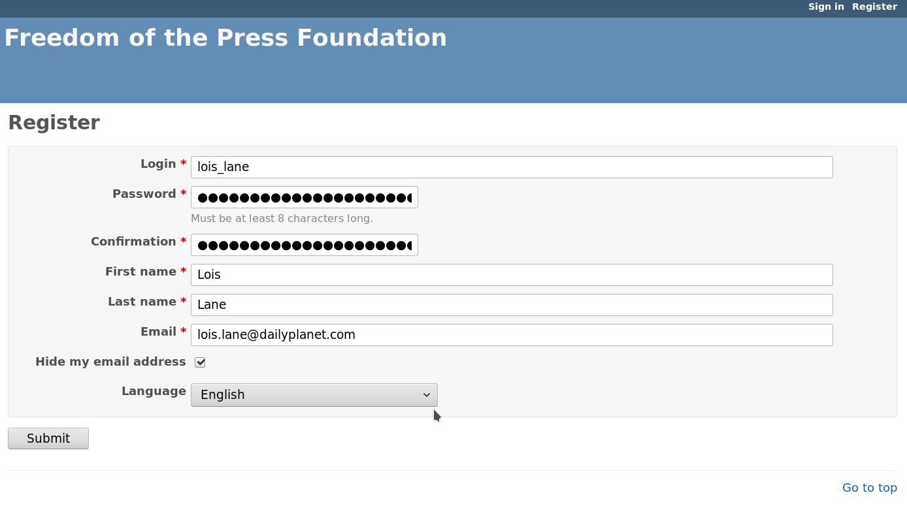

Enabling two-factor authentication
~~~~~~~~~~~~~~~~~~~~~~~~~~~~~~~~~~

Two-factor authentication (2FA) adds an extra layer of security to your account by requiring a one-time
six-digit code each time you log into the support portal, in addition to your passphrase.

2FA is required to use the support portal. After creating or logging into your account, you will be
prompted to enable 2FA. To do so:

1. Choose an application to generate two-factor codes. We recommend the
   `FreeOTP app <https://freeotp.github.io/>`__ for Android or iOS, but any
   app that implements the Time-based One Time Password (TOTP) algorithm
   should work.

2. You will see a page that shows a QR code, similar to the one below.
   Use your 2FA app's QR code scanning function to scan the code on the page,
   or manually enter the 2FA secret (called a "plain text key" here) in the 
   app.

   |2FA example|

3. Select the account you have just added to your 2FA app, and generate a new
   one-time token using the app. Enter it on the webpage and click 
   **Activate**.
4. You should see a success message like the one below. Follow the 
   recommendation and click **generate backup codes**.

   |2FA success|

5. You will be prompted to enter another two-factor code. Once you have
   done so, you will see a list of codes like the one below. Each code 
   (e.g., ``ec96 a5d7 c678``) can be used once *instead of* a 2FA code
   during the login sequence. Store these codes securely and separately
   from your passphrase. The recommended method is to keep a printout of
   the recovery codes in a secure location.

   |2FA backup codes|

6. Log out of your account and attempt to log in again. After entering your
   passphrase, you will additionally be prompted for a two-factor code, which
   you can generate using your 2FA app.

If you have to reset your 2FA settings at any time, you can use a recovery 
code. Once you are logged in, disable and then re-enable 2FA from your account
settings.

Please do not hesitate to open a ticket or email us at
securedrop@freedom.press (`GPG-encrypted <https://securedrop.org/sites/default/files/fpf-email.asc>`__)
if you encounter difficulties using 2FA on the support portal.

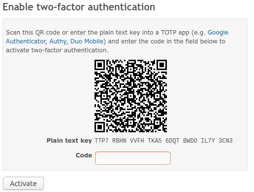

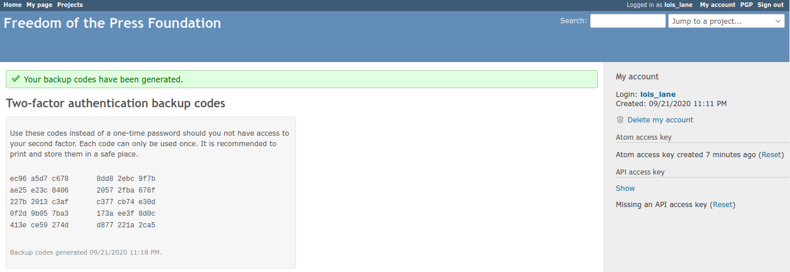

Other account settings
~~~~~~~~~~~~~~~~~~~~~~

In addition to two-factor authentication, you can also configure your local
time zone in the account settings.

We encourage you to leave the notification setting as the default:
"For any event on all my projects".

|Account settings|

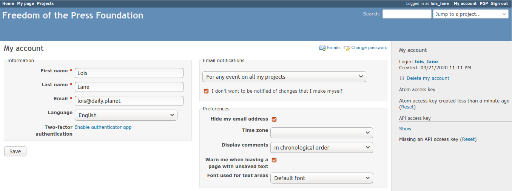

.. _encrypted_email_overview:

.. _Logging In:

Logging In
----------

Once your account has been activated, go to the `Support Page`_ and log
in with your new account.

.. _Support Page: https://support.freedom.press

|Login|

After logging in, you will be be taken to the Home page. In the top
menu bar, you will see helpful links to a variety of resources. The most
important links are:

* **Projects**: The list of projects you have access to.
* **My Page**: An overview of the open issues that were either created
  by you or are assigned to you.

|Home|

Click on **Projects** in the top menu bar. You'll see a project for your
SecureDrop instance listed underneath the parent SecureDrop project.
Only Freedom of the Press Foundation staff and people within your
organization have access to your instance's project.

|Projects|

Click on the project link. You'll be shown an **Overview** of the project and
all of its issues.

|Overview|

To view the list of open issues, click the **Issues** button to open the issues
pane.

|Issues|

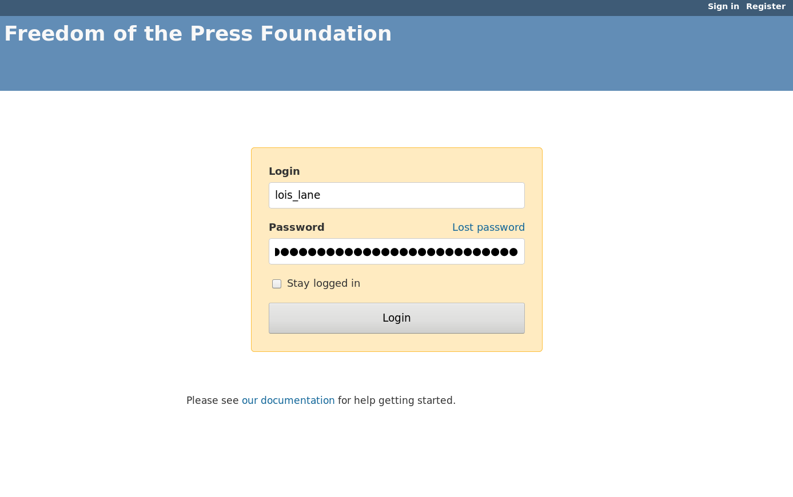
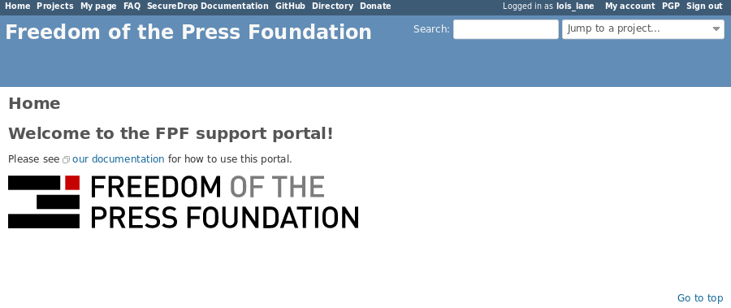
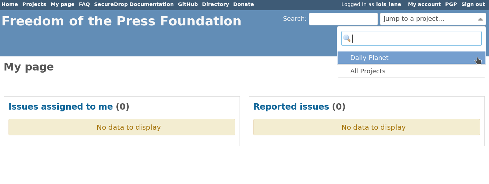
.. |Overview| image:: images/support/overview.png
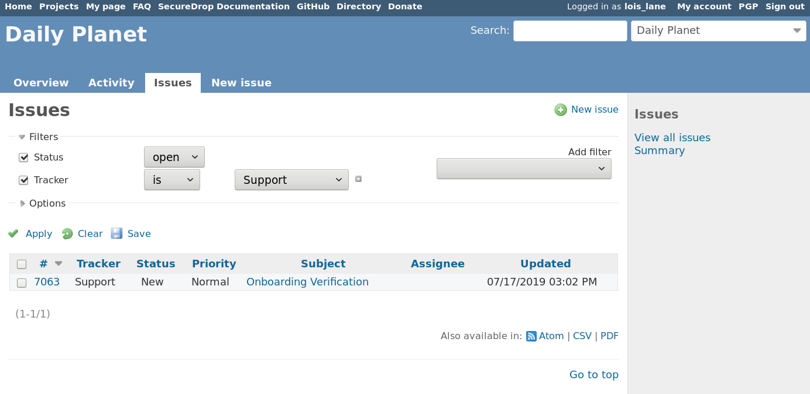

Onboarding Issue
----------------

By the time you log in, we'll have created an initial issue for
onboarding, called "Onboarding Verification". Please write a reply on
this issue, which will let us know that you succeeded in logging in and
finding your project page.

|OnboardingIssue|

To write a reply, click **Edit** button at the top of the issue.
Write your reply in the Notes text box, then click **Submit**.

|EditIssue1|

We'll reply to the issue and start a little exchange to explain some
features of the platform and answer any questions you might have. The
goal here is to make sure you're comfortable and confident using the new
Support site.

|EditIssue2|

Once we're satisfied you're ready to use the new site, we'll close the
issue.

Once we're finished with the onboarding issue, you're ready to use the Support
site. If you want to additionally set up encrypted email notifications, head
over to the :ref:`Encrypted Email Overview <encrypted_email_overview>`.

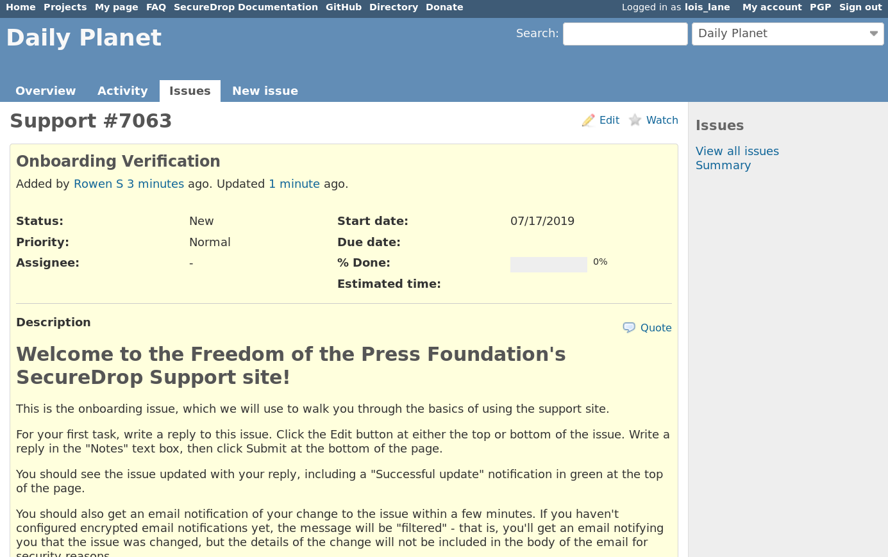
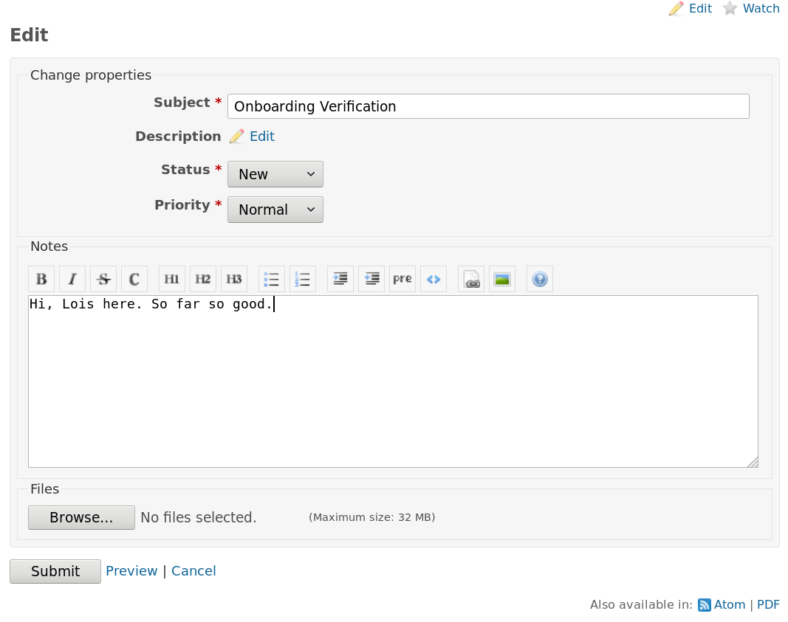
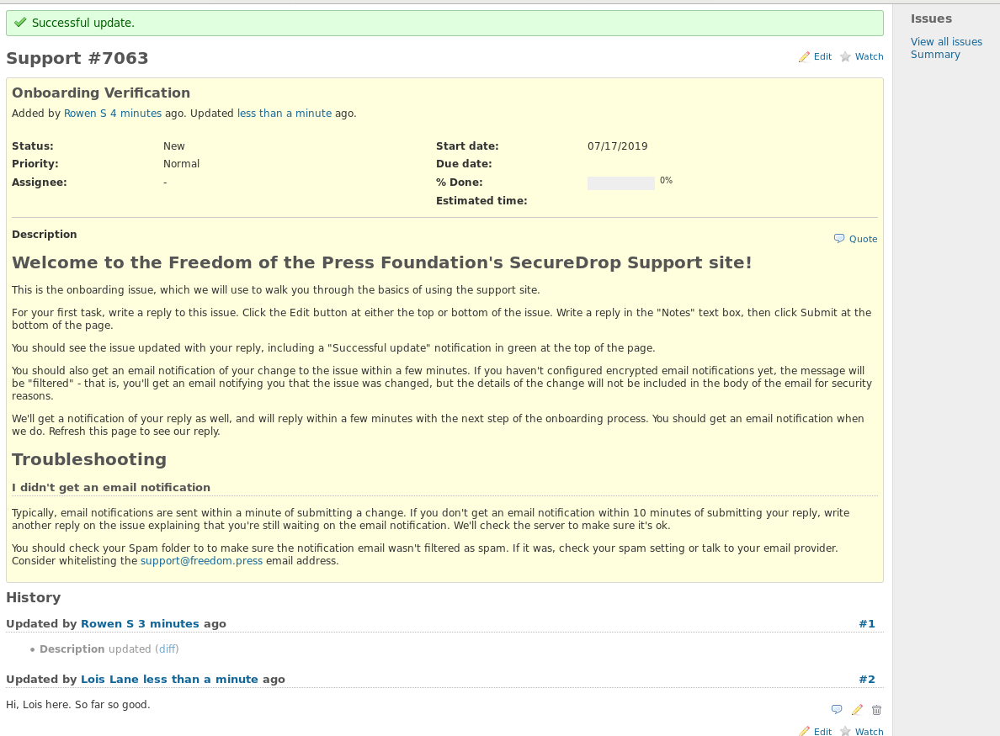

Creating a new issue
--------------------

To create a new issue, click **New issue** and fill out the Subject and
Description fields. All other fields can be left blank, although you can
assign a priority if you want. When we see the issue, we will respond
and assign it to the appropriate person. If we're waiting for a reply
from someone in your organization, we may assign it back to you.

|NewIssue|

.. |NewIssue| image:: images/support/new_issue.png

Encrypted Email
---------------
While many people find email-based workflows convenient, email is
unfortunately insecure by default. Freedom of the Press Foundation takes
the security of every SecureDrop instance seriously; therefore, we
require the use of encryption for support requests because they may
contain sensitive information about your SecureDrop instance.

After setting up your account, you will have the option of enabling
encrypted email. If you aren't already familiar with PGP, or don't already
have PGP set up in your email client, we don't recommend setting it up.

The primary benefit of enabling encrypted email is that you can receive
the full contents of messages and notifications directly in your
email without needing to login to the support website.

However, we recognize that using encryption requires the use of email
clients or plugins, and increases the time it takes to review emails.
Depending on your workflow, it may be preferable to leave encrypted
email disabled.

If you prefer not to enable encrypted email, you will still receive
notifications for issues that are available to you. Rather than
containing the sensitive contents from the message itself, the 
(filtered) email notification will alert you to an update within the
support system, and you can visit the web interface to view and interact
with the issue. This is the same security pattern used by many bank websites,
and the web interface workflow is automatically encrypted thanks to HTTPS.

|FilteredEmail|

We encourage you to use these filtered emails as a reminder to login to
your Redmine account and check the content of the corresponding updates
to an issue through the web interface.

.. note:: We welcome feedback on how we could make notifications for
          this Redmine system more convenient for you.

Setting up Encrypted Email
~~~~~~~~~~~~~~~~~~~~~~~~~~

In order to use this encrypted email workflow, you need to:

1. Provide **your public key** to the support server
2. Import the **server's public key** into your local keyring.

The following documentation explains how to perform these steps to get
the encrypted email workflow working. This documentation assumes you are
familiar with PGP/GPG. We encourage you to use your preferred GPG key
management tool and email client.

If you are not already familiar with using PGP/GPG keys, we would recommend
using the :ref:`web-based workflow <using_redmine>` instead of the
encrypted email workflow.

Providing your public key
~~~~~~~~~~~~~~~~~~~~~~~~~

Start by navigating to
`support.freedom.press/pgp <https://support.freedom.press/pgp>`_ or
click on the "PGP" menu option in the upper right corner of the support window.

|PGPMenu|

In the PGP management window you will see two sections: one for your
public key on the top, and one with the server's public key on the
bottom.

|PGPUpload|

To provide your public key, start by exporting an ASCII-armored copy of
your public key. Paste your armored public key into the empty text box
at the top and hit **Save**.

|PGPSave|

Importing the server's public key
~~~~~~~~~~~~~~~~~~~~~~~~~~~~~~~~~

Now, import the public key for our Redmine server into your local GPG
keyring. It is available on the bottom of the page in the
section with the heading "Redmine Server (support@freedom.press)", in the
text box labeled "Public PGP key".

Select the entire public key and copy it to your clipboard. Import the
copied public key into your local GPG keyring.

You can `download the key <https://freedom.press/documents/37/redmine_public_key.asc>`_ 
or fetch it from a `keyserver <https://keys.openpgp.org/vks/v1/by-fingerprint/D0E0B2F2B71BA4E48278037D9EA33029E9FBBA2E>`_ (fingerprint:
``D0E0B2F2B71BA4E48278037D9EA33029E9FBBA2E``).

.. todo:: Add section on testing encrypted email after setting it up

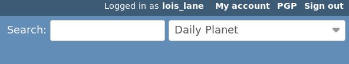
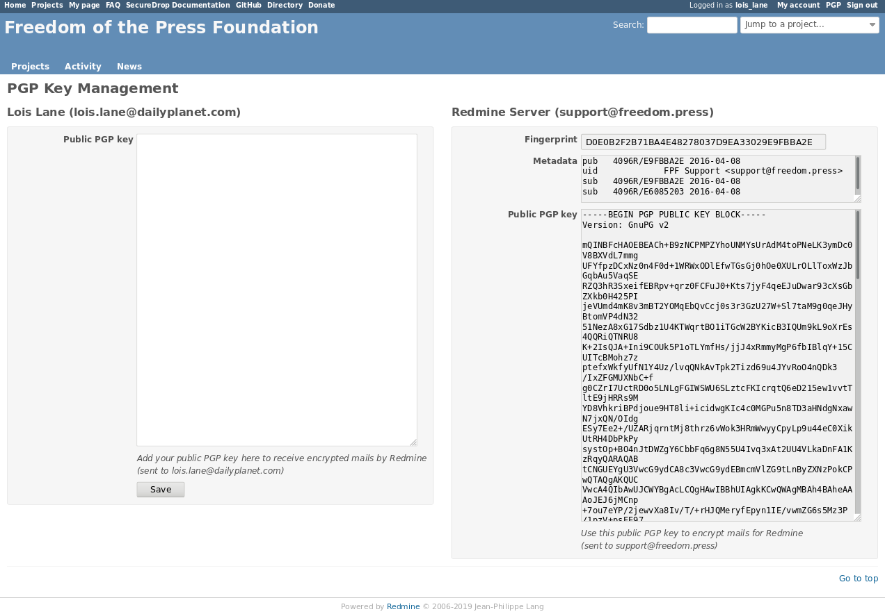
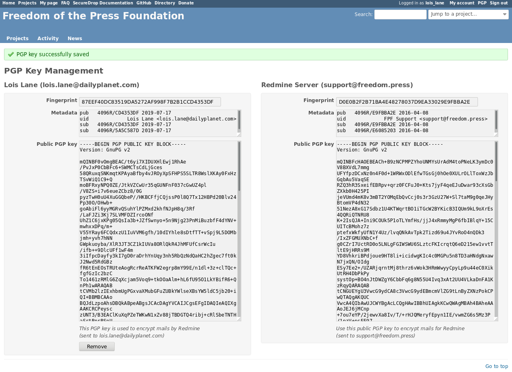

Creating a new issue via email
~~~~~~~~~~~~~~~~~~~~~~~~~~~~~~

Sending an email to support@freedom.press will automatically create a
new issue in your project, using the subject line of the email for the
Subject and the body of the email for the Description.

Always sign and encrypt your emails
-----------------------------------

To maintain the security of conversations around support requests, you
should always sign and encrypt your email to support@freedom.press if
you have a Redmine account.

Our server is configured to reject emails that do not have a valid
signature. We cannot reject unencrypted emails due to a limitation in
the Redmine-OpenPGP plugin we are using, but we are logging them and
will harangue you if you send us unencrypted email.

PGP/MIME vs. inline PGP
-----------------------

When you're replying to Redmine via email, you **must use PGP/MIME**
instead of inline PGP. The default settings for Thunderbird should work.

Note that Mailvelope does not support PGP/MIME.

Per-recipient Rules
-------------------

You may not want to use these settings (PGP/MIME, always sign) for all
of your email. If not, most email clients support the concept of
"Per-recipient rules", which allow you to configure specific settings on
a per-recipient basis.

Additional Redmine Documentation
--------------------------------

For more information on using Redmine, consult their `User Guide
<https://www.redmine.org/projects/redmine/wiki/User_Guide>`_.

.. _community_support:

Community Based Support
^^^^^^^^^^^^^^^^^^^^^^^

You can connect directly with the SecureDrop development team and the larger
SecureDrop community using the
`SecureDrop Gitter channel <https://gitter.im/freedomofpress/securedrop>`_.

.. warning::

   Remember that the Gitter channel is public.
   **Do not post any sensitive information through public channels.**
