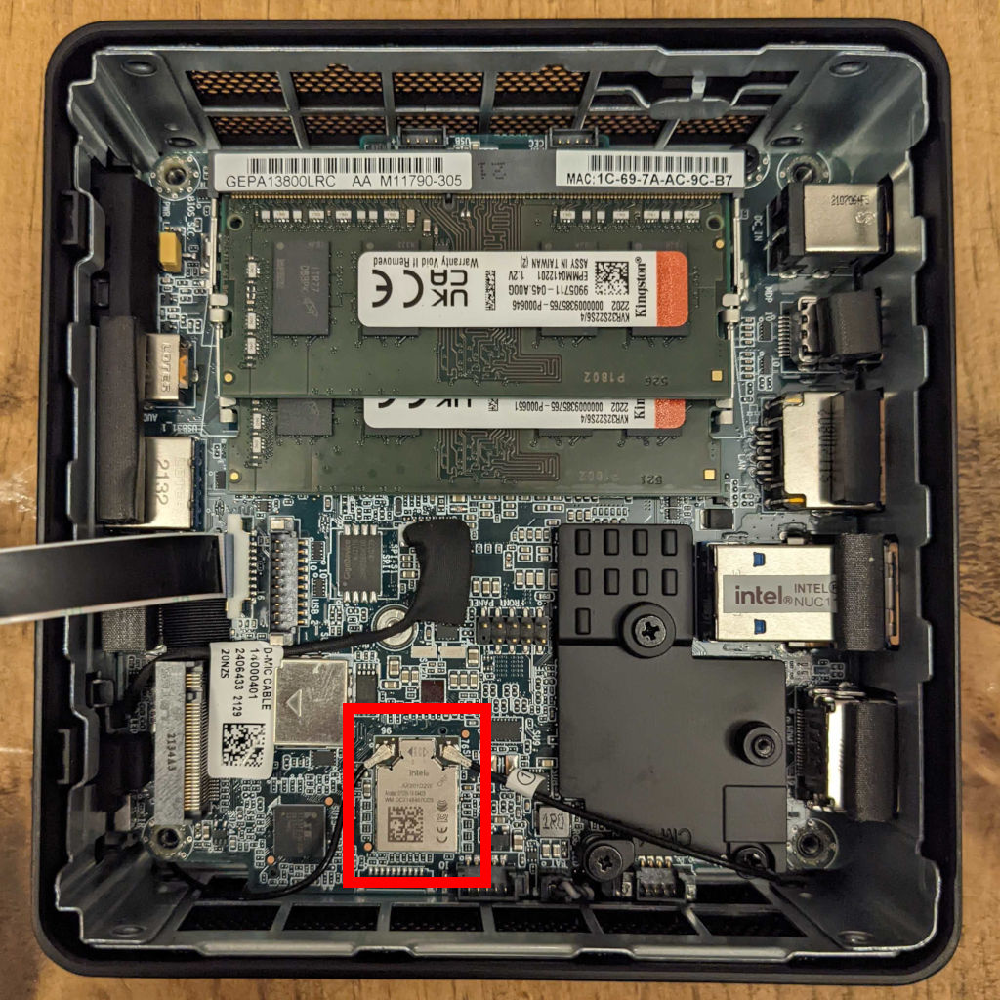
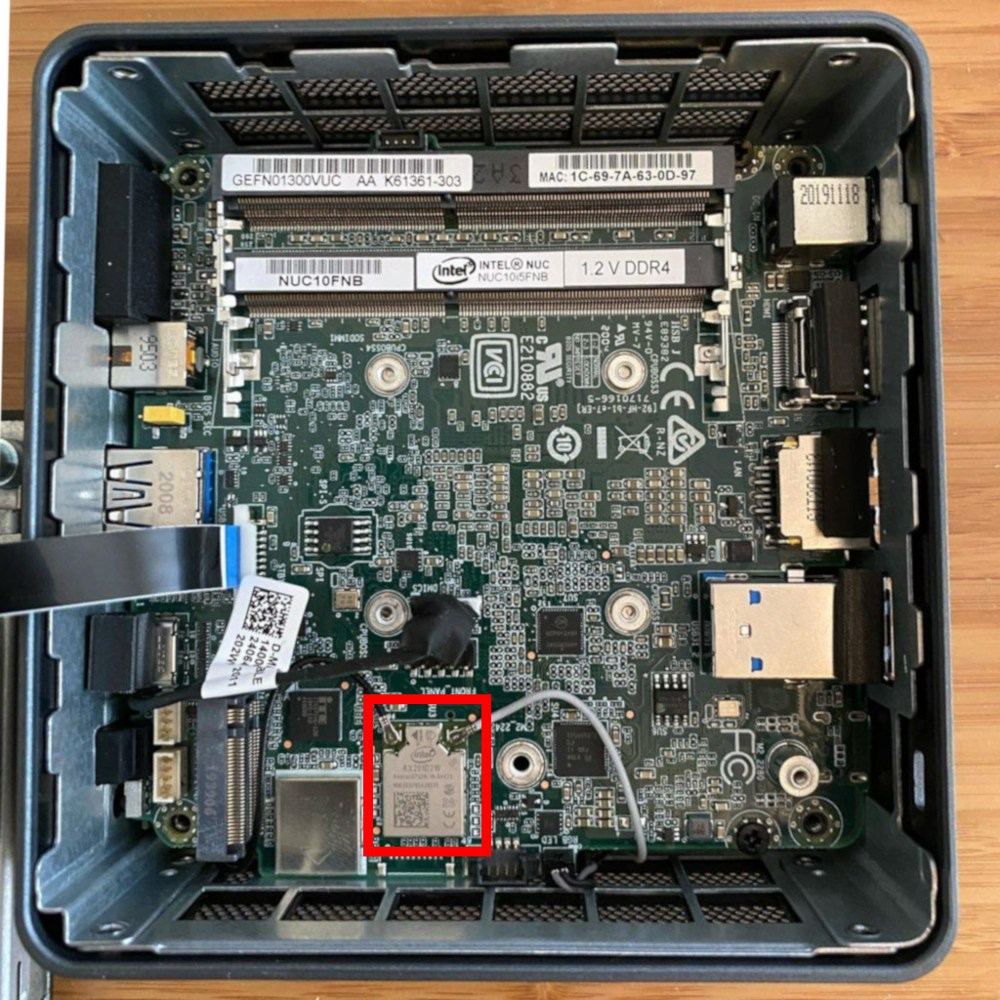
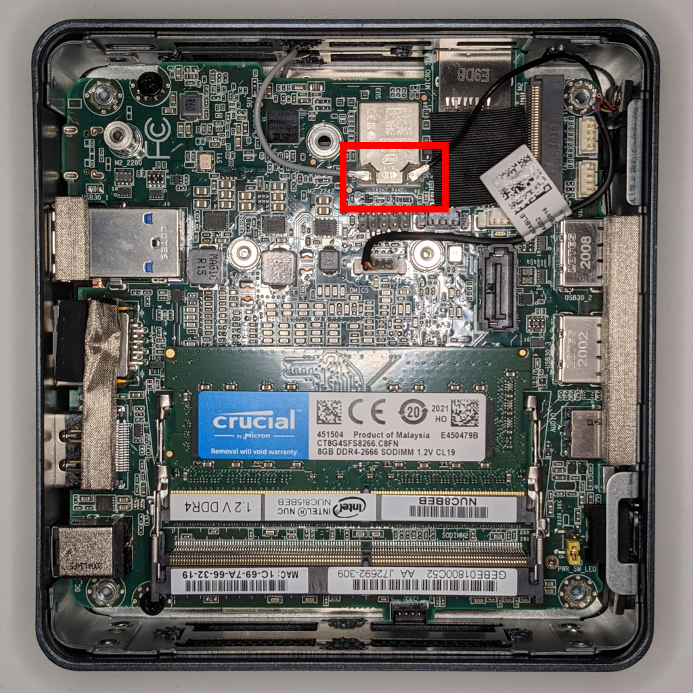

.. _hardware_guide:

Hardware
========

This document outlines the required hardware components necessary to
successfully install and operate a SecureDrop instance, and recommends
some specific components that we have found to work well. If you have
any questions, please email securedrop@freedom.press.

Hardware Overview
-----------------

.. _Required Hardware:

For an installation of SecureDrop, you must acquire:

* 2 computers with memory and hard drives to use as the SecureDrop servers.
* Mouse, keyboard, monitor (and necessary dongle or adapter) for
  installing the servers.
* At least 2 dedicated physical computers that can boot to Tails: one
  computer for the *Secure Viewing Station*, and one or more computers for the
  *Admin Workstation(s)/Journalist Workstation(s)*.
* Dedicated airgapped hardware for the mouse, keyboard, and monitor (only if you
  are using a desktop for the *Secure Viewing Station*).
* A dedicated network firewall with at least 4 NICs.
* At least 3 ethernet cables.
* Plenty of USB sticks: 1 drive for the master Tails stick, 1 drive for each
  Secure Viewing Station, 1 drive for each *Transfer Device*, 1 drive for each
  *Export Device*, and 1 drive for each admin and journalist.

.. _Optional Hardware:

Additionally, you may want to consider the following purchases:

* a printer without wireless network support, to use in combination with the
  *Secure Viewing Station*.
* an external hard drive to expand the storage capacity of the
  *Secure Viewing Station*.
* an external hard drive for server backups.
* a USB drive to store :ref:`backups of your Tails workstation drives <backup_workstations>`.
* a security key for HOTP authentication, such as a YubiKey, if you want to
  use hardware-based two-factor authentication instead of a mobile app.
* a USB drive with a physical write protection switch, or a USB write blocker,
  if you want to mitigate the risk of introducing malware from your network to
  your *Secure Viewing Station* during repeated use of an *Export Device*.
* CD-R/DVD-R writers, if you want to use CD-Rs/DVD-Rs as transfer or export
  media, and a CD shredder that can destroy media consistent with your threat
  model.

In the sections that follow, we provide additional details on most of these
items.

.. tip::

    While a printer is not required, we highly recommend it. Printing documents
    is generally far safer than copying them in digital form. See our
    :ref:`guide to working with documents <working_with_documents>` for more information.

Advice for users on a tight budget
----------------------------------
If you cannot afford to purchase new hardware for your
SecureDrop instance, we encourage you to consider
re-purposing existing hardware to use with SecureDrop. If
you are comfortable working with hardware, this is a great
way to set up a SecureDrop instance for cheap.

Since SecureDrop's throughput is significantly limited by
the use of Tor for all connections, there is no need to use
top of the line hardware for any of the servers or the
firewall. In our experience, relatively recent recycled Dell
desktops or servers are adequate for the SecureDrop servers,
and recycled ThinkPad laptops work well for the
*Admin Workstation*/*Journalist Workstation*.

Please note that very old laptops or desktops may not work for the workstations.
Since the release of Tails 3.0, 32-bit computers are no longer supported.

If you choose to use recycled hardware, you should of course
consider whether or not it is trustworthy; making that
determination is outside the scope of this document.

.. _Hardware Recommendations:

Required Hardware
-----------------

Servers
^^^^^^^

These are the core components of a SecureDrop instance.

* *Application Server*: 1 physical server to run the SecureDrop web services.

* *Monitor Server*: 1 physical server which monitors activity on the
  *Application Server* and sends email notifications to an admin.

* *Network Firewall*: 1 physical computer that is used as a dedicated firewall
  for the SecureDrop servers.

An acceptable alternative that requires more technical expertise is
to :doc:`configure an existing hardware firewall <network_firewall>`.

We are often asked if it is acceptable to run SecureDrop on
cloud servers (e.g. Amazon EC2, DigitalOcean, etc.) or on dedicated
servers in third-party datacenters instead of on dedicated hardware
hosted in the organization. This request is generally motivated by a
desire for cost savings and/or convenience. However: we consider it
**critical** to have dedicated physical machines hosted within the
organization for both technical and legal reasons:

* While the documents are stored encrypted at rest (via PGP) on the
  SecureDrop *Application Server*, the documents hit server memory
  unencrypted (unless the source used the GPG key provided to
  encrypt the documents first before submitting), and are then
  encrypted in server memory before being written to disk. If the
  machines are compromised then the security of source material
  uploaded from that point on cannot be assured. The machines are
  hardened to prevent compromise for this reason. However, if an
  attacker has physical access to the servers either because the
  dedicated servers are located in a datacenter or because the
  servers are not dedicated and may have another virtual machine
  co-located on the same server, then the attacker may be able to
  compromise the machines. In addition, cloud servers are trivially
  accessible and manipulable by the provider that operates them. In
  the context of SecureDrop, this means that the provider could
  access extremely sensitive information, such as the plaintext of
  submissions or the encryption keys used to identify and access
  the onion services.

* In addition, attackers with legal authority such as law
  enforcement agencies may (depending on the jurisdiction) be able
  to compel physical access, potentially with a gag order attached,
  meaning that the third party hosting your servers or VMs may be
  legally unable to tell you that law enforcement has been given
  access to your SecureDrop servers.

One of the core goals of SecureDrop is to avoid the potential
compromise of sources through the compromise of third-party
communications providers. Therefore, we consider the use of
virtualization for production instances of SecureDrop to be an
unacceptable compromise and do not support it. Instead, dedicated
servers should be hosted in a physically secure location in the
organization itself. While it is technically possible to modify
SecureDrop's automated installation process to work on virtualized
servers (for example, we do so to support our CI pipeline), doing so
in order to run it on cloud servers is at your own risk and without
our support or consent.

Workstations
^^^^^^^^^^^^

These components are necessary to do the initial installation of
SecureDrop and to process submissions using the air-gapped workflow.

*Secure Viewing Station* (SVS)
~~~~~~~~~~~~~~~~~~~~~~~~~~~~~~

1 physical computer used as an air-gap to decrypt and view submissions retrieved
from the *Application Server*.

The chosen hardware should be solely used for this purpose and should have any
wireless networking hardware removed before use.

Admin/Journalist Workstation(s)
~~~~~~~~~~~~~~~~~~~~~~~~~~~~~~~

*At least 1* physical computer that is used as a workstation for SecureDrop
admins and/or journalists.

Each Admin and Journalist will have their own bootable Tails USB with an
encrypted persistent partition that they will use to access SecureDrop. You will
need at least one *workstation* to boot the Tails USBs, and may need more
depending on: the number of admins/journalists you wish to grant access to
SecureDrop, whether they can share the same workstation due to availability
requirements, geographic distribution, etc.

USB Drive(s)
^^^^^^^^^^^^

*At least 2* USB drives to use as a bootable Tails USB for the *SVS* and the
*Admin Workstation*/*Journalist Workstation*.

If only one person is maintaining the system, you may use the same Tails
instance as both the *Admin Workstation* and the *Journalist Workstation*; otherwise, we
recommend buying 1 drive for each admin and each journalist.

We also recommend buying an additional USB drive for making regular backups of
your Tails workstations.

One thing to consider is that you are going to have *a lot* of USB drives to
keep track of, so you should consider how you will label or identify them and
buy drives accordingly. Drives that are physically larger are often easier to
label (e.g. with tape, printed sticker or a label from a labelmaker).

Two-factor Device
^^^^^^^^^^^^^^^^^
Two-factor authentication is used when connecting to different parts of the
SecureDrop system. Each admin and each journalist needs a two-factor
device. We currently support two options for two-factor authentication:

* Your existing smartphone with an app that computes TOTP codes
  (e.g. FreeOTP `for Android <https://play.google.com/store/apps/details?id=org.fedorahosted.freeotp>`__ and `for iOS <https://apps.apple.com/us/app/freeotp-authenticator/id872559395>`__).

* A dedicated hardware dongle that computes HOTP codes (e.g. a
  `YubiKey <https://www.yubico.com/setup/>`__).

.. include:: includes/otp-app.txt

Transfer Device(s) and Export Device(s)
^^^^^^^^^^^^^^^^^^^^^^^^^^^^^^^^^^^^^^^
Journalists need physical media (known as the *Transfer Device*) to transfer
encrypted submissions from the *Journalist Workstation* to the
*Secure Viewing Station*, to decrypt and view them there. If they deem a
submission to be newsworthy, they may need physical media (known as the
*Export Device*) to copy it to their everyday workstation.

Our standard recommendation is to use USB drives, in combination with
volume-level encryption and careful data hygiene. Our documentation, including
the :doc:`journalist guide <journalist>`, is based on this approach. We also
urge the use of a secure printer or similar analog conversions to export
documents from the *Secure Viewing Station*, whenever possible.

You may want to consider enforcing write protection on USB drives when only read
access is needed, or you may want to implement a workflow based on CD-Rs or
DVD-Rs instead. We encourage you to evaluate these options in the context of
your own threat model.

Please find some notes regarding each of these methods below, and see our
recommendations in the :doc:`setup guide <set_up_transfer_and_export_device>`
for additional background.

USB drives
~~~~~~~~~~
We recommend using one or multiple designated USB drives as the *Transfer
Device(s)*, and one or multiple designated USB drives as the *Export
Device(s)*. Whether one or multiple drives are appropriate depends on the number
of journalists accessing the system, and on whether the team is distributed
or not.

Our documentation explains how the *Transfer Device* can be encrypted using
LUKS, and how the *Export Device* can be encrypted using VeraCrypt (which works
across platforms). We have not evaluated hardware-based encryption options; if
you do select a hardware solution, make sure that both devices work in Tails,
and that the *Export Device* also works on the operating system(s) used by
journalists accessing the *Secure Viewing Station*.

USB drives with write protection (optional)
~~~~~~~~~~~~~~~~~~~~~~~~~~~~~~~~~~~~~~~~~~~
When it is consistently applied and correctly implemented in hardware, write
protection can prevent the spread of malware from the computers used to read
files stored on a *Transfer Device* or an *Export Device*.

It is especially advisable to enable write protection before attaching an
*Export Device* to an everyday workstation that lacks the security protections
of the Tails operating system. For defense in depth, you may also want to
enable write protection before attaching a *Transfer Device* to the
*Secure Viewing Station*.

The two main options to achieve write protection of USB drives are:

- drives with a built-in physical write protection switch
- a separate USB write blocker device as used in forensic applications.

DVD-Rs or CD-Rs
~~~~~~~~~~~~~~~
Single-use, write-once media can be used to realize a transfer and export
workflow that is always one-directional: files are transferred to the *Secure
Viewing Station* and the media used to do so are destroyed; files are exported
from the *Secure Viewing Station* and the media used to do so are destroyed.

If you want to realize such a workflow, we recommend purchasing separate drives
for each computer that will write to or read from the media, to minimize the
risks from malware compromising any one drive's firmware.

You will also need a stack of blank DVD/CD-Rs, which you can buy anywhere, and a
method to securely destroy media after use. Depending on your threat model, this
can be very expensive; a cheap shredder can be purchased for less than $50,
while shredders designed for use in Sensitive Compartmented Information
Facilities (SCIFs) sell for as much as $3,000.

Monitor, Keyboard, Mouse
^^^^^^^^^^^^^^^^^^^^^^^^
You will need these to do the initial installation of Ubuntu on the
*Application* and *Monitor Servers*.

Depending on your setup, you may also need these to work on the *SVS*.

Optional Hardware
-----------------

This hardware is not *required* to run a SecureDrop instance, but most
of it is still recommended.

Offline Printer
^^^^^^^^^^^^^^^

We highly recommend purchasing a printer for your *Secure Viewing Station* and
using it as the preferred method to make copies of documents received via
SecureDrop.

By printing a submission, even a non-technical user can effectively mitigate
many of the complex risks associated with malware or hidden metadata embedded in
files received via SecureDrop. Your organization may also already have robust
procedures in place for destroying sensitive printed documents.

.. important:: To maintain the integrity of the air-gap, this printer should be
               dedicated to use with the *Secure Viewing Station*, connected via
               a wired connection, and should not have any wireless communication
               capabilities.

While printing is notable for what it strips away, it is also important to
remember what it preserves: QR codes or links that journalists may scan or type
in; `printer tracking information <https://www.eff.org/issues/printers>`__
included in a scanned document; other visually encoded information. See the
:ref:`malware_risks` section in the Journalist Guide for further guidance on
this subject.

Offline Storage
^^^^^^^^^^^^^^^

The *SVS* is booted from a Tails USB drive, which has an encrypted persistent
volume but typically has a fairly limited storage capacity since it's just a USB
drive. For installations that expect to receive a large volume of submissions,
we recommend buying an external hard drive that can be used to store submissions
that have been transferred from the *Application Server* to the *SVS*.

.. include:: includes/encrypting-drives.txt

Backup Storage
^^^^^^^^^^^^^^

It's useful to run periodic backups of the servers in case of failure. We
recommend buying an external hard drive to store server backups.

Because this drive will be connected to the *Admin Workstation* to perform
backups, it should *not* be the same drive used for *Offline Storage*.

.. include:: includes/encrypting-drives.txt

Labeling Equipment
^^^^^^^^^^^^^^^^^^

As you have probably noticed by now, a SecureDrop installation has a plethora of
components. Some of these components can be hard to tell apart; for example, if
you buy 3 of the same brand of USB sticks to use for the Admin Workstation,
Journalist Workstation, and Secure Viewing Station, they will be
indistinguishable from each other unless you label them. We recommend buying
some labeling equipment up front so you can label each component as you
provision it during the installation process.

There is a multitude of options for labeling equipment. We've had good results
with small portable labelmakers, such as the `Brother P-Touch PT-210`_ or the
`Epson LabelWorks LW-300`_. We like them because they produce crisp,
easy-to-read labels, and it's easy to customize the size of the label's text,
which is great for clearly labeling both large components (like computers) and
small components (like USB sticks).

.. _`Brother P-Touch PT-210`: https://www.amazon.com/Brother-PTD210-with-TZe2312PK-Tape/dp/B01BTMEKRQ
.. _`Epson LabelWorks LW-300`: https://www.amazon.com/Epson-LabelWorks-LW-300-Label-C51CB69010/dp/B005J7Y6HW

If you do not have a label maker available but have an inkjet printer available to you, it may
also be possible to print and cut out labels using adhesive-backed paper and some scissors. These are some labels designed by our team which may be used for labeling:

-  :download:`Admin Workstation Label <./images/labels/admin_workstation.png>`
-  :download:`Journalist Workstation Label <images/labels/journalist_workstation.png>`
-  :download:`Secure Viewing Station Label <images/labels/secure_viewing_station_offline_warning.png>`
-  :download:`Firewall Label <images/labels/firewall.png>`
-  :download:`Application Server Label <images/labels/app_server.png>`
-  :download:`Monitor Server Label <images/labels/mon_server.png>`
-  :download:`Admin TAILS USB Drive Label <images/labels/usb_admin.png>`
-  :download:`Journalist TAILS USB Drive Label <images/labels/usb_journalist.png>`
-  :download:`Secure Viewing Station TAILS USB Drive Label <images/labels/usb_svs.png>`
-  :download:`File Transfer USB Drive Label <images/labels/usb_file_transfer.png>`

.. _Specific Hardware Recommendations:

Specific Hardware Recommendations
---------------------------------

Application and Monitor Servers
^^^^^^^^^^^^^^^^^^^^^^^^^^^^^^^

We currently recommend Intel 7-, 8-, 10-, and 11-series NUCs for SecureDrop
servers.

.. note:: If using non-recommended hardware, ensure you remove as much
    extraneous hardware as physically possible from your servers. This
    could include: speakers, cameras, microphones, fingerprint readers,
    wireless, and Bluetooth cards.

The Intel NUC (Next Unit of Computing) is an inexpensive, quiet, low-power
device that can be used for the SecureDrop servers. There are a
`variety of models <https://www.intel.com/content/www/us/en/products/boards-kits/nuc.html>`__
to choose from.

NUCs typically come as kits, and some assembly is required. You will need to
purchase the RAM and hard drive separately for each NUC and insert both into the
NUC before it can be used. We recommend:

-  2x 240GB SSDs (2.5" or M.2, depending on your choice of kit)
-  1x memory kit of compatible 2x8GB sticks
   -  You can put one 8GB memory stick in each of the servers.

.. _nuc11_recommendation:

Intel 11th-gen NUC
~~~~~~~~~~~~~~~~~~
We have tested and can recommend the `Intel NUC11PAHi3 <https://ark.intel.com/content/www/us/en/ark/products/205033/intel-nuc-11-performance-kit-nuc11pahi3.html>`__.
It provides two storage options: M.2 SSD storage and a 2.5" secondary storage
option (SSD or HDD).

The NUC11's AX201 wireless hardware is not removable. Before installation of the
RAM and storage, we recommend that you disconnect the wireless antennae leads
from the AX201 component. They're the black wires highlighted in the red box in
the picture. Cover the free ends with electrical tape after disconnecting them.

|NUC11 leads|

Before the initial OS installation, boot into the BIOS by pressing **F2** at
startup and adjust the system configuration:

- Under **Advanced ▸ Onboard Devices**, disable all onboard devices
  other than LAN: HD audio, microphone, Thunderbolt, WLAN, Bluetooth,
  SD card controller, and enhanced consumer infrared.

- Under **Boot ▸ Secure Boot**, disable **Secure Boot** using the drop-down menu.

.. note:: Unlike some previous generation NUCs we recommended, the NUC11PAHi3
      does not support SGX. However, if you use a different type of 11th
      generation NUC that does have SGX support, disable it under **Security
      ▸ Security Features**, as it is not used by SecureDrop but may be targeted
      by active CPU exploits.

.. _nuc10_recommendation:

Intel 10th-gen NUC
~~~~~~~~~~~~~~~~~~
We have tested and can recommend the `Intel NUC10i5FNH <https://ark.intel.com/content/www/us/en/ark/products/189239/intel-nuc-10-performance-kit-nuc10i5fnh.html>`__.
It provides two storage options: M.2 SSD storage and a 2.5" secondary storage
option (SSD or HDD).

The NUC10's AX201 wireless hardware is not removable. Before installation of the
RAM and storage, we recommend that you disconnect the wireless antennae leads
from the AX201 component. They're the black and gray wires highlighted in
the red box in the picture. Cover the free ends with electrical tape
after disconnecting them.

|NUC10 leads|

Before the initial OS installation, boot into the BIOS by pressing **F2** at
startup and adjust the system configuration:

- Under **Advanced ▸ Onboard Devices**, disable all onboard devices
  other than LAN: HD audio, microphone, Thunderbolt, WLAN, Bluetooth,
  SD card controller, and enhanced consumer infrared.

- Under **Security ▸ Security Features**, disable SGX support, which is not used
  by SecureDrop and may be targeted by active CPU exploits.

- Under **Boot ▸ Secure Boot**, uncheck the **Secure Boot** checkbox.

.. _nuc8_recommendation:

Intel 8th-gen NUC
~~~~~~~~~~~~~~~~~

We have tested and can recommend the `NUC8i5BEK <https://www.intel.com/content/www/us/en/products/boards-kits/nuc/kits/nuc8i5bek.html>`__.
It provides a single storage option: an M.2 NVMe or SATA SSD.

The NUC8i5BEK has soldered-on wireless components, which cannot easily be
removed. Before installation of the RAM and storage, we recommend that you
disconnect the wireless antennae leads:

|NUC8 leads|

Before the initial OS installation, boot into the BIOS by pressing **F2** at
startup and adjust the system configuration:

- Under **Advanced ▸ Devices ▸ Onboard Devices**, disable all onboard devices
  other than LAN: audio, audio DSP, microphone, Thunderbolt, WLAN, Bluetooth,
  and SD card.

- Under **Advanced ▸ Security**, disable SGX support, which is not used by
  SecureDrop and may be targeted by active CPU exploits.

- Under **Advanced ▸ Boot ▸ Secure Boot**, uncheck the **Secure Boot** checkbox.

.. _nuc7_recommendation:

Intel 7th-gen NUC
~~~~~~~~~~~~~~~~~

We have tested and can recommend the `NUC7i5BNH <https://ark.intel.com/content/www/us/en/ark/products/95067/intel-nuc-kit-nuc7i5bnh.html>`__.

The NUC7i5BNH has soldered-on wireless components, which cannot easily be
removed. Before installation of the RAM and storage, we recommend that you
disconnect the wireless antennae leads:

|NUC7 leads|

Before the initial OS installation, boot into the BIOS by pressing **F2** at
startup and adjust the system configuration:

- Under **Advanced ▸ Devices ▸ Onboard Devices**, disable all onboard devices
  other than LAN: audio, audio DSP, microphone, Thunderbolt, WLAN, Bluetooth,
  and SD card.

.. |NUC7 leads| image:: images/hardware/nuc7-leads.jpg

Journalist Workstation and Admin Workstation
^^^^^^^^^^^^^^^^^^^^^^^^^^^^^^^^^^^^^^^^^^^^

Both the *Journalist Workstation* and the *Admin Workstation* must be compatible
with the Tails operating system. Compare any hardware you want to procure or
allocate for this purpose against the `list of known issues <https://tails.boum.org/support/known_issues/index.en.html>`__
maintained by the Tails project, but please be advised that the list is far
from exhaustive.

We advise against using Macs, as there are many Tails compatibility issues both
with older and with newer models. Instead, we recommend the
`ThinkPad T series <https://www.lenovo.com/us/en/laptops/thinkpad/thinkpad-t-series/c/thinkpadt>`__.
The `ThinkWiki <https://www.thinkwiki.org/wiki/ThinkWiki>`__ is an excellent,
independently maintained resource for verifying general Linux compatibility of
almost any ThinkPad model.

For any Tails workstation, we recommend at least 8GB of RAM.

Secure Viewing Station (SVS)
^^^^^^^^^^^^^^^^^^^^^^^^^^^^

The *Secure Viewing Station* is a machine that is kept offline and only
ever used together with the Tails operating system. This machine will be
used to generate the GPG keys used by SecureDrop to encrypt submissions,
as well as decrypt and view submissions. Since this machine will never
touch the Internet or run an operating system other than Tails, it does
not need a hard drive or network device; in fact, we recommend removing
these components if they are already present.

As with the workstations, one good option is to buy a Linux-compatible laptop
from the Lenovo ThinkPad T series. We have tested the T420 and successfully
removed the wireless components with ease. It's possible to re-purpose old
laptops from other manufacturers, as long as the wireless components are
removable.

Just as with the servers, you can also use an Intel NUC for the *SVS*. As noted
before, NUCs do not ship with a hard drive, and older models can be configured
without any wireless components. However, NUCs *do* contain an IR receiver,
which we recommend taping over with opaque masking tape.

If you choose to use an Intel NUC, you must use an older model that offers wireless
as an **option** (described as something like ``M.2 22×30 slot and wireless antenna
pre-assembled (for wireless card support)``). If a model is advertised as having
"integrated wireless" (most newer NUC models), this means the wireless
components are not physically removable, and these machines are not a suitable
choice for the *SVS*.

Tails USBs
^^^^^^^^^^

We *strongly recommend* getting USB 3.0-compatible drives to run Tails
from. The transfer speeds are significantly faster than USB 2.0, which
means a live operating system booting from one will be much faster and
more responsive.

You will need *at least* an 8GB drive to run Tails with an encrypted
persistent partition. We recommend getting something in the 16-64GB
range so you can handle large amounts of submissions without hassle.
Anything more than that is probably overkill.

Transfer Device(s) and Export Device(s)
^^^^^^^^^^^^^^^^^^^^^^^^^^^^^^^^^^^^^^^
For USB drives with physical write protection, we have tested the `Kanguru SS3 <https://www.kanguru.com/products/kanguru-ss3>`__
on Tails, and it works well with and without encryption.

If you want to use a setup based on CD-Rs or DVD-Rs, we've found the CDR/DVD
writers from Samsung and LG to work reasonably well; you can find some examples
`here <https://www.newegg.com/External-CD-DVD-Blu-Ray-Drives/SubCategory/ID-420>`__.

Please see our recommendations in the :doc:`setup guide <set_up_transfer_and_export_device>`
for additional background.

Network Firewall
^^^^^^^^^^^^^^^^

We currently recommend 3 network firewalls:

* the `TekLager APU4D4 <https://teklager.se/en/products/routers/apu4d4-open-source-router>`__, running `OPNSense <https://opnsense.org/>`__. It has 4 NICs and ports.
* the `Netgate SG-4100 <https://shop.netgate.com/products/4100-base-pfsense>`__
  running `pfSense <https://www.pfsense.org/>`__. It has 4 discrete LAN ports and two dedicated WAN ports.
* the `Netgate SG-6100 <https://shop.netgate.com/products/6100-base-pfsense>`__
  running `pfSense <https://www.pfsense.org/>`__. It also has 4 discrete LAN ports with multiple WAN port options. It has more ports than are typically required for SecureDrop, but can be used if the other cheaper firewalls can't be procured.

.. _printers_tested_by_fpf:

Printers
^^^^^^^^

Careful consideration should be given to the printer used with the *SVS*.
Most printers today have wireless functionality (WiFi or Bluetooth
connectivity) which should be **avoided** because it could be used to
compromise the air-gap.

Unfortunately, it is difficult to find printers that work with Tails,
and it is increasingly difficult to find non-wireless printers at all.
To assist you, we have compiled the following partial list of
air-gap-safe printers that have been tested and are known to work with
Tails:

+-------------------------+--------------+----------------+--------------------+
| Printer Model           | Testing Date | Tails Versions | Printer Type       |
+=========================+==============+================+====================+
| HP DeskJet F4200        | 06/2017      | 3.0            | Color Inkjet       |
+-------------------------+--------------+----------------+--------------------+
| HP DeskJet 1112         | 06/2017      | 3.0            | Color Inkjet       |
+-------------------------+--------------+----------------+--------------------+
| HP DeskJet 1110         | 08/2017      | 3.1            | Color Inkjet       |
+-------------------------+--------------+----------------+--------------------+
| HP LaserJet 400 M401n   | 06/2015      | 1.4            | Monochrome Laser   |
+-------------------------+--------------+----------------+--------------------+
| HP DeskJet 6940         | 04/2015      | 1.3.2          | Monochrome Inkjet  |
+-------------------------+--------------+----------------+--------------------+

.. note:: We've documented both the HP DeskJet F4200 and HP LaserJet 400 M401n
          with screenshots of the installation process, in our section on
          :ref:`printer_setup_in_tails`. While the F4200 installed
          automatically, the 400 M401n required that we set "Make and model" to
          "HP LaserJet 400 CUPS+Gutenprint v5.2.9" when manually configuring the
          drivers.

If you know of another model of printer that fits our requirements and
works with Tails, please submit a pull request to add it to this list.

Monitor, Keyboard, Mouse
^^^^^^^^^^^^^^^^^^^^^^^^

We don't have anything specific to recommend when it comes to displays.
You should make sure you know what monitor cable you need for the
servers, since you will need to connect them to a monitor to do the
initial Ubuntu installation.

You should use a wired (USB) keyboard and mouse, not wireless.

Hardware End-of-Life
^^^^^^^^^^^^^^^^^^^^

No matter what hardware you decide to use, it's important to be mindful of
how long it will continue to receive security updates. Given the security
requirements for a SecureDrop instance, any hardware that is no longer
receiving security updates from the manufacturer will become more and more
vulnerable over time. Once your hardware has reached its end-of-life (EOL),
we recommend upgrading to newer, supported hardware.

For the hardware we recommend, you can find a list of end-of-life dates below:

===================  ====================================================
Hardware             End-of-Life (EOL)                                       
===================  ====================================================
Intel NUC11PAHi3     June 30, 2025                                       
Intel NUC10i5FNH     June 25, 2024                                       
Intel NUC8i5BEK      March 26, 2024                                      
Intel NUC7i5BNH      April 30, 2023                                      
Thinkpad T420 (SVS)  Already EOL; use only for airgapped SVS                 
Thinkpad T Series    EOL dates vary; consult with manufacturer           
TekLager APU4D4      Not yet confirmed
Netgate SG-4100      Not yet confirmed (will be 2 years after sales stop)
Netgate SG-6100      Not yet confirmed (will be 2 years after sales stop)
===================  ====================================================