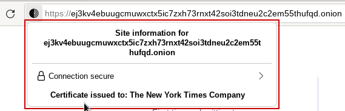

HTTPS on the *Source Interface*
===============================

The SecureDrop *Source Interface* is served as an onion service with an ``.onion``
URL, requiring Tor Browser to access it. While onion services provide
end-to-end encryption by default, as well as strong anonymity, there are
several reasons why you might want to consider deploying an additional layer of
encryption and authentication via HTTPS:

* Extended Validation (EV) certificates, which are currently the only type of
  certificates that may be issued for ``*.onion`` addresses, are intended to
  attest to the identity of the organization running a service. This provides
  an additional measure of authenticity (in addition to the organization's
  *Landing Page* and the `SecureDrop Directory`_) to help assure sources that
  they are communicating with the intended organization when they access a
  given Source Interface.

* SecureDrop supports v3 onion services, which use updated cryptographic
  primitives that provide better transport-layer encryption than those used
  by v2 onion services. Using HTTPS on the source interface will provide
  an extra layer of encryption for data in transit.

.. _`SecureDrop Directory`: https://securedrop.org/directory/

Obtaining an HTTPS certificate for Onion URLs
---------------------------------------------

Digicert
~~~~~~~~

DigiCert is one of only two Certificate Authorities (CA) that issue HTTPS
certificates for ``.onion`` sites. DigiCert requires organizations to follow
the Extended Validation (EV) process in order to obtain a certificate for an
Onion URL, so you should start by reviewing `DigiCert's documentation`_ for
obtaining a ``.onion`` certificate.

The EV certificates display information about an organization under the
certificate icon beside the URL bar:

|HTTPS Onion cert|

Additional information about the organization, such as name and geographic
location, are checked by the CA during the EV process. A Source can use this
information to confirm the authenticity of a SecureDrop instance, beyond the
verification already available in the `SecureDrop Directory`_.

In order to obtain an HTTPS certificate for your SecureDrop instance,
`contact DigiCert directly`_. As part of the Extended Validation,
you will be required both to confirm your affiliation with the organization,
and to demonstrate control over the Onion URL for your Source Interface.

In order for you to demonstrate control over the Onion URL for your Source
Interface, you will need to perform a signing operation leveraging the
private key of the Onion service used on the Source Interface.
DigiCert will provide you with some text and request that you use that text
in a signing operation. At a high level, obtaining a certificate from DigiCert
involves:

1. Generating an HTTPS keypair and CSR via ``openssl``.
2. Submitting the CSR to DigiCert.
3. Scheduling a phone call and verifying your relationship to the organization.
4. Generating another CSR, using a custom tool, leveraging the Onion service private key.
5. Submitting the second CSR to DigiCert.
6. Downloading the certificate from the DigiCert panel.
7. Installing the cert on the SecureDrop Application Server, via ``securedrop-admin``.

For SecureDrop, you should perform these steps on the Admin Workstation.
Below are detailed steps for use on Tails:

.. code:: sh

    # On the Admin Workstation, generate the first CSR
    $ mkdir ~/Persistent/sd-https-key-generation
    $ cd ~/Persistent/sd-https-key-generation
    $ openssl req -new -newkey rsa:4096 -nodes -keyout sd.key -out sd.csr

Upload that CSR to the DigiCert website, to begin the request.
After passing the EV organization verification, you'll receive
an email with a nonce. Use that value to generate the second CSR:

.. code:: sh

    # On the Admin Workstation, generate the second CSR
    $ cd ~/
    $ git clone --recurse-submodules https://github.com/HARICA-official/onion-csr.git
    $ cd onion-csr
    $ sudo apt-get update && sudo apt-get install -y ruby-dev rubygems build-essential
    # If prompted, choose to install the packages "Only once"
    $ torify gem install --user-install ffi
    $ gcc -shared -o libed25519.so -fPIC ed25519/src/*.c
    # Confirm the binary works by checking that "help" info is displayed:
    $ ./onion-csr.rb -h

    # Copy the Onion service key material to the Admin Workstation:
    $ mkdir hsdir
    $ ssh app sudo cat /var/lib/tor/services/sourcev3/hostname > hsdir/hostname
    $ ssh app sudo cat /var/lib/tor/services/sourcev3/hs_ed25519_public_key > hsdir/hs_ed25519_public_key
    $ ssh app sudo cat /var/lib/tor/services/sourcev3/hs_ed25519_secret_key > hsdir/hs_ed25519_secret_key

    # Generate (second) CSR
    $ ./onion-csr.rb -n <nonce> -d ./hsdir

The CSR will be printed to stdout, starting with ``BEGIN CERTIFICATE REQUEST``. Save
that CSR, and send it via email reply to DigiCert. After you receive your final certificate,
see instructions below for installing the certificate on the SecureDrop Application Server.

Harica
~~~~~~
The Greek CA `Harica`_ is now providing Domain Validation (DV) certificates for
``.onion`` addresses. DV certificates are less useful for authentication purposes,
but may still be used to provide another layer of encryption for source traffic.

.. _`specific URL`: https://docs.digicert.com/manage-certificates/organization-domain-management/managing-domains-cc-guide/add-authorize-domain-http-dcv/
.. _`DigiCert's documentation`: https://www.digicert.com/dc/blog/ordering-a-onion-certificate-from-digicert/

.. _`contact DigiCert directly`: https://www.digicert.com/dc/blog/ordering-a-onion-certificate-from-digicert/
.. _`CAB Forum`: https://cabforum.org/2015/02/18/ballot-144-validation-rules-dot-onion-names/
.. _`Harica`: https://www.harica.gr/

Activating HTTPS in SecureDrop
------------------------------

Make sure you have :doc:`installed SecureDrop already <install>`.

First, on the *Admin Workstation*:

.. code:: sh

  cd ~/Persistent/securedrop

Make note of the Source Interface Onion URL. Now from ``~/Persistent/securedrop``
on your admin workstation:

.. code:: sh

  ./securedrop-admin sdconfig

This command will prompt you for the following information::

  Whether HTTPS should be enabled on Source Interface (requires EV cert): yes
  Local filepath to HTTPS certificate (optional, only if using HTTPS on source interface): sd.crt
  Local filepath to HTTPS certificate key (optional, only if using HTTPS on source interface): sd.key
  Local filepath to HTTPS certificate chain file (optional, only if using HTTPS on source interface): ca.crt

The filenames should match the names of the files provided to you by DigiCert,
and should be saved inside the ``install_files/ansible-base/`` directory. You'll
rerun the configuration scripts: ::

    ./securedrop-admin install

The webserver configuration will be updated to apply the HTTPS settings.
Confirm that you can access the Source Interface at
``https://<onion_url>``, and also that the HTTP URL
``http://<onion_url>`` redirects automatically to HTTPS.

.. note:: By default, Tor Browser will send an OCSP request to a Certificate
    Authority (CA) to check if the Source Interface certificate has been revoked.
    Fortunately, this occurs through Tor. However, this means that a CA or anyone
    along the path can learn the time that a Tor user visited the SecureDrop
    Source Interface. Future versions of SecureDrop will add OCSP stapling support
    to remove this request. See `OCSP discussion`_ for the full discussion.

.. _`OCSP discussion`: https://github.com/freedomofpress/securedrop/issues/1941
