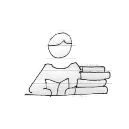

.. SecureDrop documentation master file, created by
   sphinx-quickstart on Tue Oct 13 12:08:52 2015.
   You can adapt this file completely to your liking, but it should at least
   contain the root `toctree` directive.

Welcome to SecureDrop's documentation!
======================================

SecureDrop is an open-source whistleblower submission system that media
organizations can use to securely accept documents from and communicate with
anonymous sources.

Get Started
^^^^^^^^^^^

|learn image| :doc:`I want to learn more about how SecureDrop works. <overview>`

|submit image| :doc:`I have information I want to share, and would like to learn how to do so safely. <source>`

|install image| :doc:`I am looking to set up a SecureDrop installation. <before_you_begin>`

|next image| :doc:`I have a SecureDrop installation and am interested in next steps. <getting_the_most_out_of_securedrop>`

|journalist image| :doc:`I am a journalist and would like information about how to best use this system. <journalist>`

.. toctree::
   :caption: Learn About SecureDrop
   :name: learn
   :maxdepth: 1
   :hidden:

   overview
   what_makes_securedrop_unique
   source
   journalist
   admin
   hardware
   

.. toctree::
   :caption: Installation Guide
   :name: installationguide
   :maxdepth: 1
   :hidden:

   before_you_begin
   create_usb_boot_drives
   set_up_svs
   set_up_transfer_and_export_device
   generate_submission_key
   set_up_admin_tails
   network_firewall
   servers
   install
   configure_admin_workstation_post_install
   create_admin_account
   test_the_installation
   

.. toctree::
   :caption: How-To Guides
   :name: howtoguides
   :maxdepth: 0
   :hidden:

   getting_the_most_out_of_securedrop
   firewall_pfsense
   firewall_opnsense
   onboarding_journalists
   onboarding_admins
   upgrading_to_the_latest_version
   logging
   ossec_alerts
   tails_printing_guide
   https_source_interface
   ssh_over_local_net
   yubikey_setup
   backup_and_restore
   backup_workstations
   update_tails_usbs
   rebuild_admin
   kernel_troubleshooting
   getting_support
   update_bios
   offboarding
   decommission

.. toctree::
  :caption: Reference
  :name: reference
  :maxdepth: 1
  :hidden:

  glossary
  passphrases
  passphrase_best_practices
  deployment_practices
  deployment/landing_page.rst
  deployment/minimum_security_requirements.rst
  deployment/whole_site_changes.rst
  deployment/sample_privacy_policy.rst
  threat_model/threat_model.rst
  threat_model/dataflow.rst
  threat_model/mitigations.rst
  training_schedule

Get Involved
^^^^^^^^^^^^

SecureDrop is an open source project. If you would like to contribute
to SecureDrop, please see our
`developer documentation <https://developers.securedrop.org/>`_.

