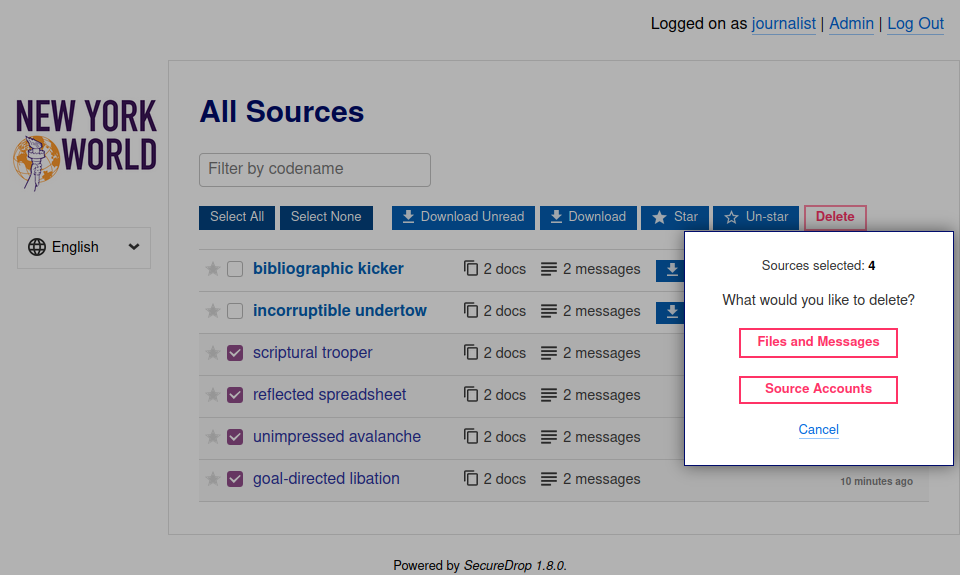
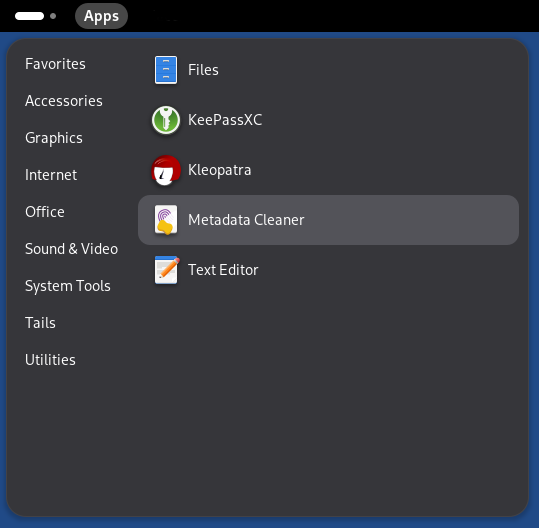
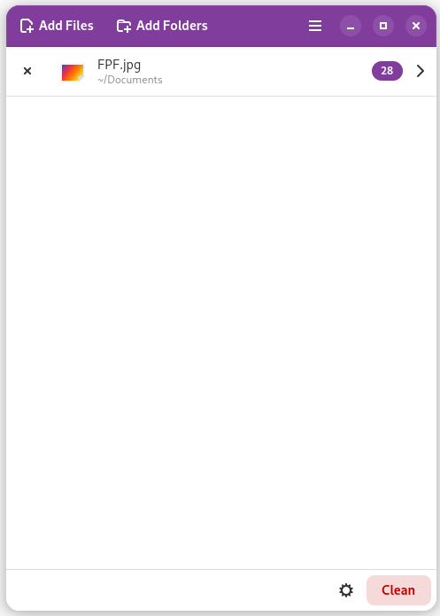
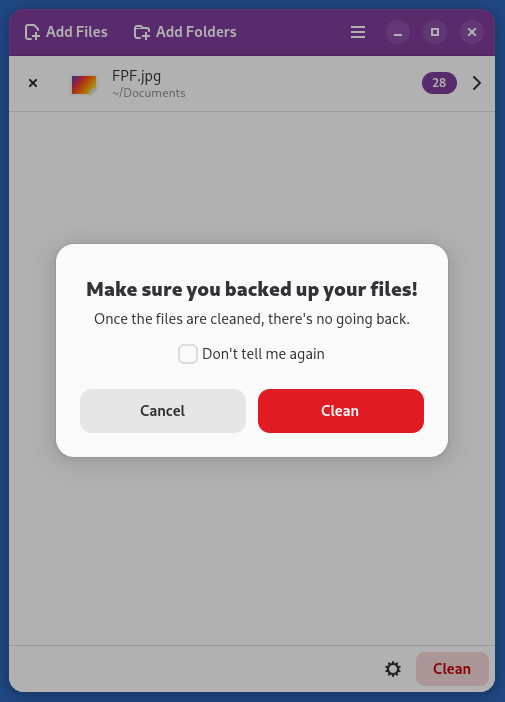
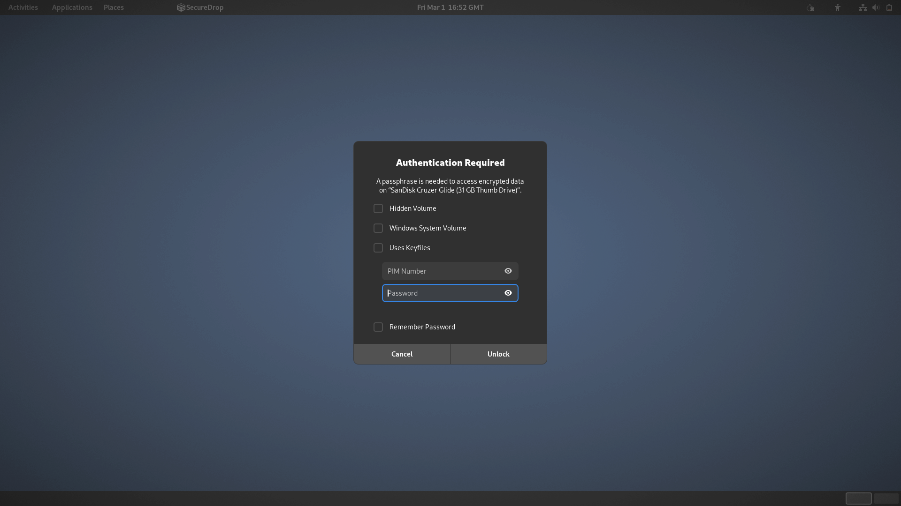

Working with Documents
======================

This section describes how to organize submissions, handle unusual file formats,
safely research submissions, remove metadata, and mitigate risks from
submitted malware.

.. tip::

   This is only a very limited introduction. Freedom of the Press Foundation
   publishes and maintains `digital security guides for journalists <https://freedom.press/training/>`__,
   many of which relate to these topics, and offers `digital security training <https://freedom.press/training/request-training/>`__
   for news organization staff.

Organizing submissions
~~~~~~~~~~~~~~~~~~~~~~

Whenever you download submissions using one of the **Download** buttons in the
*Journalist Interface*, they will be organized as a ZIP archive with a built-in
folder structure, which you can use as a template for organizing submissions on
the *Secure Viewing Station*.

Submissions downloaded in this manner from the *list of all sources* will
contain a structure like the following:

.. code:: sh

    all
    ├── recessive accreditation
    │   ├── 1_2019-07-07
    │   │   └── 1-recessive_accreditation-msg.gpg
    │   └── 2_2019-07-07
    │       └── 2-recessive_accreditation-msg.gpg
    └── surviving authentication
        ├── 1_2019-07-07
        │   └── 1-surviving_authentication-doc.gz.gpg
        └── 2_2019-07-07
            └── 2-surviving_authentication-msg.gpg

Submissions downloaded in this manner from the screen for an *individual source*
will contain a similar structure, but without the parent folder ``all``.

A folder like ``1_2019-07-07`` in the example above will always contain exactly
one message or document. The numbers in the folder name (1, 2, etc.) correspond
to the numbering in the *Journalist Interface*. The dates (2019-07-07 in the
example above) are the day (in year/month/day format) of the last activity
related to this source, at the time the archive was downloaded.

If you download messages or documents one at a time in the *Journalist
Interface*, they will not be contained in a ZIP file at all. Instead, you will
be dealing with individual files like ``1-surviving_authentication-doc.gz.gpg``,
without a folder structure.

Handling File Formats
~~~~~~~~~~~~~~~~~~~~~

SecureDrop accepts submissions of any file type. Tails comes with
`pre-installed applications <https://tails.net/doc/about/features/index.en.html>`__
for securely working with documents, including an office suite, graphics
tools, desktop publishing tools, audio tools, and printing and scanning tools.

For more information, visit the Tails guide to `working with sensitive documents`_.

Pre-Encrypted Submissions
~~~~~~~~~~~~~~~~~~~~~~~~~

SecureDrop sources can optionally encrypt prior to submitting to SecureDrop.
This means that once you decrypt the document as you usually do by double
clicking the document in the file manager, there will be another layer of
encryption.

Most often, the file will be encrypted to the SecureDrop key. If the file is
encrypted to your SecureDrop key, you should be able to double click the file as
usual once more in the SVS and it should decrypt.

However, it's also possible the file is encrypted to another key, potentially
your personal key. If this occurs, you will get an error message in Tails that
reads "Decryption failed. You probably do not have the decryption key".
To determine which key was used, if you are comfortable at the command line, you
can open the ``Terminal``, navigate to the file, and use:

.. code:: sh

  gpg --decrypt NAME_OF_FILE

replacing ``NAME_OF_FILE`` with the name of the file you wish to decrypt. This
command will tell you what key was used to encrypt the file. If you are not
comfortable at the command line, contact your SecureDrop admin or
Freedom of the Press Foundation for assistance.

.. warning:: **Do not** transfer source material off the *Secure Viewing Station*
             for decryption. Instead, transfer cryptographic keys *to* the SVS
             device for decryption and metadata removal.

Researching Submissions
~~~~~~~~~~~~~~~~~~~~~~~

Journalists should take care to research submissions using the Tor
Browser, ideally in a new Tails session on your *Journalist Workstation* for
highly sensitive submissions.

.. _removing_metadata:

Removing Metadata
~~~~~~~~~~~~~~~~~

.. tip:: For detailed information about removing metadata from documents, check
   out this in-depth `guide to removing metadata`_.

Tails comes with the `Metadata Anonymisation Toolkit 2`_ (MAT2) that
is used to help strip metadata from a variety of types of files,
including png, jpg, OpenOffice/LibreOffice documents, Microsoft Office
documents, pdf, tar, tar.bz2, tar.gz, zip, mp3, mp2, mp1, mpa, ogg,
and flac. We recommend using this and other tools to work with documents within
Tails for as much of your workflow as possible.

You can use MAT2 via the *Metadata Cleaner* application which is found in the **Accessories** section of the **Apps** menu.

|Metadata Cleaner menu|

You can load individual files or folders into *Metadata Cleaner* by clicking **Add Files** or **Add Folders**. *Metadata Cleaner* gives you a count of how many metadata parameters are associated with each file and lets you view the metadata.

|Metadata Cleaner loaded|

You can select Clean to remove the metadata from the files. Note that this process deletes the original files, leaving only the cleaned versions.

|Metadata Cleaner warning|

To use MAT2 on the command line, type ``man mat2`` to see a list of available actions you can take with MAT2. For example, you can view the metadata of a file with ``mat2 filename --show``.

|mat2 cli show|

You can create a "clean" version of the file with ``mat2 filename``, 
noting that this does not erase the metadata on the original file but instead creates a new cleaned copy. Use the ``--inplace`` flag if you wish to delete the original file and leave only a cleaned version.

Note that even after running MAT2, you should carefully inspect files to ensure
that all metadata has been wiped, or convert them to a simpler file format (for
example, converting a ``.xls`` file to a ``.csv``) to ensure that metadata is
not left behind in error.

.. _`guide to removing metadata`: https://freedom.press/training/everything-you-wanted-know-about-media-metadata-were-afraid-ask/

.. _malware_risks:

Risks From Malware
~~~~~~~~~~~~~~~~~~
SecureDrop does not scan for or remove malware in submissions you receive. There
are important steps you can take to protect yourself:

1. **Keep the version of Tails on your Secure Viewing Station up-to-date.**

   Tails offers more protection against compromise than your everyday computer,
   and the air-gap prevents potential malware from "phoning home." But if the
   version of Tails is outdated, an attacker can still attempt to exfiltrate
   or destroy information.
   |br| |br|

2. **Print documents from the Secure Viewing Station instead of exporting them
   digitally, whenever possible.**

   Printing documents prevents the proliferation of malware to your everyday
   workstation, and eliminates most categories of embedded metadata. Note that
   printing a document may still preserve watermarks, printer codes,
   steganographically encoded data, or other information not visible to the
   naked eye.
   |br| |br|

3. **Consult with your administrator or your digital security staff before
   copying files digitally.**

   If you must copy a file in digital form (because of its format, the volume
   of information, or for other reasons), we recommend taking the time to
   consult with technical experts within the organization.

   .. tip::

      Converting files to simpler formats (e.g., PDF to PNG) can help reduce the
      risk of malware. Tails provides both graphical and command-line utilities
      that can be used for this purpose.

4. **Never scan QR codes embedded in documents using a network-connected
   device.**

   `QR codes can contain malicious links`_ that your device will automatically
   visit. This can alert third-parties to your actions, reveal the identities
   of your sources, and breach the air gap that is in place with the
   *Secure Viewing Station*. 

   In general, be careful when opening any links provided in a SecureDrop
   submission. If you are unsure if a link is safe to click, you should
   consult internally, or contact Freedom of the Press Foundation for
   assistance.
   |br| |br|

5. **Don't photograph submissions using your smartphone, and be careful with all
   digital photography**.

   Many smartphones are configured to back up photographs to cloud services,
   immediately or intermittently; newer digital cameras have similar
   functionality. Not all backup settings may be visible to you.

   Any digital photograph will include certain metadata by default, which may
   reveal sensitive information about your SecureDrop usage patterns
   (potentially including GPS coordinates) to anyone who gains access
   to the file.

.. warning::

   If you have not memorized the passphrases to unlock the USB drives
   for the *Secure Viewing Station* or the *Transfer Device*, you may need
   to access a password manager on your phone or laptop to do so. We
   recommend switching any required electronic devices into airplane mode,
   and securely storing any devices you do not need outside the environment
   in which you access the *Secure Viewing Station*. This further mitigates
   the risk of accidentally compromising the air-gap.

Fully mitigating the risks of malware received via SecureDrop is beyond the
scope of this documentation. If you have questions, you can contact us at
securedrop@freedom.press (`GPG encrypted <https://securedrop.org/sites/default/files/fpf-email.asc>`__)
or via the `support portal <https://support.freedom.press/>`__. Please do **NOT**
disclose details about the contents of any submission you have received.

.. _`QR codes can contain malicious links`: https://securedrop.org/news/security-advisory-do-not-scan-qr-codes-submitted-through-securedrop-connected-devices
.. _`working with sensitive documents`: https://tails.net/doc/sensitive_documents/index.en.html
.. _`Metadata Anonymisation Toolkit 2`: https://mat.boum.org/

Moving Documents to Your Everyday Workstation
---------------------------------------------

.. important::

   As noted above, SecureDrop does not scan for or remove malware. If the file
   you received contains malware targeting the operating system and applications
   running on your everyday workstation, copying it in its original form carries
   the risk of spreading malware to that computer. Make sure you understand the
   risks, and consider other methods to export the document (e.g., print).

If you must copy a file from your *Secure Viewing Station* to your everyday
workstation in digital form, our 
:doc:`recommendation <../admin/installation/set_up_transfer_and_export_device>`
is that journalists are provided with an *Export Device*, typically a USB drive,
which is encrypted using `VeraCrypt <https://www.veracrypt.fr/en/Home.html>`__.
These instructions assume that you are following the recommended workflow.
If you are unsure, ask your administrator.

.. note::

   VeraCrypt support was added to Tails in version 3.9. We strongly recommend
   keeping your *Secure Viewing Station* up-to-date with each release of Tails.

To open the *Export Device* on the *Secure Viewing Station*, follow these steps:

1. If your *Export Device* has a physical write protection switch, make sure
   it is in the *unlocked* position.
2. Plug the *Export Device* into the *Secure Viewing Station*.
3. Enter your passphrase, which we recommend keeping in your own personal
   password manager (e.g., on your smartphone), not on *KeePassXC*.
   
|Unlock VeraCrypt|

4. Click Unlock. 

The *Export Device* should now open in the file manager. If there are still
files on the *Export Device* from your last copy operation,
delete them by moving them to the Trash, and then selecting **Empty Trash**.

Copy the file or files you want to access on your everyday workstation to the
*Export Device* using the file manager.

.. note:

Decrypting and Preparing to Publish
-----------------------------------

.. note::

   To decrypt a VeraCrypt drive on a Windows or Mac workstation, you need
   to have the *VeraCrypt* software installed. If you are unsure if you have the
   software installed or how to use it, ask your administrator, or see
   the `Freedom of the Press Foundation guide <https://freedom.press/training/encryption-toolkit-media-makers/veracrypt-guide/>`__
   for working with VeraCrypt.

To access the *Export Device* on your everyday workstation, follow these steps:

1. If your *Export Device* has a physical write protection switch, make sure it
   is in the *locked* position.
2. Plug the *Export Device* into your everyday workstation.
3. Launch the *VeraCrypt* application.
4. Click **Select Device** and select the *Export Device*, then click **OK**.
5. Click **Mount**.
6. Enter the passphrase for your *Export Device*. You should find this in your
   own personal password manager.
7. Open the *Export Device* in your operating system's file manager, and copy
   the contents of interest to your everyday workstation.

As a security precaution, we recommend deleting the files on the *Export
Device* after each copy operation. If you are using write protection, you have to perform this step on the *Secure Viewing Station* to get the security benefits of write protection.

When you are done, switch back to the *VeraCrypt* window, and click **Dismount**.

You are now ready to write articles and blog posts, edit video and
audio, and begin publishing important, high-impact work!

.. tip:: Check out our SecureDrop :doc:`Promotion Guide
         <../admin/deployment/getting_the_most_out_of_securedrop>` to read
         about encouraging sources to use SecureDrop.

Deleting submissions and source accounts
----------------------------------------

As part of routine SecureDrop usage, we recommend that you establish data retention
practices consistent with your organization's threat model, data lifecycle and data
retention policies. Regularly deleting submissions and source accounts can
mitigate risks in the event that your SecureDrop servers or a source's account
details are compromised.

To delete sources, first select them in the list of all sources in the
*Journalist Interface*, then click the **Delete** button. You will be
given a choice to delete all messages and files for the selected sources, or to
delete the source accounts.

|Delete sources|

If you delete messages and files for a source, the source will continue to appear
in the list of sources in the *Journalist Interface*, and they will still be able
to log into the *Source Interface* using their codename. Consider using this
option as part of regular deletion of reviewed submissions, especially if you
are not sure that all communication with the source has concluded.

.. note::

   If you delete all messages and files, that includes all replies you have sent
   to the source, even if the source has not seen them yet. You will still be
   able to send new replies.

If you delete the entire source account, the source will not be able to log
in again using their codename, and all information about them will be
destroyed. Consider using this option if it is clear that all communication
with the source has concluded, or if the source has requested that all information
about them and their submissions should be removed.

You can more selectively delete source submissions and journalist replies by
clicking the source's two-word designation in the list of all sources. You will
see a list of source messages (filenames end with ``-msg.gpg``), file submissions
(filenames end with ``-doc.gz.gpg``) and journalist replies (filenames end with
``--reply.gpg``).

Select the source data you wish to delete, then click the **Delete** button.
You will be prompted for confirmation.

|Delete individual submissions|

From the same page, you also have the option to delete the entire source
account. To do so, click the button labeled **Delete Source Account** at the
bottom of the page. You will be prompted for confirmation.

|Delete source account|

.. |Delete individual submissions| image:: ../images/manual/screenshots/journalist-delete_submissions.png
   :alt: Example source page displaying a dialog box that asks for confirmation before deleting the selected submissions.
.. |Delete source account| image:: ../images/manual/screenshots/journalist-delete_source_account.png
   :alt: Example source page displaying a dialog box that asks for confirmation before deleting the source account.

.. |mat2 cli show| image:: ../images/manual/screenshots/mat2_cli_show.png
   :alt: Terminal application displaying the metadata of a file.

.. |br| raw:: html

     
