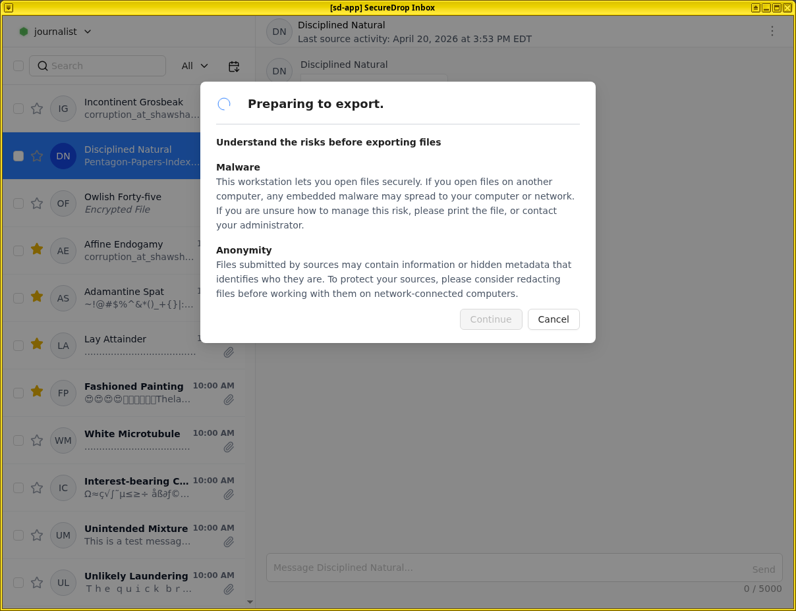
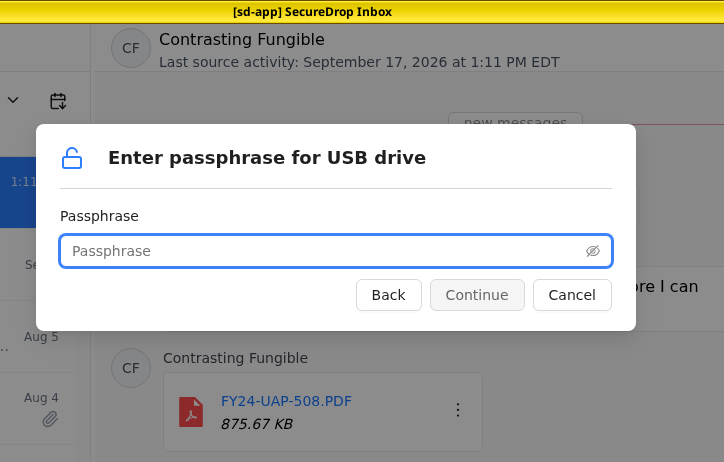
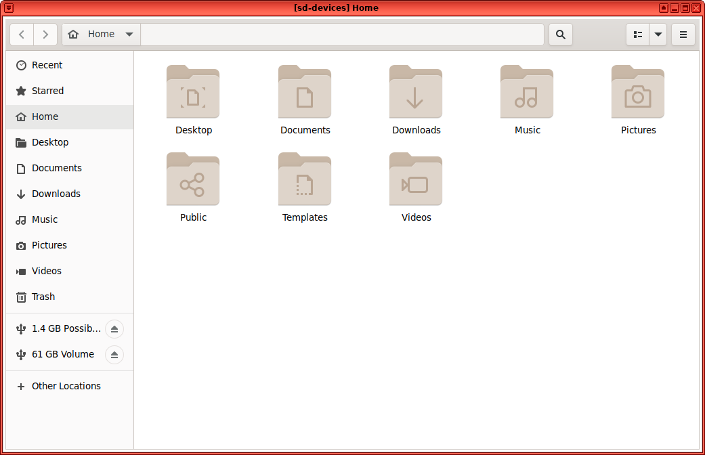
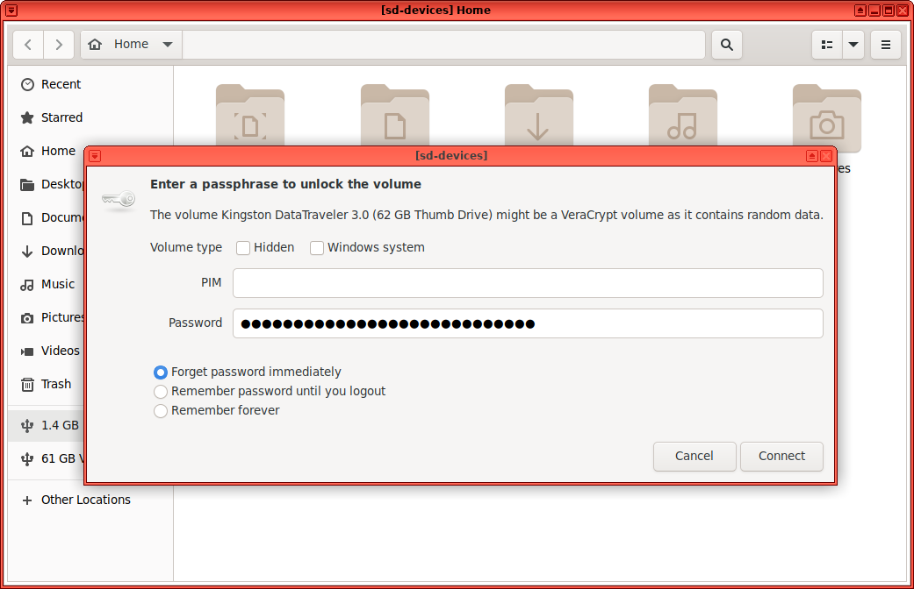

Exporting and printing
======================

In addition to providing a secure environment to view messages and files, SecureDrop Inbox has several ways to print or export files and conversations:

- Print submitted documents with an attached USB printer
- Print conversation transcripts with an attached USB printer
- Export submitted files to an Export Device
- Export conversation transcripts with a source to an Export Device

Printing
--------

To print from SecureDrop Inbox, a :ref:`compatible printer <print_requirements>`  must be plugged into the computer's USB port.

Printing documents
~~~~~~~~~~~~~~~~~~

.. TODO screenshot for step 1

#. After :ref:`downloading<downloading_documents>` the document in the conversation view, click the three dots menu and select **Print**.
#. Wait for ``sd-devices`` qube to start.
#. You will prompted to attach your printer.
#. A **Print Document** dialog will appear, from which you can configure different print options before printing the document.

Printing conversation transcripts
~~~~~~~~~~~~~~~~~~~~~~~~~~~~~~~~~

.. TODO screenshot for step 1

#. From the three dots conversation menu, select **Print Transcript**.
#. Wait for ``sd-devices`` qube to start.
#. You will prompted to attach your printer.
#. A **Print Document** dialog will appear, from which you can configure different print options before printing the document.

Exporting using an Export Device
--------------------------------

.. important::

   SecureDrop does not scan for or remove malware. If the file you received contains malware targeting the operating system and applications running on your everyday workstation, copying it in its original form carries the risk of spreading malware to that computer. Make sure you :doc:`understand the risks</journalist/working_with_exported_files>`, and consider other methods to export the file (e.g., printing documents).

If you must copy a file from your SecureDrop Workstation to another computer or device in digital form, our recommendation is that Journalists are provided with an :ref:`Export Device<glossary_export_device>`, a USB flash drive which is encrypted using LUKS or `VeraCrypt <https://www.veracrypt.fr/en/Home.html>`__. These instructions assume that you are following the recommended workflow. If you are unsure, ask your Administrator.

.. note:: Files submitted by a Source must first be :ref:`downloaded<downloading_documents>` before they can be exported.

Attach an Export Device
~~~~~~~~~~~~~~~~~~~~~~~

Before exporting any files or transcripts, you should first attach and unlock your Export Device.

1. Insert the Export Device and wait for the ``sd-devices`` qube to start.
2. If your Export Device is using VeraCrypt, you will need to unlock it manually:

   a. Open the file menu by clicking on the Qubes Application menu |qubes_menu| (in the top left), select **sd-devices** and click **Files**.
   b. In the left sidebar, there should be an entry labeled **# GB Possibly Encrypted**, click it. |screenshot_veracrypt_sd_devices_files|
   c. You will be prompted for the password configured for this Export Device:

      - Volume type: leave both unchecked
      - PIM: leave empty
      - Password: drive's password
      - Forget password immediately: selected

      |screenshot_veracrypt_sd_devices_files_unlock|
   d. Click **Connect**.

Exporting individual files
~~~~~~~~~~~~~~~~~~~~~~~~~~

.. TODO new screenshot for step 1

#. Open the three dots menu of the file you which to export and click **Export**. |screenshot_export_dialog| 
#. If you have not already unlocked your Export Device, you will be prompted for the password configured for this Export Device. |screenshot_export_drive_passphrase|
#. Once you see a message informing you that the export was successfully completed, you can safely unplug the Export Device. Alternatively, you can leave the drive plugged in and export additional files.

Exporting conversation transcript
~~~~~~~~~~~~~~~~~~~~~~~~~~~~~~~~~~

SecureDrop Inbox will generated a `.txt` file transcript of your entire conversation with a Source. Previously deleted messages will not appear in this transcript.

.. TODO screenshot for step 1

#. From the three dots conversation menu, select **Export Transcript**.
#. If you have not already unlocked your Export Device, you will be prompted for the password configured for this Export Device. |screenshot_export_drive_passphrase|
#. Once you see a message informing you that the export was successfully completed, you can safely unplug the Export Device. Alternatively, you can leave the drive plugged in and export additional files.

Exporting transcript and files
~~~~~~~~~~~~~~~~~~~~~~~~~~~~~~

You may also export the transcript and all downloaded files for a Source in one action.

.. TODO screenshot for step 1

#. From the three dots conversation menu, select **Export Transcript and Files**.
#. If you have not already unlocked your Export Device, you will be prompted for the password configured for this Export Device. |screenshot_export_drive_passphrase|
#. Once you see a message informing you that the export was successfully completed, you can safely unplug the Export Device. Alternatively, you can leave the drive plugged in and export additional files.

Decrypting and preparing to publish
~~~~~~~~~~~~~~~~~~~~~~~~~~~~~~~~~~~

.. note::

   To decrypt a VeraCrypt drive on a Windows or Mac workstation, you need to have the VeraCrypt software installed. If you are unsure if you have the software installed or how to use it, ask your Administrator, or see the `Freedom of the Press Foundation guide <https://freedom.press/training/encryption-toolkit-media-makers/veracrypt-guide/>`__ for working with VeraCrypt.

To access the Export Device on your everyday workstation, follow these steps:

1. If your Export Device has a physical write protection switch, make sure it is in the *locked* position.
2. Plug the Export Device into your everyday workstation.
3. Launch the VeraCrypt application.
4. Click **Select Device** and select the Export Device, then click **OK**.
5. Click **Mount**.
6. Enter the passphrase for your Export Device. You should find this in your own personal password manager.
7. Open the Export Device in your operating system's file manager, and copy the contents of interest to your everyday workstation.

When you are done, switch back to the VeraCrypt window, and click **Dismount**.

You are now ready to write articles and blog posts, edit video and audio, and begin publishing important, high-impact work!

.. tip:: Check out our SecureDrop :doc:`Promotion Guide </admin/deployment/getting_the_most_out_of_securedrop>` to read about encouraging sources to use SecureDrop.

Securely erase an Export Device
~~~~~~~~~~~~~~~~~~~~~~~~~~~~~~~

Due to the underlying technology of USB flash drives, Export Devices are likely to retain recoverable portions of files that have been stored on them even if those files have been deleted.

To protect against the possibility that a compromised encryption password will yield access to traces of previously exported files, you should securely erase your Export Devices on a regular basis. You may also wish to do this on a case-by-case basis after handling particularly sensitive files or if you believe a decryption password may be compromised.

Securely erasing an Export Device can only be done by re-formatting and re-encrypting the USB flash drive with a new encryption password. You can follow the :doc:`same steps</admin/installation/provisioning_usb>` used to initially create the Export Device, or contact your Administrator.

You may also choose to destroy the drives by physical means, such as using a hammer or purpose-built shredder to pulverize the drive.

.. |qubes_menu| image:: ../images/qubes_menu.png
  :alt: Qubes Application menu
