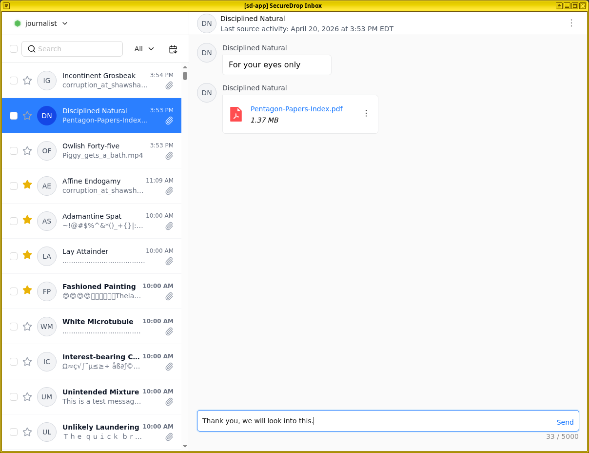
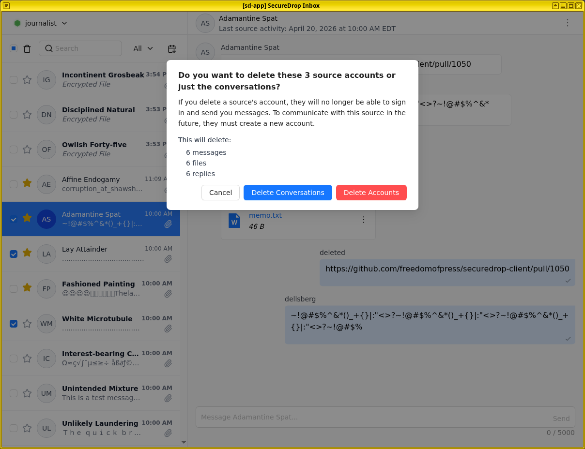

Communicating with sources
==========================

The *Journalist Workstation* lets journalists check SecureDrop, decrypt and securely
view submissions, and reply to sources, all on the same computer.

Once logged in, you will see a chat-like user interface:

- The top of the left panel shows your username, if you are logged in, or the
  sign-in button.
  
- The action area of the left panel provides the ability to search for sources,
  toggle the sort order, select multiple sources, and delete sources.

- The larger portion of the left panel holds the list of sources that have submitted to your
  instance. Each source is identified to you with a two word pseudonym. You will also
  see the date of the last source activity, an icon to indicate if a source contains attachments,
  and a button to mark a source as starred.

- The right panel holds the conversation view. All parts of the conversation
  with a specific source (messages, files, and journalist replies) will be
  displayed here.

Opening a conversation
----------------------

To display a conversation in the conversation view, simply click a source in the
source list.

|screenshot_sdapp_main_view|

Journalists sending replies are assigned different colors and identified with
their initials. Move your mouse pointer over the initials to reveal the full
name.

.. note:: When you are prompted by a dialog that says “Do you allow VM
   'sd-app' to access your GPG keys (now and for the following 28800
   seconds)?”, click **Yes**. This allows the SecureDrop Application VM access
   to the secure VM that holds your SecureDrop Submission Key.

Highlighting conversations
--------------------------

You can highlight important conversations by clicking on the star beside a
source's name. Starred sources will be visible as starred to everyone in your
organization.

Sending a reply
---------------

Compose a reply to the selected source in the text box at the bottom of the
conversation view. Click the **Send** button or press "Ctrl+Enter" to send
a reply. Any replies you did not send will be discarded when you move to a
different conversation.

|screenshot_send_reply|

.. note:: If a reply fails to be sent successfully, it will still be visible in
  subsequent sessions, including to any other users logging into the same
  physical *Journalist Workstation*.

Deleting conversations and source accounts
------------------------------------------

As part of routine SecureDrop usage, we recommend that you establish data retention practices consistent with your organization's threat model, data lifecycle and data retention policies. Regularly deleting conversations and source accounts can mitigate risks in the event that your SecureDrop servers or a source's account details are compromised.

If you delete messages and files for a source, the source will continue to appear
in the list of sources in the *SecureDrop App*, and they will still be able
to log into the *Source Interface* using their codename. Consider using this
option as part of regular deletion of reviewed submissions, especially if you
are not sure that all communication with the source has concluded.

.. note::

   If you delete all messages and files, that includes all replies you have sent
   to the source, even if the source has not seen them yet. You will still be
   able to send new replies.

If you delete the entire source account, the source will not be able to log
in again using their codename, and all information about them will be destroyed. Consider using this option if it is clear that all communication with the source has concluded, or if the source has requested that all information about them and their submissions should be removed.

Deleting conversations
''''''''''''''''''''''''''''''

You can delete a single source conversation checking the box beside the Source name in the list, then clicking the delete button (as indicated by a trash icon) in the action area at the top.

|screenshot_delete_sources_select|

You will be presented with a pop-up where you will be asked to confirm if you would prefer to **Delete Conversation** or **Delete Account**.

|screenshot_confirm_delete|

Click **Delete Conversation** to delete all files and messages (including journalist
replies) associated with this source, while keeping the source account active.
The source will continue to appear in the source list, and will be able to
communicate with you through the Source Interface.

Click **Delete Account** to also remove the source from the source list,
and to prevent them from logging into the Source Interface. Their account will
be completely removed from the system.

.. |screenshot_sdapp_main_view| image:: ../images/screenshot_sdapp_main_view.png
  :width: 100%

.. |screenshot_delete_sources_select|  image:: ../images/screenshot_delete_sources_select.png
  :width: 100%

Deleting multiple conversations
'''''''''''''''''''''''''''''''

To delete multiple conversations or accounts, select more than one source
conversation from the list, then click the delete button. You will be
presented with the same options to **Delete Conversations** and
**Delete Accounts** as you would with a single source conversation.
