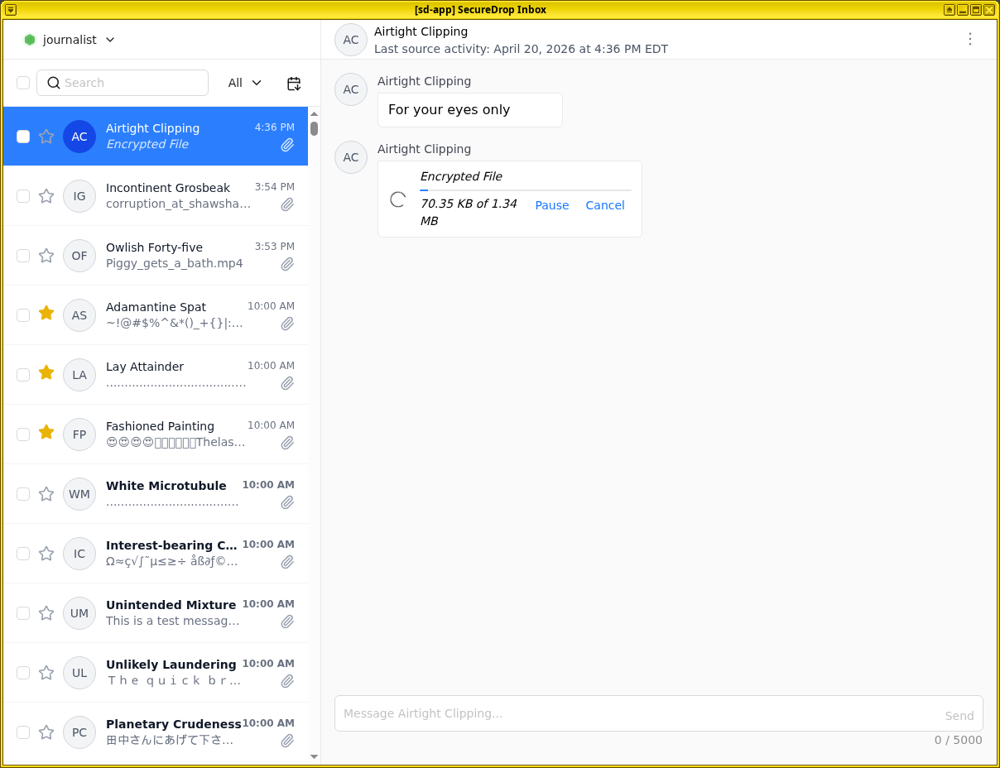
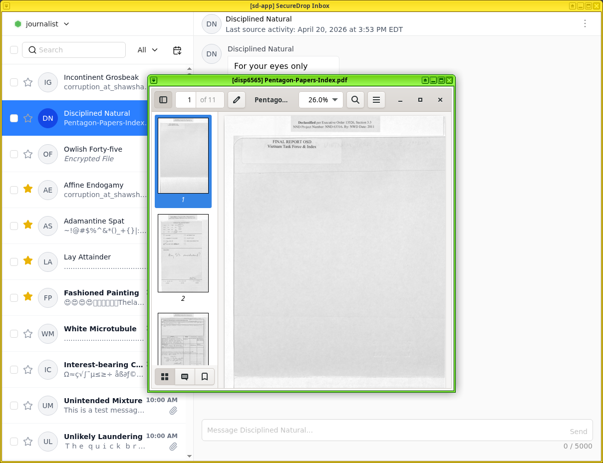
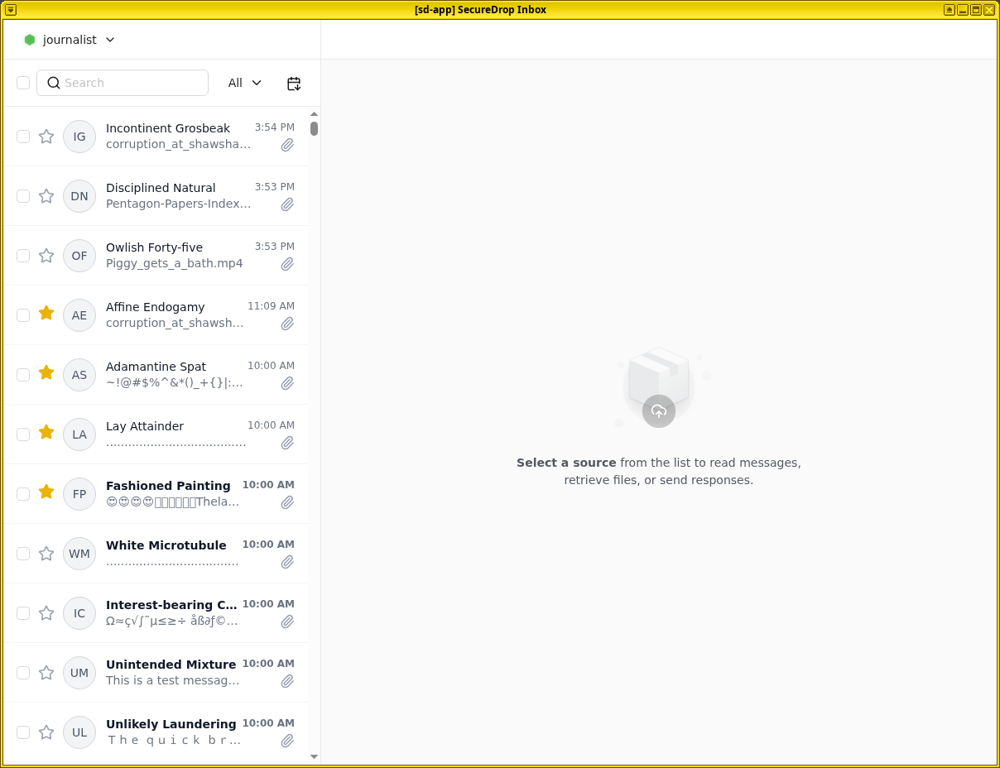
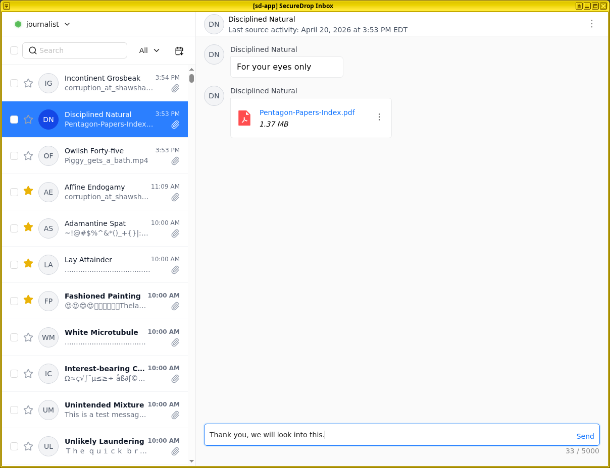
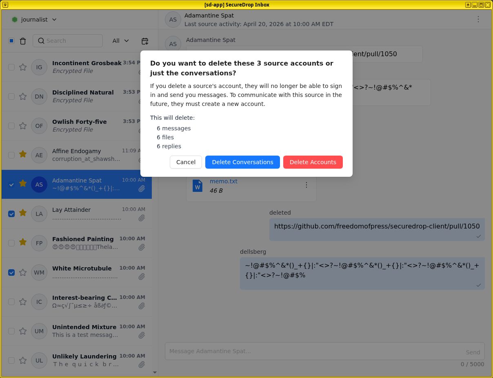
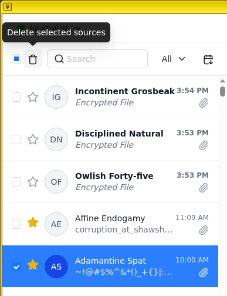

Communicating with Sources
==========================

SecureDrop Inbox lets Journalists check SecureDrop, decrypt and securely view messages and files, and reply to Sources.

Once logged in, you will see a chat-like user interface:

- The top of the left panel shows your username, if you are logged in, or the sign-in button.
- The action area of the left panel provides the ability to search through Source names or message content, toggle the sort order, select multiple Sources, and delete Sources.
- The larger portion of the left panel holds the list of Sources that have submitted to your instance. Each Source is identified to you with a two word pseudonym. You will also see the date of the last Source activity, an icon to indicate if a Source has sent any files, and a button to mark a Source as starred.
- The right panel holds the conversation view. All parts of the conversation with a specific Source (messages, files, and Journalist replies) will be displayed here.

Seen and unseen conversations
-----------------------------

Source with new messages or files that have not been seen by any Journalist will be displayed in bold text in the Source list.

As soon as any Journalist clicks on a Source with new messages or files, it will be marked as seen (no longer displayed in bold text) for all users.

Opening a conversation
----------------------

To display a conversation in the conversation view, simply click a Source in the Source list.

|screenshot_sdapp_main_view|

Journalists sending replies are assigned different colors and identified with their initials. Move your mouse pointer over the initials to reveal the full name.

Starring Sources
----------------

You can highlight important Sources by clicking on the star beside a Source's name. Starred Sources will be visible as starred to everyone in your organization.

Sending a reply
---------------

Compose a reply to the selected Source in the text box at the bottom of the conversation view. Click the **Send** button or press "Ctrl+Enter" to send a reply. Any replies you did not send will be discarded when you move to a different conversation.

|screenshot_send_reply|

.. note:: If a reply fails to be sent successfully, it will still be visible in subsequent sessions, including to any other users logging into the same physical SecureDrop Workstation.

Downloading and viewing submitted files
---------------------------------------

When a Source submits files, you will see a Download button in the conversation flow, a file size, and light-gray text that says "Encrypted File."

|screenshot_file_before_download|

.. _downloading_documents:

Downloading
~~~~~~~~~~~

To download a file, click anywhere on the **Encrypted File** message box. An animated spinner will indicate that the file is downloading, and a progress bar will indicate the download's progress:

|screenshot_file_downloading|

If necessary, you can pause the download by clicking "Pause," and resume the download later with "Resume."

Once the file has been downloaded and decrypted, the filename and file size will be visible. A three dots menu will also be visible to the right of the filename, where you can **View**, **Export** or **Print** a file. The displayed file size may increase after the download is complete, because the SecureDrop Client automatically decompresses the downloaded file.

|screenshot_file_download_successful|

Viewing submitted files on the SecureDrop Workstation
~~~~~~~~~~~~~~~~~~~~~~~~~~~~~~~~~~~~~~~~~~~~~~~~~~~~~

To view a downloaded file, click its filename. This will open the file in a temporary environment, called a "disposable" qube. The file you clicked on will open in a new window with a different colored border and a window title prefixed with "disp" (meaning disposable).

|screenshot_dispvm|

This disposable qube is a special isolated environment; it does not have internet access, and isolates the files that you are viewing from other sensitive files and applications on the SecureDrop Workstation.

Supported filetypes
^^^^^^^^^^^^^^^^^^^

The following filetypes are currently supported for viewing on the SecureDrop Workstation:

* .txt, .csv, .pdf
* Microsoft Office files (.doc, .docx, .xls, .xlsx, .ppt, .pptx)
* OpenDocument files (.odt, .ods, .odp)
* Audio: .mp3, .mp4, .mpeg, .wav, .ogg (Ogg Vorbis)
* Video: .mp4, .webm, .mov (Quicktime), .avi (Audio Video Interleave - Microsoft), .wmv (Windows Media Video)
* Image: .gif, .png, .jpeg, .tiff, .svg, .ico, .webp, .heic, .avif
* Compressed archives: .zip, .tar.gz (although printer support for files inside an archive is still to be implemented)

A full list of supported filetypes can be found `here <https://github.com/freedomofpress/securedrop-client/blob/main/workstation-config/mimeapps.list.sd-viewer>`_.

.. tip:: In Qubes, window border colors are used to signify different qubes.

.. _`the Qubes OS documentation`: https://www.qubes-os.org

Deleting conversations and Source accounts
------------------------------------------

As part of routine SecureDrop usage, we recommend that you establish data retention practices consistent with your organization's threat model, data lifecycle and data retention policies. Regularly deleting conversations and Source accounts can mitigate risks in the event that your SecureDrop servers or a Source's account details are compromised.

If you delete the entire conversation for a Source, that Source will continue to appear in the list of Sources in SecureDrop Inbox, and they will still be able to log into the Source Interface using their codename. Consider using this option as part of regular deletion of reviewed messages and files, especially if you are not sure that all communication with the Source has concluded.

.. note::

   If you delete all messages and files, that includes all replies you have sent to the Source, even if the Source has not seen them yet. You will still be able to send new replies.

If you delete the entire Source account, the Source will not be able to log in again using their codename, and all information about them will be destroyed. Consider using this option if it is clear that all communication with the Source has concluded, or if the Source has requested that all information about them and their messages and files should be deleted.

Deleting one-by-one
~~~~~~~~~~~~~~~~~~~

You can delete a single Source conversation checking the box beside the Source name in the list, then clicking the delete button (as indicated by a trash icon) in the action area at the top.

|screenshot_delete_sources_select|

You will be presented with a pop-up where you will be asked to confirm if you would prefer to **Delete Conversation** or **Delete Account**.

|screenshot_confirm_delete|

Click **Delete Conversation** to delete all files and messages (including journalist replies) associated with this Source, while keeping the Source account active. The Source will continue to appear in the Source list, and will be able to communicate with you through the Source Interface.

Click **Delete Account** to also remove the Source from the Source list, and to prevent them from logging into the Source Interface. Their account will be completely removed from the system.

Bulk deletion
~~~~~~~~~~~~~

To delete multiple conversations or Source accounts, select more than one Source conversation from the list, then click the delete button. You will be presented with the same options to **Delete Conversations** and **Delete Accounts** as you would with a single Source conversation.
