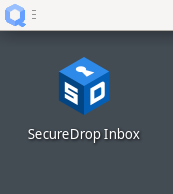
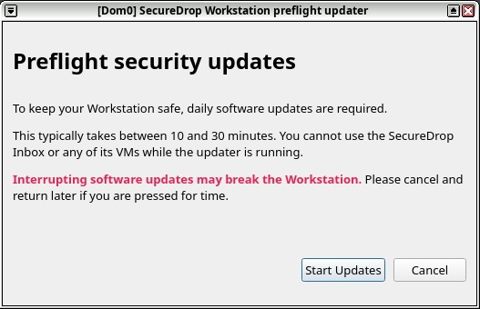
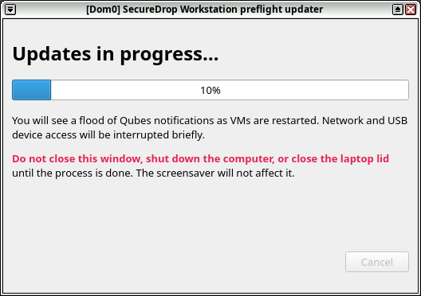
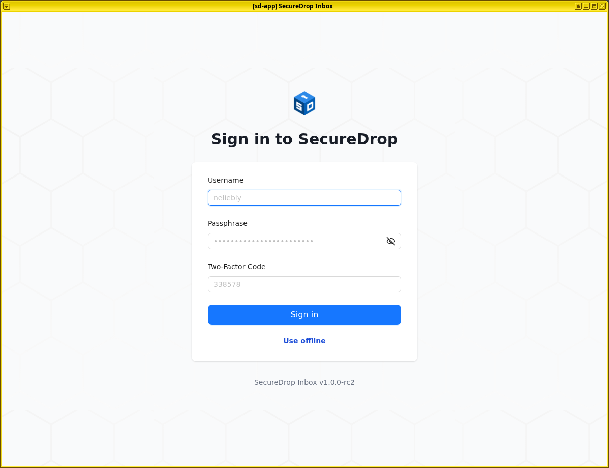
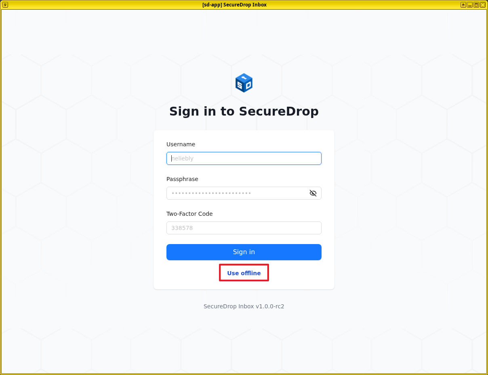
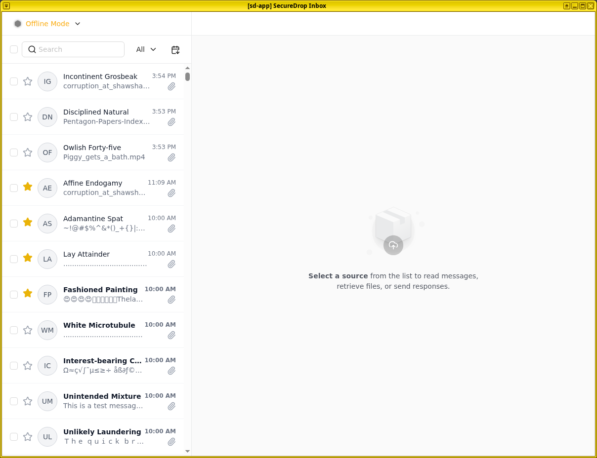

# Starting SecureDrop Inbox

After you log into Qubes, SecureDrop Inbox will start automatically. If you have previously exited the application, you can double-click on the **SecureDrop** desktop shortcut to launch it.

## Performing updates

Unless the system has just been updated, you will now be prompted you to automatically download and apply any available security updates:

For security reasons, you will not be able to launch SecureDrop Inbox until updates have been applied. This typically takes between 10 and 30 minutes.

Click "Start updates" if you are ready to start the process. (If you prefer to shut down the machine or do other work in Qubes OS instead, click "Cancel".) You will see a progress indicator until updates are completed:

:::{important}
Allow the update process to complete fully, without closing or interrupting it, or you risk breaking important system components.
:::

At the end of this process, you may be prompted you to reboot if core system components were updated. Once all steps in the update process have been completed, SecureDrop Inbox will launch automatically.

## Signing in

To sign in, enter the username and passphrase provided to you by your SecureDrop Administrator, as well as the two-factor code using the method you have set up.

### Troubleshooting tips

If you have trouble running the updater or logging in, please contact your Administrator. Our [network troubleshooting guide](../admin/maintenance/troubleshooting_connection.md) for administrators gives detailed steps for investigating connectivity issues.

## Working offline

Offline mode is available for circumstances where you wish to work offline or are unable to connect to the SecureDrop servers. In offline mode, any messages and files that you have previously downloaded will be available. You will not be able to send or delete messages, and your actions will not impact the seen/unseen state of Source conversations.

:::{important}
Protecting downloaded and decrypted files and messages is another reason why the SecureDrop Workstation needs to be powered off completely when it is not in use.
:::
