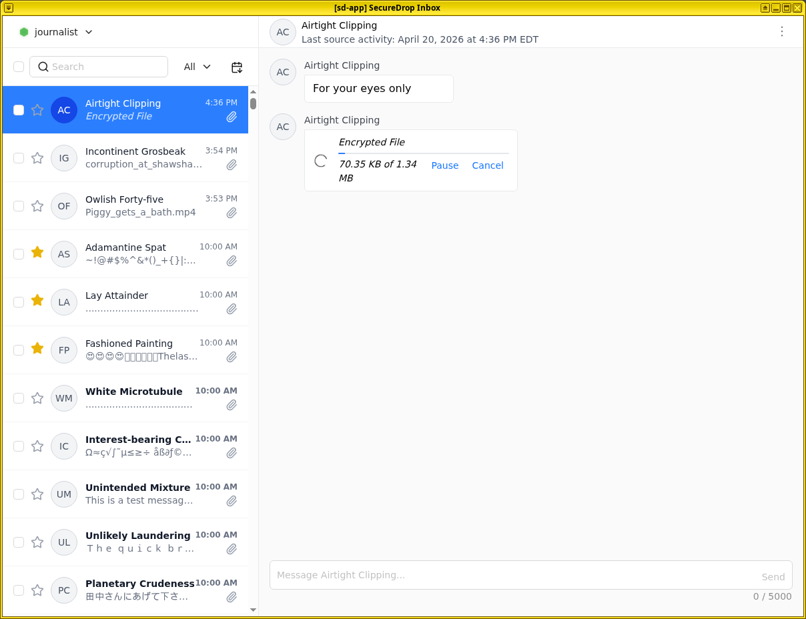
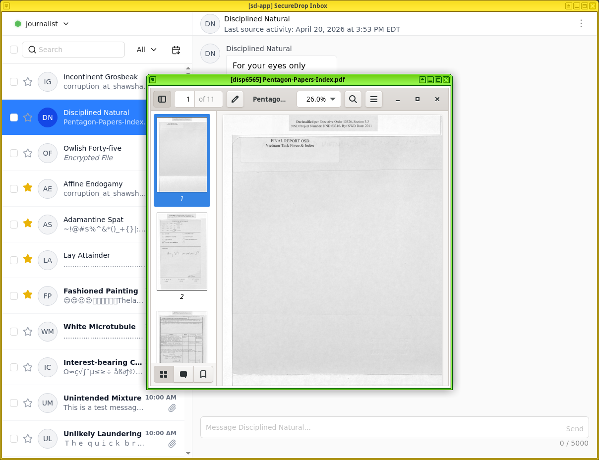
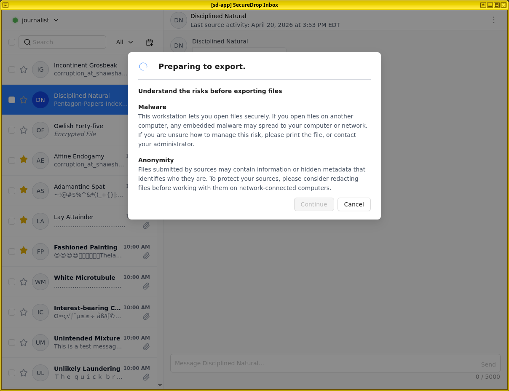
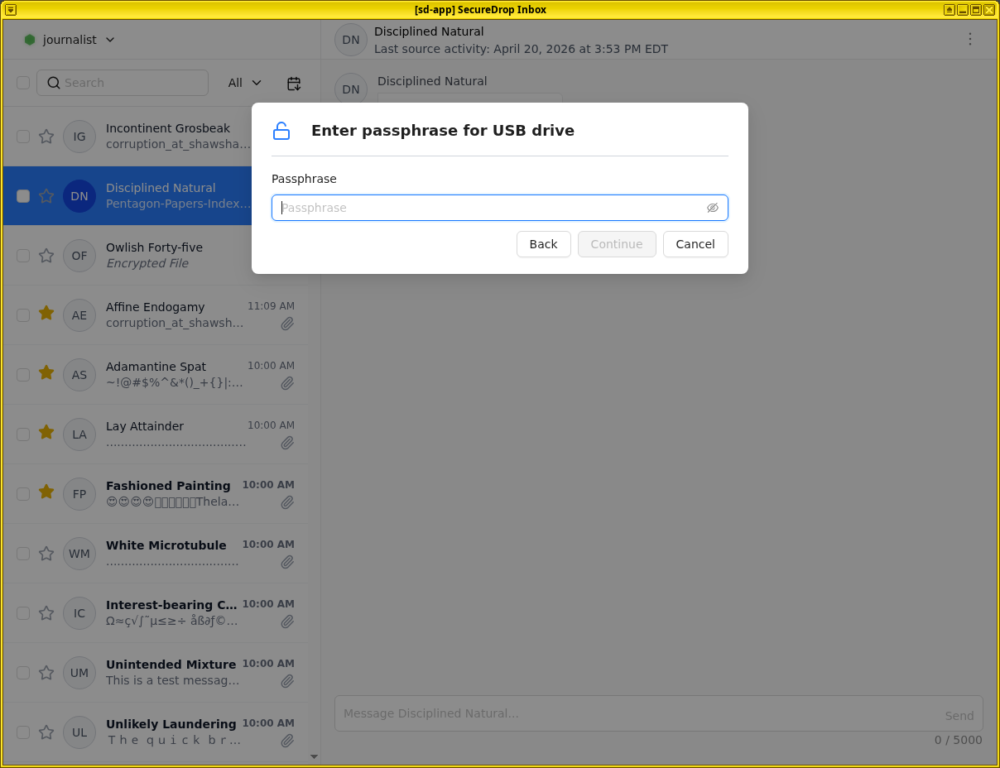
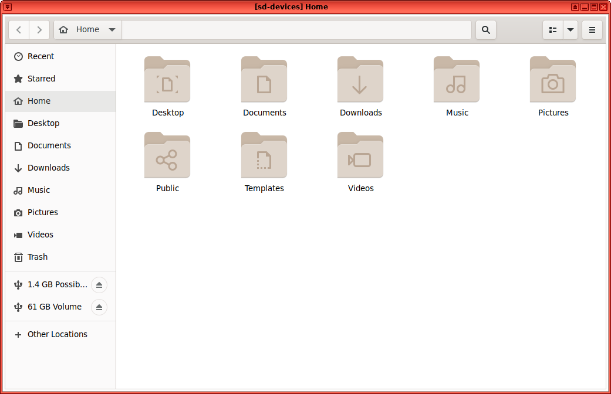
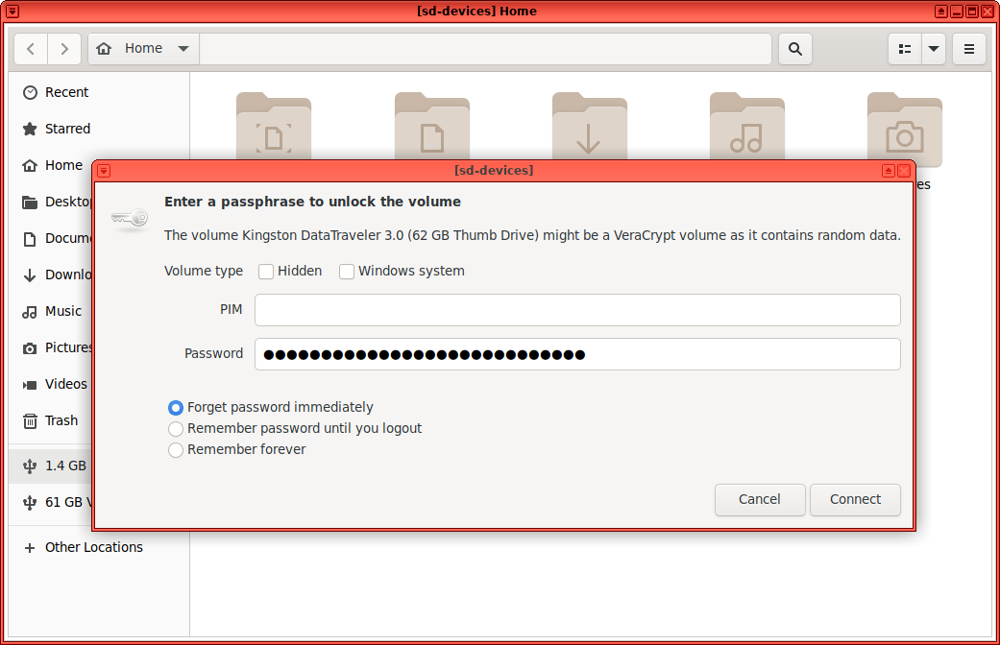

Working with Submissions
========================

When a source submits files, you will see a Download button in the conversation
flow, a file size, and light-gray text that says "Encrypted File."

|screenshot_file_before_download|

Downloading
-----------

To download a file, click the **Download** button. An animated spinner will
indicate that the file is downloading, and a progress bar will indicate
the download's progress:

|screenshot_file_downloading|

If necessary, you can pause the download by clicking "Pause," and resume
the download later with "Resume."

Once the file has been downloaded and decrypted, the filename will be visible,
as will the action **Export** and **Print**. The displayed file size may increase
after the download is complete, because the SecureDrop Client automatically
decompresses the downloaded file.

|screenshot_file_download_successful|

Viewing Submissions on the *Journalist Workstation*
-------------------------------------------------

To view a downloaded submission, click its filename. This will open
the file in a temporary environment, called a "disposable VM." The file you
clicked on will open in a new window with a different colored border and a
window title prefixed with "disp" (meaning disposable).

|screenshot_dispvm|

This disposable VM is a special isolated environment; it does not have internet access, and isolates the files that you are viewing from other sensitive files and applications on the *Journalist Workstation*.

Supported Filetypes
~~~~~~~~~~~~~~~~~~~

The following filetypes are currently supported for viewing on the *Journalist Workstation*:

* .txt, .csv, .pdf
* Microsoft Office files (.doc, .docx, .xls, .xlsx, .ppt, .pptx)
* OpenDocument files (.odt, .ods, .odp)
* Audio: .mp3, .mp4, .mpeg, .wav, .ogg (Ogg Vorbis)
* Video: .mp4, .webm, .mov (Quicktime), .avi (Audio Video Interleave - Microsoft),
  .wmv (Windows Media Video)
* Image: .gif, .png, .jpeg, .tiff, .svg, .ico, .webp, .heic, .avif
* Compressed archives: .zip, .tar.gz (although printer support for files inside
  an archive is still to be implemented)

A full list of supported filetypes can be found `here <https://github.com/freedomofpress/securedrop-client/blob/main/workstation-config/mimeapps.list.sd-viewer>`_.

.. tip:: In Qubes, window border colors are used to signify different virtual
   machines.

.. _`the Qubes OS documentation`: https://www.qubes-os.org

Printing Submissions from the *Journalist Workstation*
----------------------------------------------------

To print a document, a :doc:`compatible printer <../admin/installation/hardware>`  must be plugged into the computer's USB port.

1. Click "Print" button and wait for ``sd-devices`` VM to start.
2. You will prompted to attach your printer.
3. A Print Document dialog will appear, from which you can configure different print options before printing the document.

Exporting Submissions from the *Journalist Workstation*
-----------------------------------------------------

.. important::

   SecureDrop does not scan for or remove malware. If the file
   you received contains malware targeting the operating system and applications
   running on your everyday workstation, copying it in its original form carries
   the risk of spreading malware to that computer. Make sure you understand the
   risks, and consider other methods to export the document (e.g., print).

If you must copy a file from your **Journalist Workstation** to another computer or device in digital form, our :doc:`recommendation </admin/installation/provisioning_usb>` is that journalists are provided with an d *Encrypted USB Drive*, drive which is encrypted using `VeraCrypt <https://www.veracrypt.fr/en/Home.html>`__.
These instructions assume that you are following the recommended workflow.
If you are unsure, ask your administrator.

Exporting to an Export USB
~~~~~~~~~~~~~~~~~~~~~~~~~~

Currently, a LUKS- or VeraCrypt-encrypted USB drive is required for exporting submissions.

1. Insert the USB drive and wait for the ``sd-devices`` VM to start.
2. If your drive is using VeraCrypt, you will need to unlock it manually:

   1. Open the file menu by clicking on the Qubes Application menu |qubes_menu| (in the top left),
      select **sd-devices** and click **Files**.
   2. In the left sidebar, there should be an entry labeled **# GB Possibly Encrypted**,
      click it.
      |screenshot_veracrypt_sd_devices_files|
   3. You will be prompted for the password configured for this USB drive:

      - Volume type: leave both unchecked
      - PIM: leave empty
      - Password: drive's password
      - Forget password immediately: selected

      |screenshot_veracrypt_sd_devices_files_unlock|
   4. Click **Connect**.

3. Back in your source's conversation, click **Export**.
   |screenshot_export_dialog|
4. If you have not already unlocked your USB drive, you will be prompted for the
   password configured for this USB drive.
   |screenshot_export_drive_passphrase|

5. Once you see a message informing you that the export was successfully completed,
   you can safely unplug the USB drive. Alternatively, you can leave the drive
   plugged in and export additional files.

Decrypting and Preparing to Publish
~~~~~~~~~~~~~~~~~~~~~~~~~~~~~~~~~~~

.. note::

   To decrypt a VeraCrypt drive on a Windows or Mac workstation, you need
   to have the *VeraCrypt* software installed. If you are unsure if you have the
   software installed or how to use it, ask your administrator, or see
   the `Freedom of the Press Foundation guide <https://freedom.press/training/encryption-toolkit-media-makers/veracrypt-guide/>`__
   for working with VeraCrypt.

To access the *Export Device* on your everyday workstation, follow these steps:

1. If your *Export Device* has a physical write protection switch, make sure it
   is in the *locked* position.
2. Plug the *Export Device* into your everyday workstation.
3. Launch the *VeraCrypt* application.
4. Click **Select Device** and select the *Export Device*, then click **OK**.
5. Click **Mount**.
6. Enter the passphrase for your *Export Device*. You should find this in your
   own personal password manager.
7. Open the *Export Device* in your operating system's file manager, and copy
   the contents of interest to your everyday workstation.

As a security precaution, we recommend deleting the files on the *Export
Device* after each copy operation. If you are using write protection, you have to perform this step on the *Secure Viewing Station* to get the security benefits of write protection.

When you are done, switch back to the *VeraCrypt* window, and click **Dismount**.

You are now ready to write articles and blog posts, edit video and
audio, and begin publishing important, high-impact work!

.. tip:: Check out our SecureDrop :doc:`Promotion Guide
         </admin/deployment/getting_the_most_out_of_securedrop>` to read
         about encouraging sources to use SecureDrop.

Safely Working With Submissions Outside the *Journalist Workstation*
------------------------------------------------------------------

.. _malware_risks:

Risks From Malware
~~~~~~~~~~~~~~~~~~
SecureDrop does not scan for or remove malware in submissions you receive. There
are important steps you can take to protect yourself:

1. **Keep your *Journalist Workstation* up-to-date.**

2. **Print documents from the *Journalist Workstation* instead of exporting them
   digitally, whenever possible.**

   Printing documents prevents the proliferation of malware to your everyday
   workstation, and eliminates most categories of embedded metadata. Note that
   printing a document may still preserve watermarks, printer codes,
   steganographically encoded data, or other information not visible to the
   naked eye.

3. **Consult with your administrator or your digital security staff before
   copying files digitally.**

   If you must copy a file in digital form (because of its format, the volume
   of information, or for other reasons), we recommend taking the time to
   consult with technical experts within the organization.

   .. tip::

      Converting files to simpler formats (e.g., PDF to PNG) can help reduce the
      risk of malware. Tails provides both graphical and command-line utilities
      that can be used for this purpose.

4. **Never scan QR codes embedded in documents using a network-connected
   device.**

   QR codes can contain malicious links that your device will automatically
   visit. This can alert third-parties to your actions, reveal the identities
   of your sources, and breach the air gap that is in place with the
   *Secure Viewing Station*. 

   In general, be careful when opening any links provided in a SecureDrop
   submission. If you are unsure if a link is safe to click, you should
   consult internally, or contact Freedom of the Press Foundation for
   assistance.

5. **Don't photograph submissions using your smartphone, and be careful with all
   digital photography**.

   Many smartphones are configured to back up photographs to cloud services,
   immediately or intermittently; newer digital cameras have similar
   functionality. Not all backup settings may be visible to you.

   Any digital photograph will include certain metadata by default, which may
   reveal sensitive information about your SecureDrop usage patterns
   (potentially including GPS coordinates) to anyone who gains access
   to the file.

Fully mitigating the risks of malware received via SecureDrop is beyond the
scope of this documentation. If you have questions, you can :doc:`contact us </introduction/getting_support>`. Please do **NOT** disclose details about the contents of any submission you have received.

.. tip::

   This is only a very limited introduction. Freedom of the Press Foundation
   publishes and maintains `digital security guides for journalists <https://freedom.press/training/>`__,
   many of which relate to these topics, and offers `digital security training <https://freedom.press/training/request-training/>`__
   for news organization staff.

