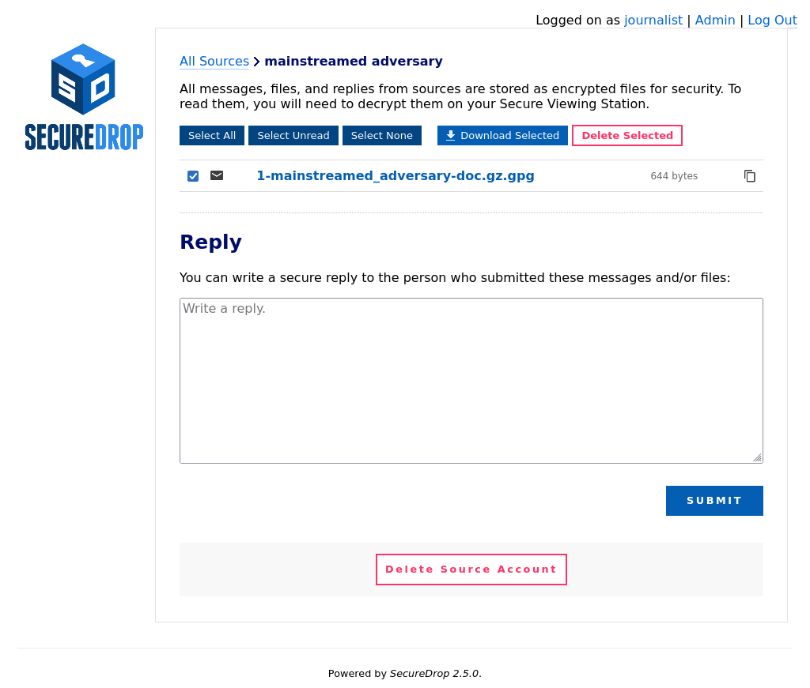

Using the Secure Viewing Station
================================

Moving Documents to the *Secure Viewing Station*
------------------------------------------------

Step 1: Download the encrypted submission
~~~~~~~~~~~~~~~~~~~~~~~~~~~~~~~~~~~~~~~~~~

Documents and messages sent by sources can only be decrypted and viewed on the
*Secure Viewing Station*. After clicking on an individual source, you will see
a page with any documents or messages the source has sent you. Documents
always end with ``-doc.gz.gpg``, while messages always end with ``-msg.gpg``.

Click on a document or message name to save it, or select a number of documents
and save them all at once by clicking **Download Selected**.

|Load external content|

A dialog box with two choices will appear, **Cancel** and **Save file**.

|Download selected|

Click **Save file**. In the save dialog, select one of the two folders
called **Tor Browser** and **Tor Browser (persistent)**.
Note that the names may be abbreviated; you can view the full name by hovering
the mouse over the shortcut.

|Download to sandbox folder|

The difference between these two folders is as follows:

- **Tor Browser**: Downloads saved to this folder will be stored in memory,
  which means that they will only be available for the duration of your current
  Tails session. The full path to this folder is ``/home/amnesia/Tor Browser``.

- **Tor Browser (persistent)**: Downloads saved to this folder will be stored
  on your Tails USB drive in the special persistent volume that is only
  available if you have unlocked it on the Tails welcome screen. The full path
  to this folder is ``/home/amnesia/Persistent/Tor Browser``.

Unless you have a reason to store encrypted submissions on the
*Journalist Workstation*, we recommend using the non-persistent "Tor Browser"
folder. In the recommended process, you will now move the submission to the
*Secure Viewing Station*, and there is no need to leave a persistent copy
behind.

.. important:: Attempting to download files to any other folder will fail.
  Tails only permits Tor Browser to access these two folders, so that
  even if your browser is compromised by malware, attackers cannot easily gain
  access to other data stored on the same computer.

  See the Tails guide to `Browsing the web with Tor Browser <https://tails.net/doc/anonymous_internet/Tor_Browser/index.en.html>`__
  for more information.

Step 2: Copy the encrypted submission to the *Transfer Device*
~~~~~~~~~~~~~~~~~~~~~~~~~~~~~~~~~~~~~~~~~~~~~~~~~~~~~~~~~~~~~~

Once downloaded to either folder, move the document to the designated
USB stick you intend to use to transfer the documents from your
*Journalist Workstation* to the *Secure Viewing Station*. This storage
device is known as your *Transfer Device*.

.. note::

   If the *Transfer Device* was set up according to our recommendations, you
    will be prompted for a decryption passphrase on the *Journalist
    Workstation* and the *Secure Viewing Station* before being able to use it
    in a given session. We recommend storing this passphrase in your own
    personal password manager (e.g., on your smartphone), so that it is readily
    accessible to you whenever you need it.

You can right-click the file and select **Copy to**, then select the *Transfer
Device* in the **Select Copy Destination** dialog.

|Copy to transfer device 1|

|Copy to transfer device 2|

This will leave a redundant copy behind in the Tor Browser folder. If you have
downloaded the file to the non-persistent "Tor Browser" folder (as
recommended), the redundant copy will disappear when the computer is shut down
or rebooted.

"Eject" the *Transfer Device* by clicking the eject icon next to its name in
the file manager. Wait for this operation to complete (the eject icon will
disappear), then unplug the *Transfer Device*. "Ejecting" the drive in this
manner ensures that all write operations are completed before you physically
unplug it.

.. _Decrypting:

Step 3: Decrypt and view the submission on the *Secure Viewing Station*
~~~~~~~~~~~~~~~~~~~~~~~~~~~~~~~~~~~~~~~~~~~~~~~~~~~~~~~~~~~~~~~~~~~~~~~

Next, boot up the *Secure Viewing Station* using Tails and enter the
passphrase for the *Secure Viewing Station* persistent volume. Once you
have logged in, plug in the *Transfer Device*.

.. note:: The *Secure Viewing Station* and *Journalist Workstation*
          are on separate Tails USB drives.

Click on the **Home** icon on your desktop, then on the *Transfer
Device*. Copy the file into your **Persistent** folder. You can do so by
opening a new window with the **Persistent** folder and dragging the file from
one window to another. A faster method is to drag the file to the
**Persistent** shortcut in the list of places.

|Copy files to persistent|

.. important::

   Always copy submissions to the **Persistent** folder *before* decrypting
   them. Otherwise you might accidentally decrypt them on the USB stick, and
   they could be recoverable in the future.

After successfully copying them to the *Secure Viewing Station*, erase the
files from your *Transfer Device*. Ensure you're viewing the *Transfer Device* folder, then right click on the files that need removal and click "Move to Trash", then navigate to "Trash" folder in
the sidebar, and select "Empty Trash".

To decrypt and view documents or messages, return to your **Persistent** folder.
All key actions are initiated by double-clicking:

- Double-clicking archives in ZIP or gzip format will open the **Archive Manager**
  application (called ``file-roller`` on the command line), which allows you to extract the contents.

- On Tails 4, double-clicking files that end in ``.gpg`` will attempt to decrypt
  the contents to the same directory. If you have configured a passphrase for your
  *Submission Key*, you will be prompted for it.

  On Tails 5.1 or greater, double-clicking the ``.gpg`` file will launch
  an application called **Kleopatra**, from which you can decrypt the file and
  save the result to the same directory.

- Double-clicking decrypted messages or documents will attempt to open them in a
  default application suitable for the file type.

If the default application does not work, you can right-click on the
document and choose **Open with Other Application...** to try opening
the document with LibreOffice Writer, Document Viewer, or another application.
You might also need to right-click on a file and choose **Rename...** to rename
a document with an incorrect or missing file extension.

.. tip::

   Always extract gzip archives with the *Archive Manager* application, which is
   the default when double-clicking the archive. Other methods may not preserve
   the filename contained in the archive.

   For example, an archive called ``1-artful_elevation-doc.gz`` might contain a
   file ``secrets.docx``, but if you extract the contents by right-clicking the
   archive and selecting **Extract here**, the extracted file will be called
   ``1-artful_elevation-doc`` instead of ``secrets.docx``. This may result in
   problems when attempting to open the file due to the loss of its file
   extension.

When you double-click an archive to open it, you should see it in the *Archive Manager* application.

|Opened archive|

Click the **Extract** button to unpack the archive. Navigate to the folder
containing the encrypted document message or document (ends with ``.gpg``).

Double-click the file to decrypt it. On Tails 5.1 or greater, this will launch
**Kleopatra**, from which you can decrypt the file and save the result to the
same directory.

The decrypted file will have the same filename, but without ``.gpg`` at the end.

|Decrypted documents|

You can now double-click on the decrypted file to open it in its
default application.

|Opened document|

.. _working_with_documents:

.. |Download selected| image:: ../images/manual/tbb_Document5.png
   :alt: Dialog box asking for confirmation before saving a file.
.. |Download to sandbox folder| image:: ../images/manual/tbb_Document6.png
   :alt: Files application displaying the name of the file to be saved and a 'Save' button. Two shortcuts named 'Tor Browser' and 'Tor Browser (...' are visible in the list of places on the left.
.. |Copy to transfer device 1| image:: ../images/manual/copy-to-transfer-device-1.png
   :alt: Files application displaying the menu that opens after a right-click on a file. The 'Copy to...' entry is selected.
.. |Copy to transfer device 2| image:: ../images/manual/copy-to-transfer-device-2.png
   :alt: Dialog box that opens after selecting 'Copy to', the Transfer Device is selected in the list of places on the left.
.. |Copy files to persistent| image:: ../images/manual/viewing1.png
   :alt: Files application displaying the content of the Transfer Device. A file is being dragged over a shortcut named 'Persistent' in the list of places on the left.
.. |Opened archive| image:: ../images/manual/tails-archive.png
   :alt: Archive Manager application displaying an archive and the 'Extract' button on the top left.
.. |Decrypted documents| image:: ../images/manual/viewing3.png
   :alt: Files application displaying a decrypted file next to its encrypted version.
.. |Opened document| image:: ../images/manual/viewing4.png
   :alt: Text editor displaying a decrypted message. The file that was double-clicked is visible below in the Files application.
.. |br| raw:: html

     
