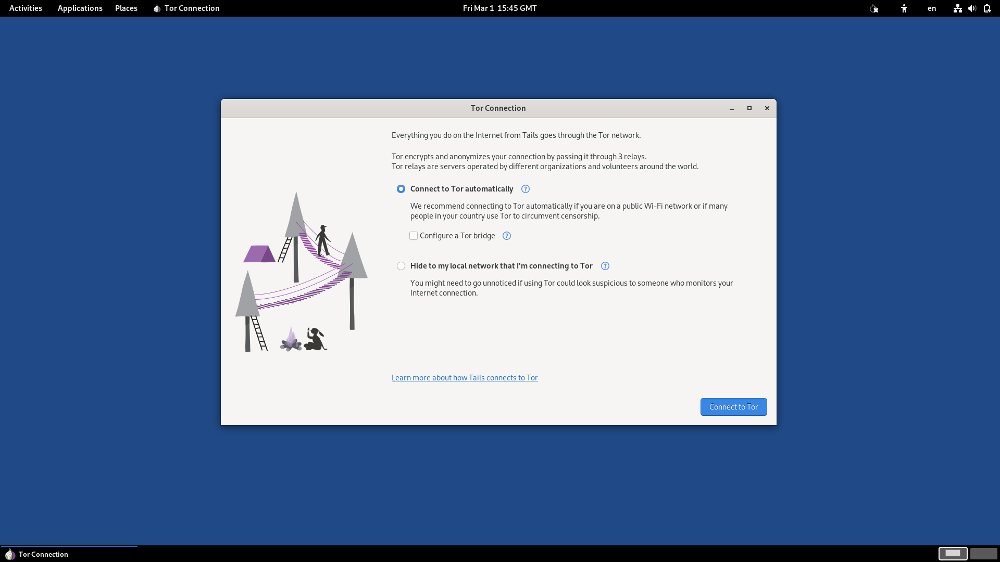
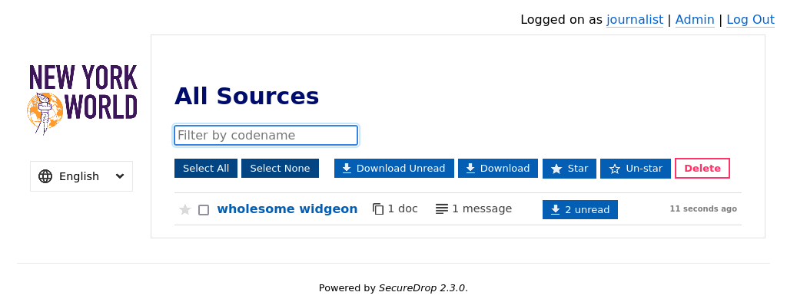
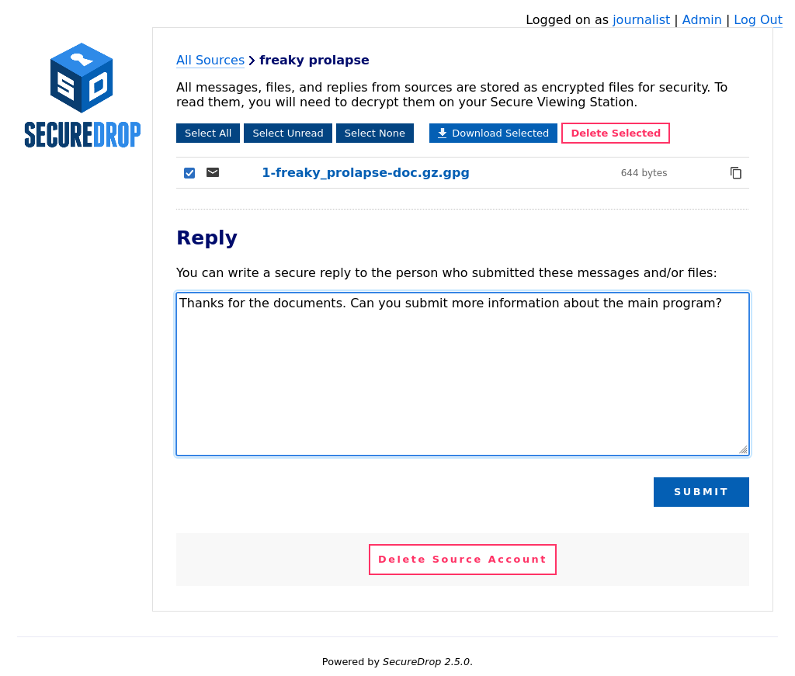

Using the Journalist Workstation
================================

Connecting to the Tor network in Tails
--------------------------------------

After you connect to the Internet, the Tor Connection assistant
will start.

If you are operating in an environment with a high degree of political freedom,
and you are able to access the Tor network reliably, you can accept the defaults:

1. Click **"Connect to Tor automatically (easier)"**
2. Leave the checkbox **"Configure a Tor bridge"** unchecked
3. Click **"Connect to Tor"**

|Connect to Tor in Tails|

For more information about alternative ways to connect to the Tor network, please
see the section `"Connecting to the Tor network" <https://tails.net/doc/anonymous_internet/tor/index.en.html>`__
in the Tails documentation.

.. note::

   The Tor Connection assistant may display an error message after
   connecting to the Tor network successfully. If the error message disappears
   after a few seconds, you can safely ignore it. The error is caused
   by SecureDrop-specific changes that briefly interrupt Tor connectivity.

Updating Your Workstation
-------------------------

You should keep your SecureDrop workstations updated with:

* **Tails updates**
* **SecureDrop workstation updates**

You should apply Tails updates to your Tails drive as they are released, as
they often contain critical security fixes. The *Journalist Workstation* Tails
drive, once booted and connected to Tor, will alert you if upgrades are
available. For most Tails upgrades, you can simply follow the steps in the
Tails Upgrader that appears on screen to update your Tails drive. However,
sometimes Tails upgrades are "manual," which means that you should follow the
instructions in the `Tails Upgrade Documentation`_ to upgrade the drives. Talk
to your SecureDrop administrator if you have trouble.

You can also check for and install updates using the "Check for SecureDrop
Updates" option from the *SecureDrop Menu*.

.. include:: ../includes/update-gui.txt

.. _`Tails
   Upgrade Documentation`: https://tails.net/doc/upgrade/index.en.html

Connecting to the *Journalist Interface*
----------------------------------------
Journalists viewing documents on SecureDrop must connect to the
*Journalist Interface* using the `Tails operating system
<https://tails.net/>`__ on a USB drive. As part of your on-boarding, your
admin should have provided you with a Tails drive configured for this purpose,
known as the *Journalist Workstation* USB drive.

If you do not have a USB drive clearly identified as the *Journalist
Workstation*, ask your administrator for assistance before continuing.

.. note:: The Tails OS makes using SecureDrop very different from
          other computing experiences. The added layers of security
          mean extra steps each time you want to login. With practice,
          you will become increasingly comfortable with the process.

To use the *Journalist Interface*, you will visit a Tor Onion Service address
in Tor Browser. By design, this Onion Service address is only accessible
from your *Journalist Workstation*; it will not work in Tor Browser on another
computer, unless explicitly configured with an access token.

To visit the *Journalist Interface*, open the *SecureDrop Menu* and select the
"Launch Journalist Interface" option. This will open Tor Browser to an ".onion"
address. Log in with your username, passphrase, and two-factor authentication
token. (If you have been provided with a YubiKey, see
:doc:`Using YubiKey with the Journalist Interface <../admin/deployment/yubikey_setup>`
for detailed setup and usage information.)

|Journalist Interface Login|

Reset Passphrase or Two-factor Authentication Credentials
~~~~~~~~~~~~~~~~~~~~~~~~~~~~~~~~~~~~~~~~~~~~~~~~~~~~~~~~~

If necessary, journalists may reset their user passphrase or two-factor
authentication token in their user profile. To navigate to your user profile,
log in to the *Journalist Interface* and click on the link in the upper right
of the screen where it says **Logged on as <your user name>.**

If you have lost or forgotten your passphrase or your two-factor device (i.e.
your mobile phone or security key), you will need to contact your SecureDrop
admin for assistance.

|Journalist account profile|

.. include:: ../includes/tor-security-setting.txt

.. _daily_journalist_alerts:

Daily Journalist Alerts About Submissions
-----------------------------------------

When a SecureDrop has little activity and receives only a few
submissions every other week, checking the *Journalist Interface*
daily only to find there is nothing is a burden. It is more convenient
for journalists to be notified daily via encrypted email about whether
or not there has been submission activity in the past 24 hours.

If the email shows submissions were received, the journalist can
connect to the *Journalist Interface* to get them.

.. note::

   For security reasons, the email will be sent every 24 hours, regardless
   of whether there are new submissions or not. The subject of the email will
   always be "Submissions in the past 24h". To find out whether there were
   submissions or not, you must decrypt the contents of the email.

This is an optional feature that must be activated :doc:`by the
administrator <../admin/reference/admin>`. In the simplest case a journalist
provides their email and GPG public key to the admin. If a team of journalist
wants to receive these daily alerts, they should share a GPG key and
ask the admin to setup a mail alias (SecureDrop does not provide that
service) so they all receive the alerts and are able to decrypt them.

Interacting With Sources
------------------------

If any sources have uploaded documents or sent messages, they will be
listed on the homepage by codename.

|Journalist Interface|

.. note:: Codenames that journalists see are different than the
          codenames visible to sources.

Click on a codename to see the dedicated page for that source. You
will see all of the messages that they have written and documents that
they have uploaded.

.. tip:: You can also **Star** interesting or promising sources to
         easily return to them later. All starred sources will be bumped to the
         top of the list of sources.

If you want to reply to the source, write your message in the text
field and click **Submit**.

|Sent reply|

Once your reply has been successfully submitted, you will be returned
to the source page and see a message confirming that the reply was
stored. The source will see your reply the next time they log in with
their unique codename.

To minimize the impact of a source codename being compromised, the *Source
Interface* encourages the source to delete the reply after reading it. Once a
source has read your reply and deleted it from their inbox, a checkmark will
appear next to the reply in the interface.

.. note:: Prior to SecureDrop 0.9.0, replies when deleted from the source inbox
  would also disappear from the journalist inbox. As such, if there are older
  conversations, there may be discontinuities in the conversation.

You may also delete replies if you change your mind after sending them.

Documents and messages are encrypted to the SecureDrop installation's
*Submission Public Key*. In order to read the messages or look at the documents
you will need to transfer them to the *Secure Viewing Station*, which holds
the *Submission Private Key*. To recall the conversation history between your
organization and sources, you can also download replies and transfer them to
the *Secure Viewing Station* for decryption.

.. |Journalist Interface Login| image:: ../images/manual/screenshots/journalist-index_with_text.png
   :alt: Login page to access the journalist interface. It requires a username, passphrase and two-factor authentication token.

.. |Journalist account profile| image:: ../images/manual/screenshots/journalist-edit_account_user.png
   :alt: Example user profile page of a journalist. It displays forms to reset their passphrase and two-factor authentication.
.. |br| raw:: html

     
