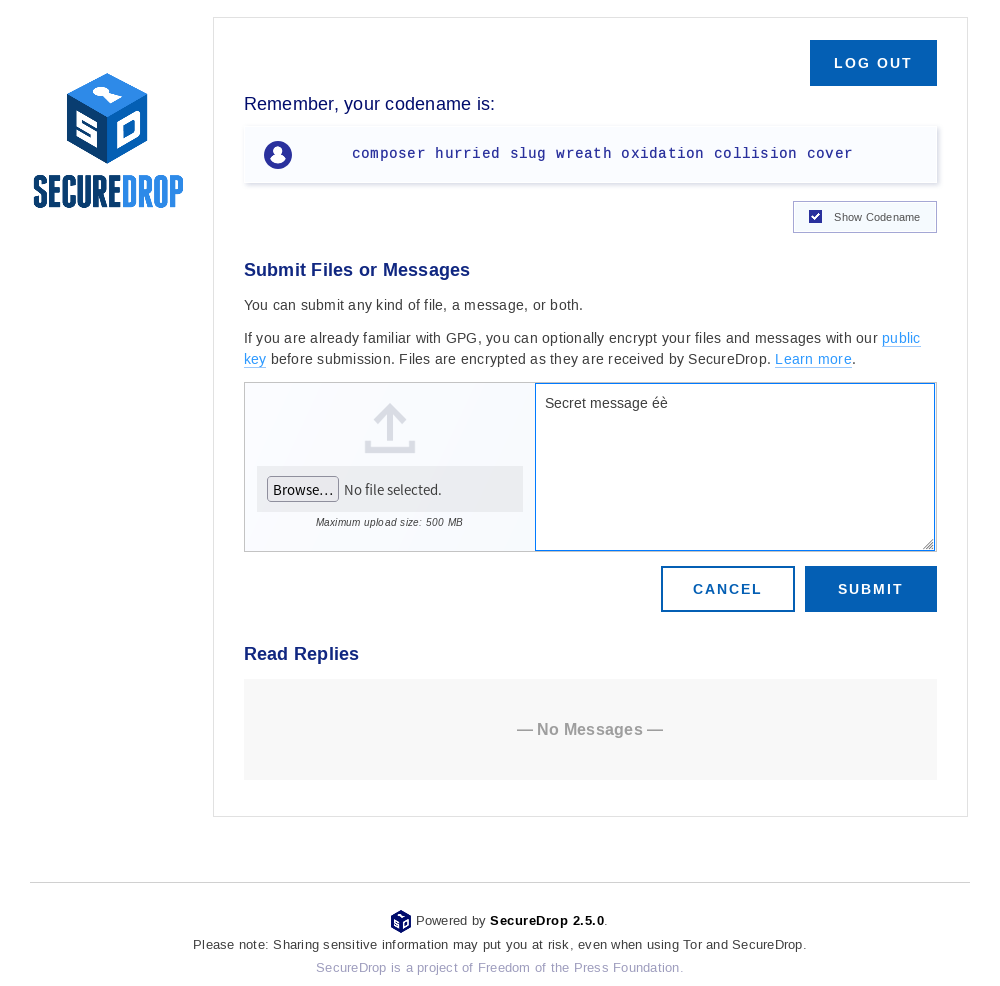
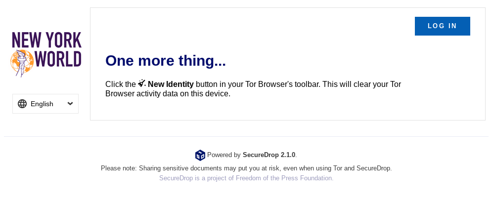

Source Guide
============

.. note::

   This guide provides an introduction to using SecureDrop as a source.
   It is not exhaustive, it does not address ethical or legal dimensions of
   whistleblowing, and it does not speak to other methods for confidentially
   communicating with journalists. Please proceed at your own risk. For additional
   background, also see the Freedom of the Press Foundation guide, `How to Share Sensitive
   Leaks With the Press <https://freedom.press/news/sharing-sensitive-leaks-press/>`__.

.. warning:: Freedom of the Press Foundation has no access to any other
   organization's SecureDrop instance, and cannot assist directly in your
   communications with them. If you plan to use SecureDrop to maintain your
   anonymity, you should not discuss your own use of it with others via unsafe
   methods, including email to Freedom of the Press Foundation.

What is SecureDrop?
-------------------

SecureDrop is a tool that news organizations and NGOs use that enables secure
and anonymous communication between whistleblowers and journalists.
No personal information is collected; information submitted to SecureDrop is
encrypted, and SecureDrop is not a “cloud” service. If you don’t have sensitive
information to send to a news organization, it may be okay to use a traditional
methods such as phone or email when reaching out.

SecureDrop can accept both messages and individual file uploads (up to 500MB).
If you have multiple files to submit, you may do that. As a source, you can also
return to receive follow-up correspondence with an organization,
or to send additional information. Dozens of news organizations
— from *ProPublica* to *The New York Times* — use SecureDrop
to accept tips securely and anonymously.

To truly protect your anonymity, it is important for you to take
some extra precautions in advance. This resource will describe things
you can do to help protect your anonymity when using SecureDrop.
Note that your Internet Service Provider, or ISP (e.g., Comcast/Xfinity,
Cox, Wave, etc), may already have a record of your visit to this website,
docs.securedrop.org.

**Before you begin...**

* DO NOT access SecureDrop on your employer's network.
* DO NOT access SecureDrop using your employer's hardware.
* DO NOT access SecureDrop on your home internet network.

* **DO** carefully read the remaining instructions, that will carefully
  step-through the reasons why we advise the above, and provide guidance
  to minimize risk when using SecureDrop.

Suggested Devices for Using SecureDrop
--------------------------------------

When sensitive disclosures such as government improprieties are involved,
we suggest you buy a new computer and at least one new USB flash drive.
You should only use cash to make those purchases.

Many time-saving features of computers and phones can easily compromise
your anonymity: bookmarks, recommendations, synchronization features,
shortcuts to frequently opened files, etc.
Those reasons and more are why using a dedicated computer
for whistleblowing activities can be safer.

To build an even stronger buffer for yourself, we recommend booting
the computer into the `Tails operating system`_ (typically from a USB stick).
Tails is specifically designed to run on your computer without leaving traces
of your activity. This may take some additional technical steps, but it is safer
and fairly simple to get started. Even if you choose to use a dedicated computer
for SecureDrop that will never be used for anything else, Tails will help
to avoid leaving traces of your activity on the computer's hard disk,
in your ISP's logs, or on cloud services.

Choose the Right Location
-------------------------

Find a busy cafe you don’t regularly go to and sit at a place with your back
to a wall to avoid cameras capturing information on your screen or keystrokes.
Be sure to also make any purchases while there (WiFi, tea, snacks) or
on your way to the cafe (bus, train, gas) with cash.

Use Tor Browser
---------------

Each SecureDrop may **only** be reached through the Tor Browser.
SecureDrop pages are only available as onion services—encrypted web pages
that end in ".onion," and only the Tor browser is able to open these pages.

Tor is an anonymizing network that makes it difficult for anybody observing the
network to associate a user's identity (e.g., the computer's IP address) with
their activity. Tor Browser can be downloaded from the `Tor Project's website`_.
Tor Browser is a modified version of the Firefox web browser that also includes
features protect your security and anonymity. If there is a chance that visiting
the Tor Project's website to download Tor Browser might raise suspicion,
you have a couple of alternatives:

* If your mail provider is less likely to be monitored, you can send a mail to
  gettor@torproject.org with the text "linux", "windows" or "osx" in the body
  (for your preferred operating system) and a bot will answer with instructions.
* You can download a copy of Tor Browser for your operating system from the
  `GitLab mirror <https://gitlab.com/thetorproject/gettorbrowser/tree/torbrowser-releases>`__
  maintained by the Tor team.

While using Tor Browser on your personal computer helps hide your activity on
the network, it will leave traces of its own installation on your local
machine. Most operating systems keep logs, for example, any time an application
is used. The sensitivity of the information you share and the capabilities of
those who may not want you to share that information, should be considered when
making these decisions.

.. important::

   Tor protects your anonymity, but third parties who can monitor your network
   traffic can detect *that you are using Tor*. They may even be able to do so
   long after your browser session, using network activity logs. This is why we
   recommend using Tor Browser from a cafe you do not
   visit regularly.

.. _`Tor Project's website`: https://www.torproject.org/
.. _`Tails operating system`: https://tails.boum.org/

Choose Who to Submit To
-----------------------
We recommend conducting all research related to your submission in Tor Browser.
If you are unsure whether you are using Tor, you can visit the address
https://check.torproject.org.

All organizations operating SecureDrop have a *landing page* that provides their
own organization-specific recommendations for using SecureDrop. We encourage
you to consider an organization’s *landing page* before submitting to them.

.. note::

   Each SecureDrop instance is operated and administered independently by
   the organization you are submitting to. Only the journalists associated
   with that organization can see your submissions.

Most organizations make their SecureDrop prominently accessible from their
main website's homepage (for news organizations, typically under sections called
"Tips" or "Contact us"). You can also find an incomplete list of organizations
accepting submissions through SecureDrop in the `SecureDrop Directory`_
maintained by Freedom of the Press Foundation.

Using Tor Browser, find the ".onion" address for the SecureDrop for
the organization that you wish to submit to.

.. tip::

   If the organization does have an entry in the SecureDrop Directory, we
   recommend comparing the address of the entry with the one on the
   organization's own SecureDrop landing page.

   If the two addresses don't match, please do not submit to this organization
   yet. Instead, please `contact us <https://securedrop.org/report-an-error>`__
   through the SecureDrop website, using Tor Browser. For additional
   security, you can use our .onion service address in Tor:

   ``sdolvtfhatvsysc6l34d65ymdwxcujausv7k5jk4cy5ttzhjoi6fzvyd.onion/report-an-error``

   We will update the directory entry if the information in it is incorrect.

Once you have located the ".onion" address, copy it into the address bar in Tor
Browser to visit the organization's SecureDrop.

.. _`SecureDrop Directory`: https://securedrop.org/directory

Making Your First Submission
----------------------------

Open Tor Browser and navigate to the .onion address for the SecureDrop you wish
to make a submission to. The page will invite you to get started with your
first submission or to log in. It should have a logo specific to the organization
you are submitting to.

|Source Interface with JavaScript Disabled|

If this is the first time you're using Tor Browser, it's likely that you
have JavaScript enabled and that the Tor Browser's security level is set
to "Low". In this case, there will be a purple warning banner at the top of
the page that encourages you to disable JavaScript and change the security
level to "Safest".

|Source Interface Security Slider Warning|

Click the **Security Level** link in the warning banner, and a message bubble
will pop up explaining how to increase the security level to **Safest**.

|Fix JavaScript warning|

1. Click the shield icon in the toolbar
2. Click **Change**
3. Select **Safest**

|Security Slider|

.. note::

   The "Safest" setting disables the use of JavaScript on every page you visit
   using Tor Browser, even after a browser restart. This may cause other
   websites you visit using Tor Browser to no longer work correctly, until
   you adjust the Security Level again. We recommend keeping the setting at
   "Safest" during the entirety of the session in which you access an
   organization's SecureDrop instance.

The SecureDrop page should now refresh automatically and stop displaying
the warning. If this is the first time you are using SecureDrop,
click the **Get Started** button.

|Source Interface with JavaScript Disabled|

You should now see a screen that shows the unique codename that SecureDrop has
generated for you. Note that your codename will not be the same as the codename
shown in the image below. It is extremely important that you both remember this
code and keep it secret. After submitting documents, you will need to provide
this code to log back in and check for responses.

|Memorizing your codename|

The best way to protect your codename is to memorize it. If you cannot memorize
it right away, we recommend writing it down and keeping it in a safe place at
first, and gradually working to memorize it over time. Once you have memorized
it, you should destroy the written copy.

.. tip:: For detailed recommendations on best practices for managing your
   passphrase, check out :doc:`passphrase_best_practices`.

Once you have generated a codename and put it somewhere safe, click
**Submit Documents**.

You will next be brought to the submission page, where you may
upload a document, enter a message to send to journalists, or both. You
can only submit one document at a time, so you may want to combine
several files into a ZIP archive if necessary. The maximum submission
size is currently 500MB. If the files you wish to upload are over that
limit, we recommend that you send a message to the journalist explaining
this, so that they can set up another method for transferring the
documents.

|Submit a document|

When your submission is ready, click **Submit**.

After clicking **Submit**, a confirmation page should appear, showing
that your message and/or documents have been sent successfully. On this
page you can make another submission or view responses to your previous
messages.

|Confirmation page|

Once you are finished submitting documents, be certain you have saved your
secret codename and then click the **Log out** button.

The final step to clearing your session is to restart Tor Browser for
optimal security. After logging out, you should see a new page recommending
you to click the **New Identity** button in the Tor Browser toolbar.

|Logout|

You can either close the browser entirely or follow the instructions on the page:

1. Click on the **New Identity** button in the Tor Browser toolbar
2. Click **Yes** in the dialog box that appears to confirm you'd like to restart Tor Browser

|Restart TBB|

Continuing the Conversation
---------------------------

If you have already submitted a document and would like to check for
responses, click the **Log in** button on the media
organization's SecureDrop page.

|Source Interface with JavaScript Disabled|

The next page will ask for your secret codename. Enter it and click
**Continue**.

|Check for response|

If a journalist has responded, their message will appear on the
next page. Before leaving the page, you should
delete any replies. In the unlikely event that someone learns
your codename, this will ensure that they will not be able to see the previous
correspondences you had with journalists.

|Check for a reply|

After you delete the reply from the journalist, make sure you see the
confirmation message: "Reply deleted".

|Delete received messages|

.. |Security Slider| image:: images/manual/source-turn-slider-to-high.png
   :alt: Advanced Security Settings in Tor Browser.
.. |Fix JavaScript warning| image:: images/manual/security-slider-high.png
   :alt: Example home page displaying instructions to increase Tor Browser's Security Level.
.. |Source Interface with JavaScript Disabled|
  image:: images/manual/screenshots/source-index.png
     :alt: Example home page of a SecureDrop instance.
.. |Memorizing your codename|
  image:: images/manual/screenshots/source-generate.png
     :alt: Example welcome page displaying a codename.

.. |Confirmation page|
  image:: images/manual/screenshots/source-lookup.png
    :alt: Example submission page, displaying a confirmation message after a submission was sent successfully.

.. |Restart TBB| image:: images/manual/restart-tor-browser.png
   :alt: Dialog box asking for confirmation before Tor Browser is restarted.
.. |Check for response|
  image:: images/manual/screenshots/source-enter-codename-in-login.png
    :alt: Example login page asking you to enter your secret codename.
.. |Check for a reply|
  image:: images/manual/screenshots/source-checks_for_reply.png
    :alt: Example submission page, displaying a reply from a journalist.
.. |Delete received messages|
  image:: images/manual/screenshots/source-deletes_reply.png
    :alt: Example submission page, displaying a confirmation message after a reply was deleted.
