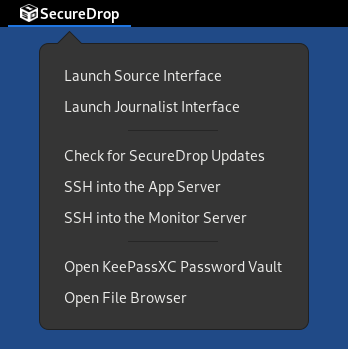

Upgrade from 2.10.0 to 2.10.1
=============================

Update Servers to SecureDrop 2.10.1
------------------------------------

Servers running Ubuntu 20.04 will be updated to the latest version of SecureDrop
automatically within 24 hours of the release.

Update Workstations to SecureDrop 2.10.1 and Tails 6
----------------------------------------------------
If you have not already upgraded to Tails 6 alogside the 2.10.0 release,
you should do so as part of this upgrade. Please note that the upgrade
from Tails 6 must be performed manually. If you have already upgraded
to Tails 6, you only need to complete Step 1 below.

.. important:: We always recommend backing up your workstations prior to
  an upgrade, but we *especially* recommend it before a major Tails version
  bump. This upgrade is an excellent occasion to make sure you have fresh
  backups for each of your Tails drives. See our :ref:`backup instructions <backup_workstations>`
  for more information.

To upgrade your *Secure Viewing Station* Tails USB, follow our instructions
to :ref:`update Tails manually <Update Tails Manually>`. The *SVS* upgrade
to Tails 6 **must** be fully performed on an air-gapped machine.

To upgrade your *Journalist Workstation* and *Admin Workstation* USB drives,
complete the following steps for each USB drive:

1. Update to SecureDrop 2.10.1 using the graphical updater
2. Perform a manual upgrade to Tails 6
3. Apply SecureDrop-specific configuration
4. Verify that the workstation works as expected.

These steps are further explained below. If these steps fail unexpectedly, please get
in touch.

Step 1: Update to SecureDrop 2.10.1 using the graphical updater
~~~~~~~~~~~~~~~~~~~~~~~~~~~~~~~~~~~~~~~~~~~~~~~~~~~~~~~~~~~~~~~

On the next boot of your SecureDrop *Journalist* and *Admin Workstations*,
the *SecureDrop Workstation Updater* will alert you to workstation updates. You
must have `configured an administrator password <https://tails.net/doc/first_steps/welcome_screen/administration_password/>`_
on the Tails welcome screen in order to use the graphical updater.

Perform the update to 2.10.1 by clicking "Update Now":

.. image:: ../images/securedrop-updater.png

Fallback: Perform a manual update
^^^^^^^^^^^^^^^^^^^^^^^^^^^^^^^^^
If the graphical updater fails and you want to perform a manual update instead,
first delete the graphical updater's temporary flag file, if it exists (the
``.`` before ``securedrop`` is not a typo): ::

  rm ~/Persistent/.securedrop/securedrop_update.flag

This will prevent the graphical updater from attempting to re-apply the failed
update and has no bearing on future updates. You can now perform a manual
update by running the following commands: ::

  cd ~/Persistent/securedrop
  git fetch --tags
  gpg --keyserver hkps://keys.openpgp.org --recv-key \
   "2359 E653 8C06 13E6 5295 5E6C 188E DD3B 7B22 E6A3"
  git tag -v 2.10.1

The output should include the following two lines: ::

    gpg:                using RSA key 2359E6538C0613E652955E6C188EDD3B7B22E6A3
    gpg: Good signature from "SecureDrop Release Signing Key <securedrop-release-key-2021@freedom.press>" [unknown]

Please verify that each character of the fingerprint above matches what is
on the screen of your workstation. A warning that the key is not certified
is normal and expected. If the output includes the lines above, you can check
out the new release: ::

    git checkout 2.10.1

.. important:: If you do see the warning "refname '2.10.1' is ambiguous" in the
  output, we recommend that you contact us immediately at securedrop@freedom.press
  (`GPG encrypted <https://securedrop.org/sites/default/files/fpf-email.asc>`__).

Finally, run the following commands: ::

  sudo apt update
  ./securedrop-admin setup
  ./securedrop-admin tailsconfig

Step 2: Perform a manual upgrade to Tails 6
~~~~~~~~~~~~~~~~~~~~~~~~~~~~~~~~~~~~~~~~~~~
Because Tails 6 represents a major release, an automatic update from Tails 5 is
not possible.

Follow our instructions to :ref:`update Tails manually <Update Tails Manually>`.

Step 3: Apply SecureDrop-specific configuration
~~~~~~~~~~~~~~~~~~~~~~~~~~~~~~~~~~~~~~~~~~~~~~~
Boot up the updated workstation, connect to the Tor network, and run the
following commands in a terminal: ::

  cd ~/Persistent/securedrop
  sudo apt update
  ./securedrop-admin setup
  ./securedrop-admin tailsconfig

You must run these commands on Tails 6 even if you have just run them on
Tails 5. This will create a Python virtual environment compatible with Tails 6
and re-apply the SecureDrop-specific configuration on your workstation.

Step 4: Verify that the workstation works as expected
~~~~~~~~~~~~~~~~~~~~~~~~~~~~~~~~~~~~~~~~~~~~~~~~~~~~~
You should now see the SecureDrop Menu in the menu bar at the top:

|The SecureDrop Menu|

Note that the options listed in the menu will depend on whether
you are booting a *Journalist Workstation* or an *Admin Workstation*.
Confirm that all options work as expected.

.. note:: Support for desktop shortcuts has been removed in Tails 6.
  Use the *Securedrop Menu* to access all SecureDrop-related features.

Getting Support
---------------

Should you require further support with your SecureDrop installation, we are
happy to help!

.. include:: ../includes/getting-support.txt
