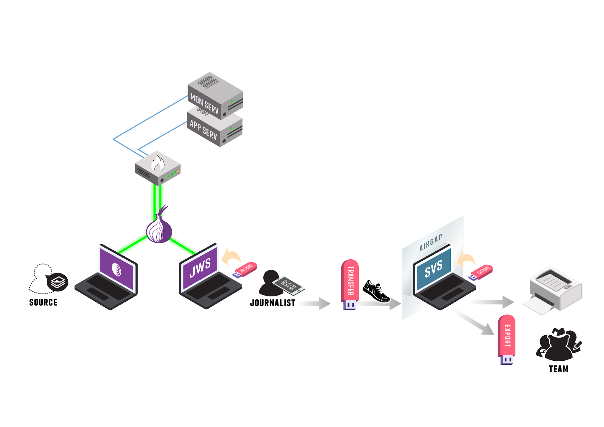

What Is SecureDrop?
===================

SecureDrop is an open-source whistleblower submission system that media
organizations can use to securely accept documents from and communicate with
anonymous sources.

Purpose
-------

In many of the recent leak prosecutions in the United States, sources have been
investigated because authorities are able to retrieve both metadata and content
of communications from third parties like email and phone providers in secret. 
SecureDrop attempts to completely eliminate third parties from the equation so
that news organizations can challenge any legal orders before handing over any 
data.

SecureDrop also substantially limits the metadata trail that may exist from 
journalist-source communications in the first place. In addition, it attempts
to provide a safer environment for those communications than regular corporate
news networks, which may be compromised.

Project History
---------------

The web application, which was originally called DeadDrop, was developed by
`Aaron Swartz <https://github.com/aaronsw>`_ 
in 2012 before his tragic death. The hardening guide and security
environment was architected by 
`James Dolan <https://github.com/dolanjs>`_. 
Investigative journalist
`Kevin Poulsen <https://github.com/klpwired>`_ 
originally managed the project. The New Yorker launched the first
implementation and branded their version StrongBox in May 2013.

In October 2013, Freedom of the Press Foundation took over management and
development of the open source project and re-named it SecureDrop. In the
project's early years at FPF, development was driven by James Dolan and
`Garrett Robinson <https://github.com/garrettr>`_. 
Today, SecureDrop is maintained by a small full-time development team at
FPF and a growing volunteer community.

What Technology Does SecureDrop Use?
------------------------------------

SecureDrop does not seek to re-invent the wheel. Instead it combines several
well-respected tools into an application that is easier to use for sources
and enforces the use of many security best practices by news organizations.

Among the tools used in and around the SecureDrop application are: 
`Tor <https://www.torproject.org/?>`_,
`GnuPG encryption <https://gnupg.org/>`_,
`Apache <https://httpd.apache.org/>`_,
`OSSEC <https://ossec.github.io/>`_,
`grsecurity <https://grsecurity.net/>`_,
`Ubuntu Server <https://www.ubuntu.com/server>`_,
`the Tails operating system <https://tails.boum.org/>`_,
and an air-gap to minimize exfiltration risks.

Privacy
-------

The SecureDrop application does not record your IP address, information about
your browser, computer, or operating system. Furthermore, the SecureDrop pages
do not embed third-party content or deliver persistent cookies to your browser.
The server will only store the date and time of the newest message sent from
each source. Once you send a new message, the time and date of your previous
message is automatically deleted.

Journalists are also encouraged to regularly delete all information from the
SecureDrop server and store anything they would like saved in offline storage
to minimize risk. More detailed information can be found in our
:ref:`sample privacy policy <Sample Privacy Policy>`,
which we encourage news organizations using SecureDrop to adopt from
when creating their own. Make sure to also follow our
:ref:`best practices for creating the SecureDrop landing page <Landing Page>`
so that it logs as little information as possible as well.

Security
--------

While we can't guarantee 100% security (no organization or product can), the
goal of SecureDrop is to create a significantly more secure environment
for sources to share information than exists through normal digital channels. 
Of course, there are always risks. That said, each release of SecureDrop with 
major architectural changes goes through a security audit by a reputable third
party security firm.

Audits
------

Before major code changes are shipped, our policy is to have SecureDrop 
audited by a professional, third-party security firm. 
Five audits of SecureDrop have been completed so far:

1. The first audit of SecureDrop, conducted in the Spring of 2013, was
   conducted by a group of University of Washington researchers and 
   Bruce Schneier, and can be found 
   `here <https://securedrop.org/documents/2/UW-CSE-13-08-02.PDF>`__.
2. After significant changes to the system, the second audit of SecureDrop was
   conducted by Cure53 at the end of 2013 and can be read 
   `here <https://securedrop.org/documents/3/pentest-report_securedrop.pdf>`__.
3. In the summer of 2014 iSEC Partners completed the third audit of SecureDrop.
   Their report can be read 
   `here <https://securedrop.org/documents/4/iSEC_OTF_FPF_SecureDrop_Deliverable_v1.1.pdf>`__
   and you can also read about 
   `how we resolved the issues they found <https://securedrop.org/news/announcing-new-version-securedrop-results-our-third-security-audit/>`__.
4. The fourth audit was conducted in summer 2015, also by iSEC Partners, and
   can be found in full 
   `here <https://securedrop.org/documents/5/iSEC_OTF_FPF_SecureDrop_Deliverable_v1.2.pdf>`__.
5. The most recent audit was independently undertaken by Leviathan Security
   on behalf of Sofwerx in late 2018, and can be found in full 
   `here <https://securedrop.org/documents/14/Sofwerx_SecureDrop_Security_Review_-_Public_Distribution_.pdf>`__.

In addition to these audits, we also have a 
`bug bounty program <https://bugcrowd.com/freedomofpress>`__ hosted by Bugcrowd.

How It Works
------------

|SecureDrop architecture highlevel overview diagram|

Sources and journalists connect to SecureDrop using the Tor network
(represented in the diagram above by the onion symbol). The SecureDrop software
is running on premises on dedicated infrastructure (two physical servers and
a firewall).

The following steps describe how a SecureDrop submission is submitted,
received and reviewed:

1. A source (bottom left in the diagram) uploads a submission to the news
   organization using `Tor Browser <https://www.torproject.org/>`__.

2. A journalist connects to SecureDrop using their *Journalist
   Workstation* (booted from a USB drive) and physically transfers files to
   the air-gapped Secure Viewing Station, a machine that is never connected
   on the Internet.

3. On the *Secure Viewing Station*, the journalist can view the document,
   process it (e.g., to remove metadata or potential malware), print it, or
   export it to a dedicated device.

.. seealso:: Check out
          :doc:`What makes SecureDrop Unique <what_makes_securedrop_unique>`
          to read more about SecureDrop's approach to keeping sources safe.

User Roles
--------------

There are three main user roles that interact with a SecureDrop instance:

:doc:`Sources <source/source>`
~~~~~~~~~~~~~~~~~~~~~~~~~~~~~~

A source submits documents and messages by using Tor Browser (or Tails) to access
the *Source Interface*: a public onion service. Submissions are encrypted
in place on the *Application Server* as they are uploaded.

:doc:`Journalists <journalist/journalist>`
~~~~~~~~~~~~~~~~~~~~~~~~~~~~~~~~~~~~~~~~~~

Journalists working in the newsroom use two machines to interact with
SecureDrop. First, they use a *Journalist Workstation* running Tails to connect
to the *Journalist Interface*, an authenticated onion service. Journalists
download `GPG <https://www.gnupg.org/>`__-encrypted submissions and copy them
to a *Transfer Device* (a thumb drive or DVD). Those submissions are then
connected to the airgapped *Secure Viewing Station* (*SVS*) which holds the key
to decrypt them. Journalists can then use the *SVS* to read, print, and
otherwise prepare documents for publication. Apart from those deliberately
published, decrypted documents are never accessed on an Internet-connected
computer.

.. note:: The terms in italics are terms of art specific to SecureDrop. The
	  :doc:`Glossary <glossary>` provides more-precise
          definitions of these and other terms. SecureDrop is designed against
          a comprehensive :doc:`threat_model/threat_model`, and has a specific
          notion of the :doc:`roles <glossary>` that are involved in its
          operation.

:doc:`Admins <admin/reference/admin>`
~~~~~~~~~~~~~~~~~~~~~~~~~~~~~~~~~~~~~

The SecureDrop servers are managed by a systems admin; for larger
newsrooms, there may be a team of systems admins. The admin
uses a dedicated *Admin Workstation* running `Tails <https://tails.boum.org>`__,
connects to the *Application* and *Monitor Servers* over  `authenticated onion services
<https://tb-manual.torproject.org/onion-services/>`__, and manages them
using `Ansible <https://www.ansible.com/>`__.

Environment Overview
--------------------

Server Infrastructure
~~~~~~~~~~~~~~~~~~~~~

At SecureDrop's heart is a pair of servers: the *Application (“App”) Server*,
which runs the core SecureDrop software, and the *Monitor (“Mon”) Server*,
which keeps track of the *Application Server* and sends out alerts if there's a
problem. These two servers run on dedicated hardware connected to a dedicated
firewall appliance. They are typically located physically inside the newsroom,
and must be physically located on-site within your organization's premises.

- *Application Server*:
   An Ubuntu server running two segmented Tor hidden
   services. The source connects to the *Source Interface*, a public-facing Tor
   Onion Service, to send messages and documents to the journalist. The
   journalist connects to the *Journalist Interface*, an `authenticated Tor
   Onion Service
   <https://community.torproject.org/onion-services/advanced/client-auth/>`__, to
   download encrypted documents and respond to sources.
- *Monitor Server*:
   An Ubuntu server that monitors the *Application Server*
   with `OSSEC <https://www.ossec.net/>`__ and sends email alerts.

The servers connect to the network via a dedicated hardware firewall.

Application Environment
~~~~~~~~~~~~~~~~~~~~~~~

The SecureDrop application environment consists of at least two computers,
in addition to the servers described above:

- *Secure Viewing Station*:
   A physically-secured and air-gapped laptop running
   the `Tails operating system`_ from a USB stick, that journalists use to
   decrypt and view submitted documents.

In addition to the *Secure Viewing Station* computers, each journalist will
also need a computer to connect to SecureDrop:

- *Journalist Workstation:*
   The computer used by the journalist to connect to
   the *Journalist Interface* to download encrypted documents that they will
   transfer to the *Secure Viewing Station*. The *Journalist Workstation*
   is also used to respond to sources via the *Journalist Interface*.

Depending on your organization's threat model, the *Journalist Workstation*
can either be the journalist's every-day laptop or a dedicated computer. In
either case, it is recommended that journalists always use the
`Tails operating system`_ on their *Journalist Workstation* when connecting
to the *Journalist Interface*.

SecureDrop administrators will also require a computer to connect to SecureDrop
and perform administrative tasks. This computer is referred to as the
*Admin Workstation*, and must be capable of running the
`Tails operating system`_. The *Admin Workstation* may also be used
as a *Journalist Workstation* if necessary.

.. _`Tails operating system`: https://tails.boum.org

Operation
---------

Planning & Preparation
~~~~~~~~~~~~~~~~~~~~~~

Setting up SecureDrop is a multi-step process. Before getting started, you
should make sure that you're prepared to operate and maintain it. You'll need
a systems admin who's familiar with Linux, the GNU utilities, and the
Bash shell. You'll need the :doc:`hardware <admin/installation/hardware>` 
on which SecureDrop runs — this will normally cost $2000-$3000. The journalists
in your organization will need to be trained in the operation of SecureDrop,
and you'll need to publish and promote your new SecureDrop instance afterwards —
using your existing websites, mailing lists, and social media.

It is recommended that you have all of this planned out before you get started.
If you need help, contact the `Freedom of the Press Foundation
<https://securedrop.org/help>`__ who will be glad to help walk you through
the process and make sure that you're ready to proceed.

Technical Setup
~~~~~~~~~~~~~~~

Once you are familiar with the architecture and have all the hardware,
:doc:`setting up SecureDrop <admin/installation/install>` will take at
least a day's work for your admin. We recommend that you set aside at least
a week to :ref:`complete and test <Deployment>` your setup.

Provisioning & Training
~~~~~~~~~~~~~~~~~~~~~~~

Once SecureDrop is installed, journalists will need to be provided with
accounts, two-factor credentials, workstations, and so on — and then
:doc:`trained <training_schedule>` to use these tools safely and reliably. You
will probably also need to train additional backup admins so that you
can be sure that your SecureDrop setup keeps running even when your main
admin is on holiday.

Introducing staff to SecureDrop takes half a day. Training a group to use
SecureDrop proficiently takes at least a day — and a single trainer can only
work with so many people at once. You will probably need to run several
training sessions to instruct an entire newsroom. Depending on staff
availability, training and provisioning may take a week or more. If you have
multiple offices, training will need to happen at each location. Again, the
`Freedom of the Press Foundation <https://securedrop.org/help>`__ are happy to
help you plan and train your team.

Going Public
~~~~~~~~~~~~

Once you have a SecureDrop instance and your team knows how to use it, you
should test it thoroughly and then tell the world. The `Freedom of the Press
Foundation <https://securedrop.org/help>`__ are happy to help you check that
your SecureDrop setup is up-to-code and properly grounded. After that you'll want
to check out the :ref:`best practices <Landing Page>` for your
SecureDrop *Landing Page* and our guide to
:doc:`promoting your SecureDrop instance <admin/deployment/getting_the_most_out_of_securedrop>`.

Sharing Access
--------------

With Other Journalists In Your Organization
~~~~~~~~~~~~~~~~~~~~~~~~~~~~~~~~~~~~~~~~~~~
While SecureDrop supports having multiple journalist accounts for the document
interface, all accounts will access the same inbox. To avoid confusion, we
recommend news organizations assign 1-3 journalists to regularly check
SecureDrop and make sure that they all are in contact as to who is responsible
for responding to each source. 

We are considering alternative workflows for future SecureDrop releases; 
please visit our 
`development roadmap <https://github.com/freedomofpress/securedrop/wiki/Development-Roadmap>`_ 
for up-to-date information.

With Other Organizations
~~~~~~~~~~~~~~~~~~~~~~~~

Currently you cannot use SecureDrop with multiple organizations for security
reasons. One of the benefits of SecureDrop is that it completely eliminates
third parties from your communication channel. The media organization owns and
operates the server that both the source and journalist connect to.

Any legal request or order has to be served on the media organization operating
the SecureDrop server, giving them a chance to challenge it before handing over
any data. If a third party operated a SecureDrop server which multiple
organizations used, a legal order could be served on the operator without the
media organizations knowing.