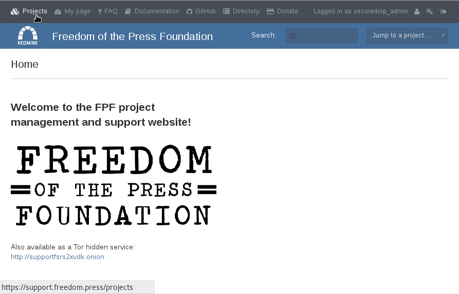
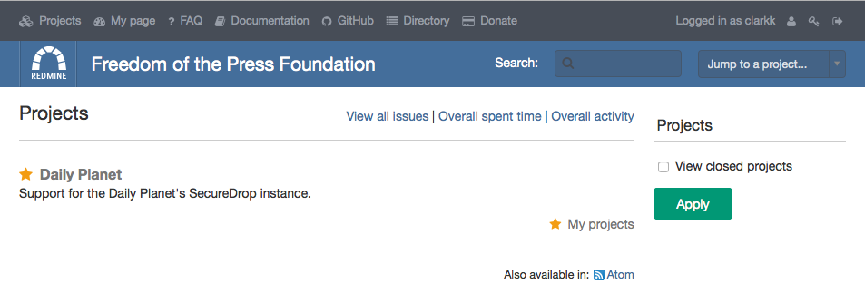
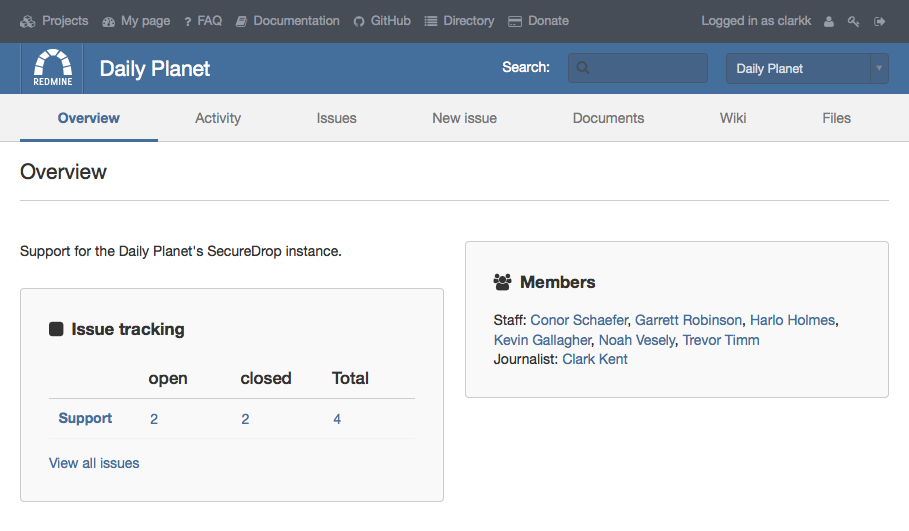
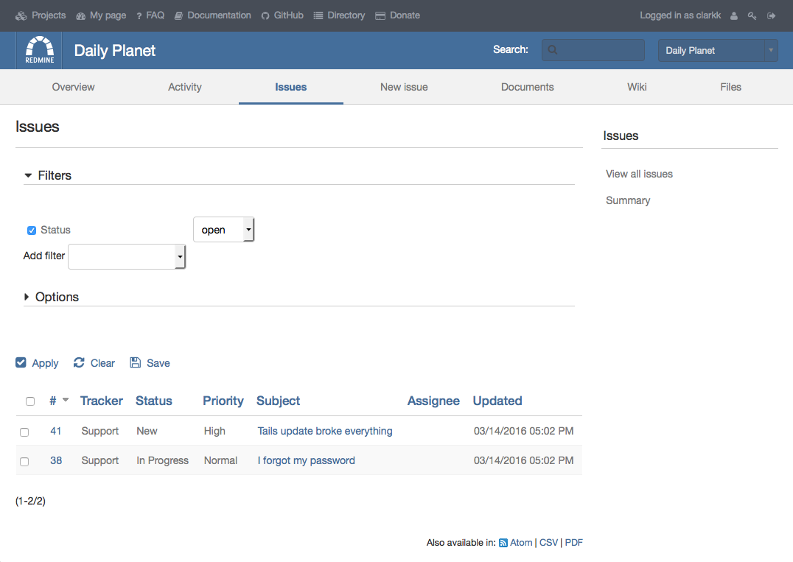
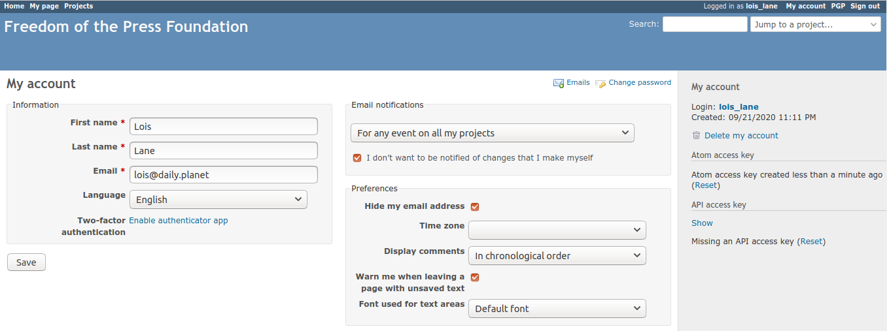

Using Redmine
=============

.. _Logging In:

Logging In
----------

Once your account has been activated, go to the `Support Page`_ and log
in with your new account.

.. _Support Page: https://support.freedom.press

|Login|

After logging in, you will be be taken to the Home page. In the top
menu bar, you will see helpful links to a variety of resources. The most
important links are:

* **Projects**: The list of projects you have access to.
* **My Page**: An overview of the open issues that were either created
  by you or are assigned to you.

|Home|

Click on **Projects** in the top menu bar. You'll see a project for your
SecureDrop instance listed underneath the parent SecureDrop project.
Only Freedom of the Press Foundation staff and people within your
organization have access to your instance's project.

|Projects|

Click on the project link. You'll be shown an **Overview** of the project and
all of its issues.

|Overview|

To view the list of open issues, click the **Issues** button to open the issues
pane.

|Issues|

.. |Login| image:: images/login.png

Onboarding Issue
----------------

By the time you log in, we'll have created an initial issue for
onboarding, called "Onboarding Verification". Please write a reply on
this issue, which will let us know that you succeeded in logging in and
finding your project page.

|OnboardingIssue|

To write a reply, click **Edit** button at the top of the issue.
Write your reply in the Notes text box, then click **Submit**.

|EditIssue1|

We'll reply to the issue and start a little exchange to explain some
features of the platform and answer any questions you might have. The
goal here is to make sure you're comfortable and confident using the new
Support site.

|EditIssue2|

Once we're satisfied you're ready to use the new site, we'll close the
issue.

Once we're finished with the onboarding issue, you're ready to use the Support
site. If you want to additionally set up encrypted email notifications, head
over to the :doc:`Encrypted Email Overview <encrypted_email_overview>`.

The rest of this documentation is for your reference.

.. |OnboardingIssue| image:: images/onboarding_issue.png
.. |EditIssue1| image:: images/edit_issue_1.png
.. |EditIssue2| image:: images/edit_issue_2.png

Key Features
------------

Creating a new issue
^^^^^^^^^^^^^^^^^^^^

To create a new issue, click **New issue** and fill out the Subject and
Description fields. All other fields can be left blank, although you can
assign a priority if you want. When we see the issue, we will respond
and assign it to the appropriate person. If we're waiting for a reply
from someone in your organization, we may assign it back to you.

|NewIssue|

.. |NewIssue| image:: images/new_issue.png

Creating a new issue via email
~~~~~~~~~~~~~~~~~~~~~~~~~~~~~~

Sending an email to support@freedom.press will automatically create a
new issue in your project, using the subject line of the email for the
Subject and the body of the email for the Description.

Account Settings
^^^^^^^^^^^^^^^^

Under your account settings (accessible in the top right corner) you may
set your local time zone. We encourage you to leave the notification
setting as the default: "For any event on all my projects".

|AccountSettings|

Additional Documentation
^^^^^^^^^^^^^^^^^^^^^^^^

For more information on using Redmine, consult their `User Guide
<https://www.redmine.org/projects/redmine/wiki/User_Guide>`_.

